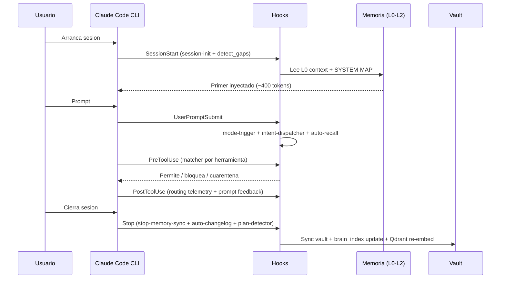
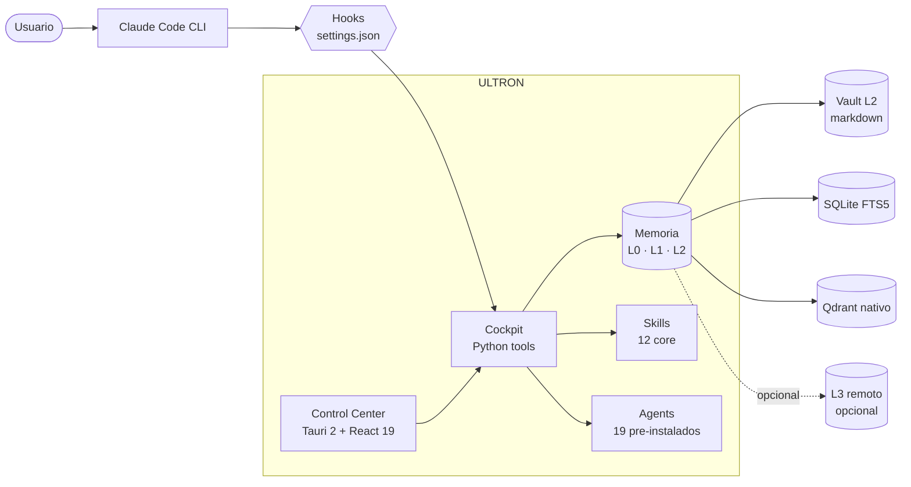

<!--
  ULTRON — README (Español)
  English version: README.md
-->

<div align="center">

<h1>ULTRON</h1>

<p><b>Tu centro de mando local para Claude Code.</b></p>

<p>
  Memoria jerárquica &middot; skills y agents curados &middot; hooks endurecidos &middot;
  un panel desktop que convierte el trabajo de varios días con Claude
  (y, si quieres, Codex y Gemini) en algo que puedes gestionar de verdad.
</p>

<p>
  <a href="https://github.com/SkiTemplar/ultron/actions/workflows/ci.yml"></a>
  <a href="LICENSE"></a>
  <a href="CHANGELOG.md"></a>
  
  <a href="https://claude.com/claude-code"></a>
  
  
</p>

<p>
  <b>Docs:</b>
  <a href="INSTALL.md">Instalación</a> &middot;
  <a href="docs/QUICKSTART.md">Quickstart</a> &middot;
  <a href="CHANGELOG.md">Changelog</a> &middot;
  <a href="CONTRIBUTING.md">Contribuir</a> &middot;
  <a href="SECURITY.md">Seguridad</a> &middot;
  <a href="AUTHORS.md">Autores</a> &middot;
  <a href="NOTICE">Notice</a> &middot;
  <a href="LICENSE">Licencia</a>
</p>

<p>
  <b>Lee en:</b>
  <a href="README.md">English</a>
  ·
  <a href="README.es.md">Español</a>
</p>

<sub>Texto plano, opt-in, cero SaaS, cero telemetría. La fontaneria es el producto.</sub>

</div>

> [!WARNING]
> **Beta pública.** ULTRON se pública como preview funcional. Hay bordes sin pulir, cambios incompatibles entre minor releases y una cola continua de arreglos. Los reports y PRs son MUY bienvenidos &mdash; abre un issue en este repo. Cada release nueva entra en el [Changelog](CHANGELOG.md) a medida que aparecen bugs.

<p align="center">
  
  <br />
  <sub><i>Dashboard &mdash; Full Diagnostic, Maintenance commands, Pending items.</i></sub>
</p>

<p align="center">
  
  <br />
  <sub><i>Pesta&ntilde;a Skills &mdash; scanner de seguridad estricto, skills quarantined arriba del todo, findings + waiver inline.</i></sub>
</p>

> Los screenshots se llenar&aacute;n a medida que avance la beta p&uacute;blica &mdash; el layout que ves coincide con la versi&oacute;n actual.

---

## Tabla de contenidos

<details>
<summary><b>Click para expandir</b></summary>

1. [Qué es ULTRON](#que-es-ultron)
2. [Qué resuelve](#que-resuelve)
3. [Cómo funciona](#como-funciona)
4. [Quick start](#quick-start)
5. [Funcionalidades](#funcionalidades)
6. [Arquitectura](#arquitectura)
7. [Personalizar](#personalizar)
8. [Stack técnico](#stack-técnico)
9. [Notas de release](#notas-de-release)
10. [Contribuir](#contribuir)
11. [Origen y atribución](#origen-y-atribución)
12. [Licencia](#licencia)
13. [Créditos](#créditos)

</details>

---

## Qué es ULTRON

ULTRON es un **centro de mando local** que se monta encima del CLI oficial de [Claude Code](https://claude.com/claude-code). Vive entero en tu carpeta de usuario (`~/.ultron/`), guarda todo en archivos de texto plano y pareja el runtime con un panel desktop Tauri para que un proyecto de varios días no se sienta como diez conversaciones huerfanas pegadas con cinta aislante.

> [!NOTE]
> ULTRON no sustituye a Claude Code. Lo envuelve, le da memoria persistente, enruta la skill especialista correcta segun la intencion del prompt y expone la maquinaria en una UI que puedes auditar y editar.

| Pilar | Lo que aporta |
|---|---|
| **Memoria jerárquica** | Tres capas locales (L0 contexto caliente → L1 índice keyword → L2 vault) mas un mirror remoto L3 opcional, para que Claude retome donde lo dejaste tras cada reinicio. |
| **Skills** | 12 skills core instaladas por defecto — `ultron`, `senior-engineer`, `debugger`, `code-reviewer`, `refactoring-specialist`, `ui-designer`, `business-strategist`, `skill-creator`, `superpowers`, `webapp-testing`, `windows-admin`, `second-opinion`. Mas slots opt-in para las tuyas. Un dispatcher activa la correcta segun la intención del usuario. |
| **Agents** | 19 subagentes autónomos pre-instalados (12 ULTRON first-party + 7 community curados), mas un catalogo de 69 entradas instalables a demanda desde la pestaña Agents = **88 totales disponibles**. Mismo scanner anti-prompt-injection que Skills. |
| **Hooks endurecidos** | Anti-prompt-injection, recall automático de notas, log de sesion y sync con el vault — todo auditable, todo enchufado a `settings.json`. |
| **Panel desktop** | Tauri 2 + React 19 con 18 secciones cableadas (17 visibles + Logs deshabilitado) para memoria, skills, agents, hooks, planes, sesiones, costes y MCPs. |

**Filosofía.** Archivos de texto plano. Todo opt-in. Cero SaaS. Cero telemetría externa. No hay backend en la nube. Arranca piezas, forkealas o edita el código fuente — el sistema esta pensado para desmontarse.

---

## Qué resuelve

Cuando trabajas con Claude Code en proyectos reales aparecen los mismos problemas:

- El contexto se evapora entre sesiones; pierdes los primeros diez minutos rebriefando al modelo.
- Skills, hooks y servidores MCP viven en carpetas distintas y no hay un panel único.
- Los planes largos derivan; no sabes que se decidió hace tres días sin hacer scroll en chats.
- Costes y uso de herramientas se acumulan sin visibilidad.

ULTRON resuelve todo eso en local, sin alquilar un backend:

- Cada sesion nueva arranca leyendo un primer pre-computado (`context.md`, tope ~400 tokens).
- Las skills auto-enrutan por intención — no necesitas recordar nombres exactos; escribe "revisa este código" y la skill correcta se activa.
- El vault (`~/.ultron-vault/`) se indexa en SQLite FTS5 y en una instancia local de Qdrant (binario nativo, sin daemon) para recall semántico.
- El panel concentra hooks, planes, sesiones, costes y MCPs instalados en una sola ventana.

---

## Cómo funciona

Imagina ULTRON como un **archivador mas un mayordomo** montado encima de Claude Code. Cada sesion, el mayordomo le pasa a Claude un briefing de una pagina con lo que estabas haciendo, quien eres y donde estan las cosas. Cada prompt, unos scripts vigilan que no haya foot-guns evidentes antes de que se ejecute ninguna herramienta. Cada cierre de sesion, los mismos scripts archivan lo que acaba de pasar para que la proxima sesion lo herede.

Concretamente: cuando arrancas Claude Code lee `~/.claude/CLAUDE.md` (tus instrucciones globales). Ese archivo contiene un **wake-up protocol** que dispara la lectura de `~/.ultron/.tmp/context.md` (el briefing) y `~/.ultron/SYSTEM-MAP.md` (un índice estable de rutas para que Claude no malgaste tokens grepeando archivos que podria leer directamente). En menos de un segundo, Claude sabe el estado del mundo.

A partir de ahi, los hooks definidos en `~/.claude/settings.json` se enchufan a cada paso del ciclo:



### Memoria: el archivador

Tres capas locales, una remota opcional, mas un motor de búsqueda semántica encima de todo:

| Capa | Dónde vive | Para qué sirve | Analogía |
|---|---|---|---|
| **L0** hot context | `~/.ultron/.tmp/context.md` | Primer pre-computado, ≤400 tokens, cargado en cada SessionStart | Post-it pegado al monitor |
| **L1** índice keyword | `~/.ultron/brain_index/index.db` | SQLite FTS5 sobre el vault troceado, recall BM25 | Fichero de una biblioteca |
| **L2** vault | `~/.ultron-vault/*.md` | Notas markdown curadas con wikilinks — fuente de verdad | Las estanterías que el fichero indexa |
| **L3** remote *(opt-in)* | `github.com/<tu>/ultron-memory` | Mirror externo de L2, drenado por el hook `Stop` en modo HIGH+ | Caja en almacenamiento offsite |

> [!NOTE]
> **Estado de L3.** El path del Stop hook esta cableado (ver `memory_sync.py push-async`). L3 es **opt-in y per-user**: no existe mirror compartido — cada usuario crea su propio repo **privado** llamado `ultron-memory` bajo su cuenta, lo cablea como remote de `~/.ultron-vault`, y ULTRON pushea deltas en modo HIGH+. Ver `docs/memory-layers.md` para el setup inicial.

Encima de L1+L2 vive una instancia local de **Qdrant** (binario nativo de la plataforma en Windows o Linux, sin daemon) que corre recall semántico sobre el mismo corpus — asi que "encuentra esa nota sobre permisos de Tauri" funciona aunque no recuerdes las palabras exactas. Un sistema de decay devuelve notas estancadas a la superficie cada vez que arrancas sesion, asi que el contexto viejo resurge en lugar de pudrirse.

---

## Quick start

> [!IMPORTANT]
> Windows 11 es la plataforma principal; Linux x86_64 (Debian / Ubuntu / Fedora / Arch) soportado desde v15.5 (build verificado, install end-to-end aun sin testear por el autor). macOS es un non-goal explicito.

Abre un terminal, pega el one-liner que matchee tu OS, espera ~3 minutos.
Fija un tag de release si quieres un install reproducible. **La referencia
completa de instalación esta en [`INSTALL.md`](INSTALL.md)** (detalles del
bootstrap, flags del installer manual, troubleshooting); el install manual
paso a paso vive en [`docs/INSTALL-ADVANCED.md`](docs/INSTALL-ADVANCED.md).

**Windows 11** (PowerShell, sin Git):

```powershell
iwr -useb https://raw.githubusercontent.com/SkiTemplar/ultron/main/bootstrap.ps1 | iex
```

**Linux x86_64** (Debian / Ubuntu / Fedora / Arch):

```bash
curl -fsSL https://raw.githubusercontent.com/SkiTemplar/ultron/main/bootstrap.sh | bash
```

Ambos scripts resuelven el último tag `v*.*.*` via la GitHub Releases API,
verifican el SHA-256 del ZIP de sistema, extraen en `~/.ultron`, ejecutan
`install.ps1` / `install.sh` y lanzan el Control Center desktop.
Re-ejecútalos cuando quieras para actualizar — `~/.ultron-vault/` y
`~/.ultron/plans/` se preservan.

> [!NOTE]
> **Windows SmartScreen.** El instalador NSIS no esta firmado. SmartScreen mostrará un aviso — click en **Mas información → Ejecutar de todos modos**. Code signing documentado en [`docs/RELEASE-PROCESS.md`](docs/RELEASE-PROCESS.md).

---

## Funcionalidades

| Area | Highlights |
|---|---|
| **Memoria** | Capas locales L0 → L2 + mirror remoto L3 opcional (planeado), índice SQLite FTS5, binario Qdrant nativo para recall semántico, sistema de decay devuelve notas estancadas a la superficie |
| **Skills** | 12 skills core instaladas por defecto, dispatch por intención, slots opt-in para las tuyas, ruleset anti-PI PI001-PI013 |
| **Agents** | 19 pre-instalados (12 ULTRON first-party + 7 community stack-aligned) + catalogo de 69 entradas instalables a demanda = **88 totales disponibles**. Pestaña Agents dedicada con el mismo scanner anti-prompt-injection que Skills, slot de Agent en el AI Router, embeddings en Qdrant para descubrimiento semántico. |
| **Skill / Agent Vault** | Degrada una skill o agent sin borrarlo: el botón **Vault** mueve el archivo a `~/.ultron/skill-vault/` o `~/.ultron/agent-vault/` para que Claude deje de auto-cargarlo. Restaura desde el panel Vault de la sidebar. Las entradas en vault aun pueden surgir como sugerencias via el hook de auto-recall (`[VAULT·SKILL·82%] …`). |
| **Hooks** | `SessionStart`, `UserPromptSubmit`, `PreToolUse`, `PostToolUse`, `PreCompact`, `PostCompact`, `Stop` — todos auditables |
| **Control Center** | 18 secciones cableadas (17 visibles + Logs deshabilitado): Dashboard, Usage, Notifications, Changelog, News, System, MCPs, Skills, Agents, Memory, Sessions, Projects, Gaming, Plans, Stats, Personal, Settings + Logs. La pestaña System incluye sub-pestañas: Overview, Schedules, Hooks. |
| **Dual-mode** | Peer review opcional con Codex CLI + delegación long-context con Gemini CLI, ambos via suscripcion |
| **Seguridad** | Scanner anti-prompt-injection, carpeta de cuarentena, allow-list IPC en Tauri, deny list defensiva en `settings.json` |
| **Privacidad** | Sin telemetría, sin llamadas externas sin accion del usuario, el vault es tuyo |

<details>
<summary><b>Skills core (12, instaladas por defecto)</b></summary>

`ultron` &middot; `senior-engineer` &middot; `code-reviewer` &middot; `debugger` &middot; `refactoring-specialist` &middot; `ui-designer` &middot; `business-strategist` &middot; `skill-creator` &middot; `superpowers` &middot; `webapp-testing` &middot; `windows-admin` &middot; `second-opinion`

Los slots opt-in se entregan como **plantillas vacias**: forkea ULTRON y rellena las tuyas (asistente financiero, voz creativa, ingeniero de game engine, agente personal de mail/calendar, etc.). El picker de `install.ps1` pregunta una por una.

</details>

<details>
<summary><b>Agents (12 ULTRON + 7 community curados + 69 catalogo = 88 total)</b></summary>

Los agents viven en `~/.claude/agents/*.md` y siguen el mismo contrato de YAML frontmatter que las skills.

**12 agentes ULTRON first-party** (siempre instalados): `ultron-arch`, `ultron-changelog`, `ultron-context`, `ultron-docs`, `ultron-metadata`, `ultron-news`, `ultron-perf`, `ultron-refactor`, `ultron-security`, `ultron-self-improve`, `ultron-skill-editor`, `ultron-test`.

**7 agentes community stack-aligned** (instalados por defecto): `cpp-pro` (C++17/20/23 moderno), `graphics-programmer` (OpenGL / Vulkan / HLSL / GLSL / WGSL + RenderDoc), `unreal-engine-engineer` (UE5 C++ / Blueprints / GAS / Nanite / Lumen), `unity-engineer` (Unity 2022 LTS + Unity 6, DOTS, URP / HDRP), `devops-engineer` (GitHub Actions, signing, Tauri release), `database-admin` (Postgres / Supabase / SQLite + EXPLAIN ANALYZE), `fullstack-developer` (features cross-stack).

**69 agentes de catalogo** en `cockpit/agent-catalog.json` — instalables a demanda desde **pestaña Agents → Discover online**. Cada agente pasa por el mismo scanner PI001-PI013 que gatekeepa las skills; los que fallan caen en quarantine con el mismo flujo de waiver Allow-anyway. El AI Router expone un slot Agent (Settings → AI Router → Reset to ULTRON recommended cablea pares curados).

</details>

<details>
<summary><b>Cómo funciona la memoria (L0 → L3)</b></summary>

ULTRON encadena cuatro capas de memoria para que Claude retome donde lo dejaste tras cada reinicio. Piénsalo como **post-it → fichero → estanterías → caja offsite**:

- **L0 — hot context.** `~/.ultron/.tmp/context.md` (≤ 400 tokens). Resumen pineado de sesiones recientes, proyectos, alertas pendientes. Cargado automáticamente en SessionStart. *Post-it.*
- **L1 — índice keyword.** SQLite + FTS5 en `~/.ultron/brain_index/index.db`. Lookup BM25 rápido sobre cada nota del vault. Reconstruido incrementalmente por el hook Stop. *Fichero.*
- **L2 — vault.** Notas markdown plano estilo Obsidian en `~/.ultron-vault/` (tu conocimiento curado a largo plazo). Mas `~/.ultron/archive/` para material indexado mas antiguo. *Las estanterías.*
- **L3 — mirror remoto** *(opt-in).* El hook Stop puede pushear a `github.com/<tu>/ultron-memory` para sync cross-machine (modo HIGH+). Cada usuario crea su propio repo **privado** (el contenido del vault es personal); el path solo corre cuando **tu** cableas tu remote en `~/.ultron-vault`. *Caja offsite.*

Encima de esas, un binario Qdrant nativo (`~/.ultron/qdrant-native/qdrant.exe`) provee recall semántico via dense embeddings para skills + agents + notas del vault. El recall es híbrido: FTS5 + Qdrant, ambos surgen resultados via el CLI `ultron recall` y la pestaña Memory. Todo el sistema es texto plano — sin SaaS lock-in, puedes grepear, diffear, forkear, archivar.

</details>

---

## Arquitectura

ULTRON se mete entre **tu** y **Claude Code**. El CLI hace el dialogo; ULTRON hace la contabilidad. Cinco piezas en movimiento:

- **Hooks** — pequeños scripts Python y PowerShell cableados en `~/.claude/settings.json`. Disparan en `SessionStart`, `UserPromptSubmit`, `PreToolUse`, `PostToolUse`, `Stop`. Aqui pasa el scanning anti-prompt-injection, el routing por intención y los updates de memoria.
- **Cockpit** — la caja de herramientas Python en `~/.ultron/scripts/cockpit/`. Los hooks la llaman para hacer el trabajo real: indexar el vault, calcular el primer de contexto, enrutar prompts a skills, embebir en Qdrant.
- **Memoria** — el archivador de la sección anterior (L0 → L2 local, L3 opcional). Cockpit lo lee y escribe; el Control Center lo visualiza.
- **Skills + Agents** — archivos markdown en `~/.claude/skills/` y `~/.claude/agents/` que Claude Code activa por intención o invocación explícita. ULTRON trae 12 skills core + 19 agents pre-instalados (88 totales disponibles).
- **Control Center** — la app desktop Tauri 2 + React 19 en `~/.ultron/control-center/`. Es el panel que realmente miras; lo de debajo es texto plano que puedes grepear.



<details>
<summary><b>Matriz de compatibilidad</b></summary>

| Plataforma | Estado |
|---|---|
| Windows 11 | Soportada (objetivo principal) |
| Windows 10 | Best effort (no esta en CI) |
| Linux x86_64 (Debian / Ubuntu / Fedora / Arch) | Build verificado desde v15.5 (`.deb` + `.AppImage`); install end-to-end sin testear por el autor |
| macOS | Fuera de scope — non-goal explicito |

</details>

---

## Personalizar

ULTRON esta construido para que lo desmontes y lo recables a tu gusto. Todo es texto plano debajo de tu home:

- **`~/.claude/CLAUDE.md`** — tus instrucciones globales para cada sesion de Claude Code. Edita directamente o usa la pestaña `Personal` del Control Center.
- **`~/.claude/settings.json`** — hooks y permisos. La pestaña `Hooks` (dentro de System) es un editor tipado sobre este archivo.
- **`~/.claude/skills/<name>/SKILL.md`** — activar / desactivar / editar una skill. Borra una carpeta para desinstalarla.
- **`~/.claude/agents/<name>.md`** — misma idea para subagentes autónomos. La pestaña Agents muestra estado de instalación, findings de seguridad y el catalogo de community agents desde `cockpit/agent-catalog.json`.
- **`~/.ultron-vault/`** — tu vault L2. Markdown plano con wikilinks. Lo que escribas aqui se indexa en la proxima ejecución de `brain_index.py update`.
- **`~/.ultron/plans/PLANS.json`** — tus planes en curso. La pestaña `Plans` es un frontend sobre este archivo.
- **`~/.ultron/personal/profile.md`** — tu perfil personal (intereses, contexto, preferencias).
- **El propio código fuente.** ULTRON es open source bajo MIT: cada hook Python, cada comando Tauri en Rust, cada componente React esta en este repo. Clona, branchea, edita, manda PRs — o forkealo y corre un sabor privado. Ver [`CONTRIBUTING.md`](CONTRIBUTING.md).

> [!TIP]
> Esto es **tu** sistema. Forkealo. Modificalo. Cambia el código. La filosofía es texto plano mas Git, asi que todo es revisable con un diff.

---

## Stack técnico

| Capa | Tecnologia |
|---|---|
| Control Center (frontend) | Tauri 2 + React 19 + TypeScript (strict) |
| Control Center (backend) | Rust (estable) |
| Herramientas Python (cockpit/) | Python 3.13 + uv |
| Memoria | SQLite FTS5 + Qdrant (binario nativo de la plataforma, proceso único) |
| Agents | Markdown con YAML frontmatter en `~/.claude/agents/`, catalogo en `cockpit/agent-catalog.json`, embeddings via `embed_agents.py` |
| Scripting OS | PowerShell 5.1+ |
| Runtimes LLM | Claude Code CLI (principal), Codex CLI (peer review, opcional), Gemini CLI (long-context, opcional) |

---

## Notas de release

Stable actual: **[v15.5.20](https://github.com/SkiTemplar/ultron/releases/tag/v15.5.20)** — pulido de UX, hooks y gate de leakage.

Notas completas: [`CHANGELOG.md`](CHANGELOG.md). Assets más recientes: [GitHub Releases](https://github.com/SkiTemplar/ultron/releases/latest).

---

## Contribuir

PRs bienvenidos en arquitectura, packaging, soporte cross-platform y skills core. El contenido personal (feeds de noticias del autor, categorias de gasto, librerias de juegos) esta fuera de scope — forkealos para ti. Guia completa en [`CONTRIBUTING.md`](CONTRIBUTING.md).

Reporta problemas de seguridad de forma privada segun [`SECURITY.md`](SECURITY.md).

---

## Origen y atribución

ULTRON fue originalmente creado por **[USER SURNAME](https://www.linkedin.com/in/USER-SURNAME-SURNAME2-671b02274/)** ([@SkiTemplar](https://github.com/SkiTemplar)) en 2026.

El proyecto es open source bajo MIT (ver [`LICENSE`](LICENSE)). Forks y modificaciones son bienvenidos — contribuidores que extiendan sustancialmente el trabajo pueden añadirse a [`AUTHORS.md`](AUTHORS.md). Por los terminos de MIT, cualquier copia o trabajo derivado debe conservar el aviso de copyright original que nombra a USER SURNAME como autor original de ULTRON. El nombre "ULTRON" identifica al proyecto original; los proyectos derivados deberian elegir un nombre distinto salvo que pretendan upstream sus cambios. Política completa en [`NOTICE`](NOTICE).

---

## Licencia

MIT — ver [`LICENSE`](LICENSE).

**Marca / no afiliación**: "ULTRON" en este proyecto es un acrónimo:
**U**ltimate **L**ocal **T**oken **R**eduction **O**rchestration **N**etwork.
Este software **no está afiliado, respaldado, patrocinado ni asociado con**
Marvel Entertainment, The Walt Disney Company, ni ninguna de sus filiales.
Ver [`NOTICE`](NOTICE) para el disclaimer completo.

---

## Créditos

ULTRON orquesta tres herramientas que no le pertenecen y sin las que no existiria:

- [**Claude Code**](https://claude.com/claude-code) — Anthropic. El runtime que ULTRON envuelve.
- [**Codex CLI**](https://github.com/openai/codex) — OpenAI. Peer review y rescue opcional.
- [**Gemini CLI**](https://github.com/google-gemini/gemini-cli) — Google. Long-context delegate e image generation opcional.

La capa vectorial usa [Qdrant](https://qdrant.tech). El shell desktop es [Tauri](https://tauri.app). El pipeline Python corre sobre [uv](https://github.com/astral-sh/uv). Gracias a los cuatro proyectos.

<div align="center">

<sub>Construido por <a href="https://github.com/SkiTemplar">USER SURNAME</a> &middot; <a href="https://www.linkedin.com/in/USER-SURNAME-SURNAME2-671b02274/">LinkedIn</a> &middot; MIT &middot; 2026</sub>

</div>
