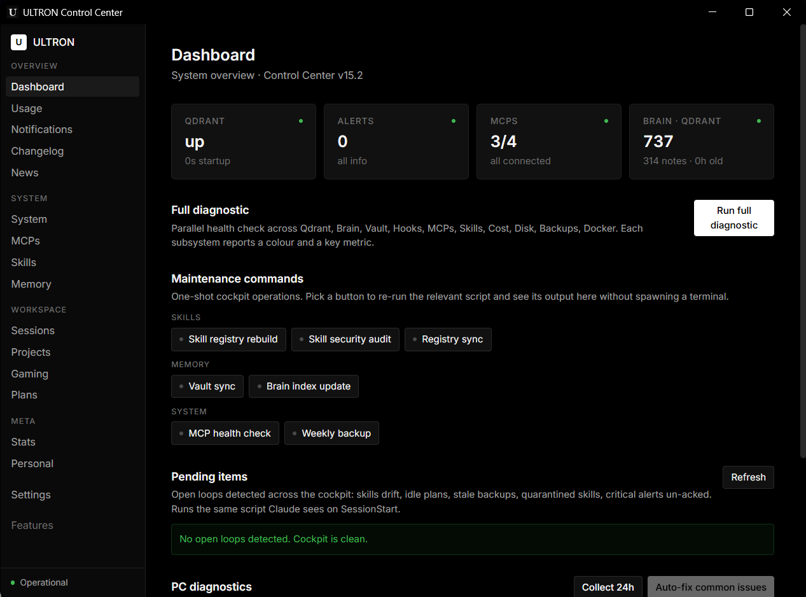
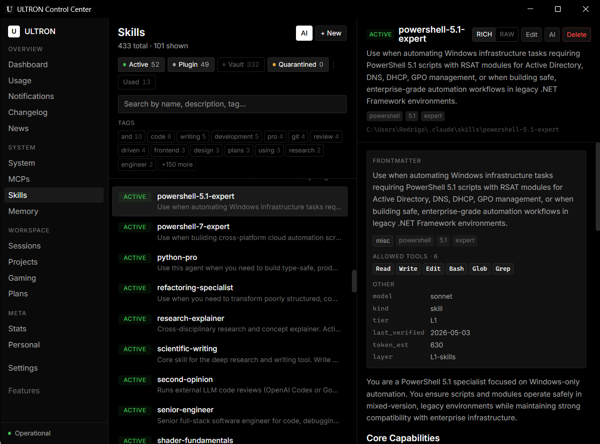
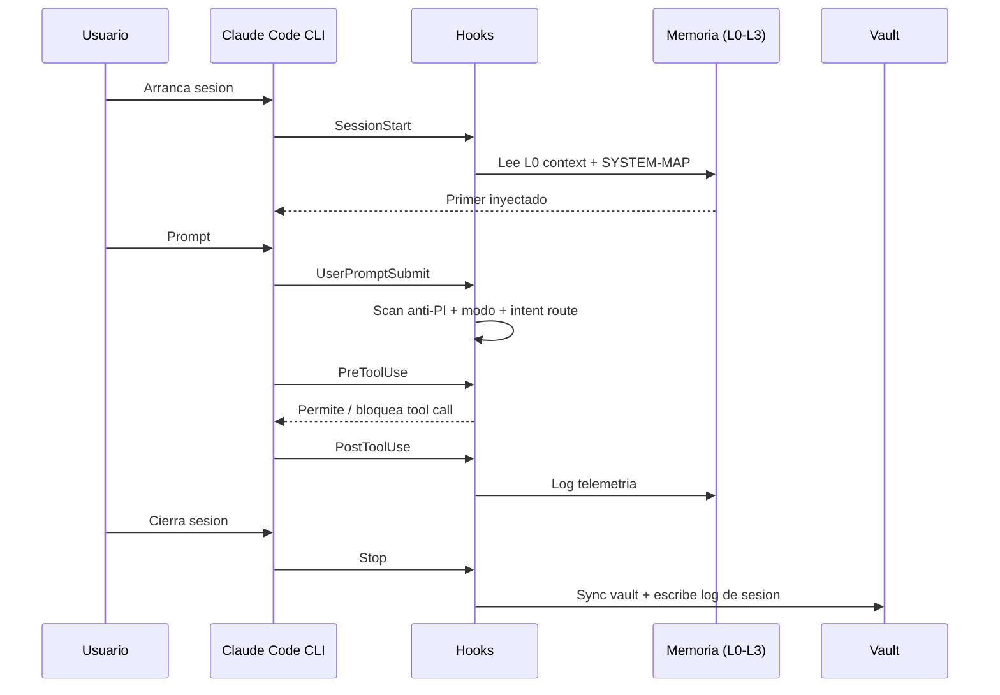
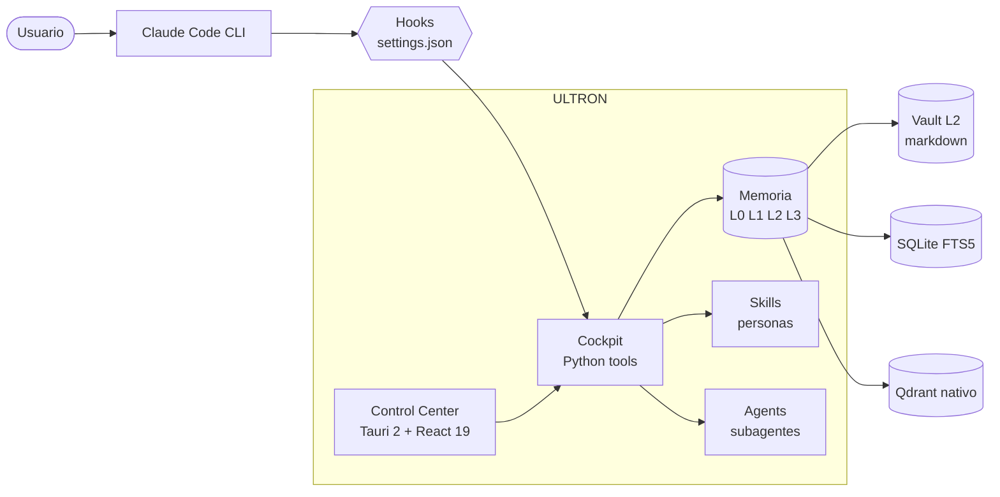

<!--
  ULTRON — README (Español)
  English version: README.md
-->

<div align="center">

<h1>ULTRON</h1>

<p><b>Tu centro de mando local para Claude Code.</b></p>

<p>
  Memoria jerárquica &middot; personas opt-in &middot; hooks endurecidos &middot;
  un panel desktop que convierte el trabajo de varios días con Claude
  (y, si quieres, Codex y Gemini) en algo que puedes gestionar de verdad.
</p>

<p>
  <a href="https://github.com/SkiTemplar/ultron/actions/workflows/ci.yml"></a>
  <a href="LICENSE"></a>
  <a href="CHANGELOG.md"></a>
  
  <a href="https://claude.com/claude-code"></a>
  
  
</p>

<p>
  <b>Docs:</b>
  <a href="INSTALL.md">Instalación</a> &middot;
  <a href="docs/QUICKSTART.md">Quickstart</a> &middot;
  <a href="CHANGELOG.md">Changelog</a> &middot;
  <a href="CONTRIBUTING.md">Contribuir</a> &middot;
  <a href="SECURITY.md">Seguridad</a> &middot;
  <a href="AUTHORS.md">Autores</a> &middot;
  <a href="NOTICE">Notice</a> &middot;
  <a href="LICENSE">Licencia</a>
</p>

<p>
  <b>Lee en:</b>
  <a href="README.md">English</a>
  ·
  <a href="README.es.md">Español</a>
</p>

<sub>Texto plano, opt-in, cero SaaS, cero telemetría. La fontaneria es el producto.</sub>

</div>

> [!WARNING]
> **Beta pública.** ULTRON se pública como preview funcional. Hay bordes sin pulir, cambios incompatibles entre minor releases y una cola continua de arreglos. Los reports y PRs son MUY bienvenidos &mdash; abre un issue en este repo. Cada release nueva entra en el [Changelog](CHANGELOG.md) a medida que aparecen bugs.

<p align="center">
  
  <br />
  <sub><i>Dashboard &mdash; Full Diagnostic, Maintenance commands, Pending items.</i></sub>
</p>

<p align="center">
  
  <br />
  <sub><i>Pesta&ntilde;a Skills &mdash; scanner de seguridad estricto, skills quarantined arriba del todo, findings + waiver inline.</i></sub>
</p>

> Los screenshots se llenar&aacute;n a medida que avance la beta p&uacute;blica &mdash; el layout que ves coincide con la versi&oacute;n actual.

---

## Tabla de contenidos

<details>
<summary><b>Click para expandir</b></summary>

1. [Qué es ULTRON](#que-es-ultron)
2. [Qué resuelve](#que-resuelve)
3. [Cómo funciona](#como-funciona)
4. [Quick start](#quick-start)
5. [Funcionalidades](#funcionalidades)
6. [Arquitectura](#arquitectura)
7. [Personalizar](#personalizar)
8. [Stack técnico](#stack-técnico)
9. [Notas de release](#notas-de-release)
10. [Contribuir](#contribuir)
11. [Origen y atribución](#origen-y-atribución)
12. [Licencia](#licencia)
13. [Créditos](#créditos)

</details>

---

## Qué es ULTRON

ULTRON es un **centro de mando local** que se monta encima del CLI oficial de [Claude Code](https://claude.com/claude-code). Vive entero en tu carpeta de usuario (`~/.ultron/`), guarda todo en archivos de texto plano y pareja el runtime con un panel desktop Tauri para que un proyecto de varios días no se sienta como diez conversaciones huerfanas pegadas con cinta aislante.

> [!NOTE]
> ULTRON no sustituye a Claude Code. Lo envuelve, le da memoria persistente, enruta personas especializadas y expone la maquinaria en una UI que puedes auditar y editar.

| Pilar | Lo que aporta |
|---|---|
| **Memoria jerárquica** | Cuatro capas (L0 contexto caliente hasta L3 mirror remoto) para que Claude retome donde lo dejaste tras cada reinicio. |
| **Personas y skills** | Un dispatcher activa al especialista correcto segun la intención: `debugger`, `code-reviewer`, `ui-designer`, etc. |
| **Agents** | 12 ULTRON + 7 community curados = 19 subagentes autónomos pre-instalados, mas un catalogo de 69 adicionales (88 totales), todos pasados por el mismo ruleset PI que las skills. |
| **Hooks endurecidos** | Anti-prompt-injection, recall automático de notas, log de sesion y sync con el vault — todo enchufado a `settings.json`. |
| **Panel desktop** | Tauri 2 + React 19 con 17 secciones (16 visibles + Logs cableado pero deshabilitado) para memoria, skills, agents, hooks, planes, sesiones, costes y MCPs. |

**Filosofía.** Archivos de texto plano. Todo opt-in. Cero SaaS. Cero telemetría externa. No hay backend en la nube. Arranca piezas, forkealas o edita el JSON a mano — el sistema esta pensado para desmontarse.

---

## Qué resuelve

Cuando trabajas con Claude Code en proyectos reales aparecen los mismos problemas:

- El contexto se evapora entre sesiones; pierdes los primeros diez minutos rebriefando al modelo.
- Skills, hooks y servidores MCP viven en carpetas distintas y no hay un panel único.
- Los planes largos derivan; no sabes que se decidió hace tres días sin hacer scroll en chats.
- Costes y uso de herramientas se acumulan sin visibilidad.

ULTRON resuelve todo eso en local, sin alquilar un backend:

- Cada sesion nueva arranca leyendo un primer pre-computado (`context.md`, tope ~400 tokens).
- Las personas auto-enrutan por intención — no necesitas recordar los nombres exactos de las skills.
- El vault (`~/.ultron-vault/`) se indexa en SQLite FTS5 y en una instancia local de Qdrant (binario nativo, sin daemon) para recall semántico.
- El panel concentra hooks, planes, sesiones, costes y MCPs instalados en una sola ventana.

---

## Cómo funciona

Cuando arrancas Claude Code, lee `~/.claude/CLAUDE.md` (tus instrucciones globales). Ese archivo contiene un **wake-up protocol** que dispara la lectura de `~/.ultron/.tmp/context.md` (memoria L0) y `~/.ultron/SYSTEM-MAP.md` (índice estable de rutas). En menos de un segundo, Claude sabe quien eres, que estabas haciendo y donde buscar lo demas.

A partir de ahi, los hooks definidos en `~/.claude/settings.json` se enchufan al ciclo:



Las **cuatro capas de memoria**:

| Capa | Dónde vive | Para qué sirve |
|---|---|---|
| **L0** hot context | `~/.ultron/.tmp/context.md` | Primer pre-computado, <=400 tokens, leido en cada sesion |
| **L1** indexed | `~/.ultron/brain_index/index.db` | SQLite FTS5 sobre el vault troceado, recall BM25 |
| **L2** vault | `~/.ultron-vault/*.md` | Notas markdown curadas con wikilinks — fuente de verdad |
| **L3** remote | git remote opcional | Mirror externo de L2, drenado por el hook `Stop` |

Encima de L1 vive una instancia local de **Qdrant** (binario nativo de la plataforma en Windows o Linux, sin daemon) para recall semántico sobre el mismo corpus. Un sistema de decay devuelve notas estancadas a la superficie cada vez que arrancas sesion.

---

## Quick start

> [!IMPORTANT]
> Windows 11 es la plataforma principal; Linux x86_64 (Debian / Ubuntu / Fedora / Arch) soportado desde v15.5. macOS es un non-goal explicito.

Hay **tres rutas de instalación**. Elige una.

### Opción A — Bootstrap desde la release de GitHub (Windows, sin Git)

```powershell
iwr -useb https://raw.githubusercontent.com/SkiTemplar/ultron/main/bootstrap.ps1 | iex
```

> [!CAUTION]
> La URL de arriba apunta a lo que haya en `main` *ahora mismo*. Si quieres una
> install reproducible fijada a una release concreta, usa el tag:
> ```powershell
> iwr -useb https://raw.githubusercontent.com/SkiTemplar/ultron/refs/tags/v15.5.18/bootstrap.ps1 | iex
> ```
> La release tambien adjunta `ultron-system-<tag>.zip.sha256` para verificar la
> integridad del ZIP despues de descargarlo.

Qué hace `bootstrap.ps1`:
1. Consulta la GitHub Releases API y resuelve el último tag `v*.*.*`.
2. Descarga `ultron-system-<ver>.zip` (skills · agents · hooks · cockpit scripts) y lo extrae en `~/.ultron`.
3. Ejecuta `install.ps1` para cablear todo en `~/.claude/`.
4. Descarga `ULTRON Control Center_<ver>_x64-setup.exe` (instalador NSIS) y lo lanza.

Re-ejecútalo cuando quieras para actualizar — `~/.ultron-vault/` y `~/.ultron/plans/` se preservan.

### Opción A2 — Bootstrap en Linux (Debian / Ubuntu / Fedora / Arch)

> [!WARNING]
> **Build de Linux sin verificar.** v15.5 añadió el camino de release
> para Linux (`.deb`, `.AppImage`, `bootstrap.sh`, `install.sh`, modulos
> Rust con cfg gates, scripts cockpit portados a bash) y el workflow de
> GitHub Actions compila bien en `ubuntu-22.04`. El autor desarrolla en
> Windows y **no** ha probado end-to-end una instalación Linux real.
> Si lo lanzas en una máquina Debian/Ubuntu/Fedora/Arch real y funciona
> (o se rompe), abre un issue con la distro + version + log para que
> podamos pasar este banner a "verificado". PRs arreglando bugs
> especificos de Linux son muy bienvenidos.

```bash
curl -fsSL https://raw.githubusercontent.com/SkiTemplar/ultron/main/bootstrap.sh | bash
```

Qué hace `bootstrap.sh`:
1. Resuelve el último tag `v*.*.*` via la GitHub Releases API.
2. Descarga `ultron-system-<ver>.zip` + `.sha256`, verifica el hash y extrae en `~/.ultron`.
3. Ejecuta `install.sh`, que detecta el package manager (`apt` / `dnf` / `pacman`) e instala las deps (`webkit2gtk-4.1`, `libsoup-3.0`, `librsvg2-bin`, build essentials, Node 22, uv, Rust, Claude Code CLI).
4. Descarga el binario Linux (`.deb` en Debian/Ubuntu, `.AppImage` en el resto), coloca el AppImage en `~/.local/bin/` y escribe un launcher `.desktop` en `~/.local/share/applications/`.

Las releases Linux adjuntan `ultron-control-center_<ver>_amd64.deb` y `ULTRON Control Center_<ver>_amd64.AppImage` junto a los instaladores Windows. Fija una release concreta igual que en Windows:

```bash
curl -fsSL https://raw.githubusercontent.com/SkiTemplar/ultron/refs/tags/v15.5.18/bootstrap.sh | bash
```

`install.sh` puede invocar `sudo` para el paso del package manager; el resto es per-user. Si se detecta WSL, avisa y recomienda usar la ruta Windows nativa en su lugar.

### Opción B — Clonar el repo (recomendado para contribuir)

```powershell
git clone https://github.com/SkiTemplar/ultron.git $env:USERPROFILE\.ultron
cd $env:USERPROFILE\.ultron
.\install.ps1
```

**Flags utiles del installer.**

```powershell
.\install.ps1                  # interactivo (recomendado)
.\install.ps1 -NonInteractive  # CI / desatendido (acepta defaults)
.\install.ps1 -Verbose         # debug paso a paso
.\install.ps1 -NoApp           # sin la build de Tauri (mas rapido, headless)
.\install.ps1 -NoDocker        # saltar Qdrant (recall semantico apagado)
```

El installer es **idempotente** — puedes ejecutarlo varias veces sin miedo; detecta lo que ya esta hecho y solo aplica los cambios pendientes. Si algo falla, mira [`INSTALL.md`](INSTALL.md) para troubleshooting manual.

> [!NOTE]
> **Sobre Windows SmartScreen.** El instalador NSIS no esta **firmado** todavia, asi que SmartScreen mostrará un aviso "Windows protegió tu PC" al lanzarlo. Click en **Mas información** -> **Ejecutar de todos modos**. Un certificado de code signing (~200 USD/año en Sectigo/DigiCert) quitaria el aviso; documentado en [`docs/RELEASE-PROCESS.md`](docs/RELEASE-PROCESS.md).
>
> **En Linux.** El `.AppImage` no tiene un aviso equivalente al de SmartScreen — `chmod +x` y a correr. El `.deb` no esta firmado y se instala con `sudo dpkg -i ultron-control-center_<ver>_amd64.deb` (si apt se queja por deps faltantes, `sudo apt -f install` lo cierra).

Para desinstalar todo lo que ULTRON metió en tu máquina (sin tocar tus skills en `~/.claude/skills/`):

```powershell
.\uninstall.ps1            # interactivo: confirma antes de borrar
.\uninstall.ps1 -DryRun    # solo enseña lo que tocaría
.\uninstall.ps1 -KeepBackups   # renombra ~/.ultron/ en vez de borrarlo
```

<details>
<summary><b>Qué hace el installer (10 pasos)</b></summary>

| # | Paso | Qué hace |
|---|---|---|
| 1 | Preflight | Chequeos de OS / PowerShell / RAM / disco / internet |
| 2 | Claude Code | Verifica que el CLI esta instalado y autenticado |
| 3 | uv | Instala uv si falta |
| 4 | Qdrant | Descarga el binario nativo de la plataforma (v1.18.0) en `~/.ultron/qdrant-native/` y siembra `config/production.yaml`. Proceso único, sin daemon. Lo arranca `ensure-qdrant.ps1` (Windows) / `ensure-qdrant.sh` (Linux) en cada SessionStart |
| 5 | Layout | Crea `~/.ultron/`, `~/.ultron-vault/`, `~/.claude/skills/` |
| 6 | Hooks | Fusiona `templates/settings-hooks.json` en `settings.json` (no destructivo, con backup) |
| 7 | Skills | Picker interactivo: 12 core (siempre ON) + slots opt-in |
| 8 | brain_index | Inicializa el índice SQLite FTS5 |
| 9 | Control Center | `npm install` y opcionalmente `tauri build` |
| 10 | Doctor | Verificación final con `doctor.py` (0 = clean, 1 = warn, 2 = block) |

</details>

---

## Funcionalidades

| Area | Highlights |
|---|---|
| **Memoria** | Jerarquia L0-L3, índice SQLite FTS5, binario Qdrant nativo para recall semántico, decay surfacing |
| **Personas** | 12 skills core, dispatch por intención, ruleset anti-PI PI001-PI013 |
| **Agents** | Instalación limpia: 19 pre-instalados (12 ULTRON + 7 community curados). Catalogo: 69 mas en `cockpit/agent-catalog.json`, instalables on-demand (88 total posibles). Pestaña Agents dedicada con el mismo scanner de seguridad que Skills, slot de Agent en el AI Router, embeddings en Qdrant para descubrimiento semántico. |
| **Hooks** | `SessionStart`, `UserPromptSubmit`, `PreToolUse`, `PostToolUse`, `Stop` — todos auditables |
| **Control Center** | 17 secciones (16 visibles): Dashboard, Usage, Notifications, Changelog, News, MCPs, Skills, Agents, Memory, Sessions, Projects, Gaming, Plans, Stats, Personal, Settings + Logs (cableada, deshabilitada). La pestaña System incluye sub-pestañas: Overview, Schedules, Hooks. |
| **Dual-mode** | Peer review opcional con Codex CLI + delegación long-context con Gemini CLI, ambos via suscripcion |
| **Seguridad** | Scanner anti-prompt-injection, carpeta de cuarentena, allow-list IPC en Tauri |
| **Privacidad** | Sin telemetría, sin llamadas externas sin accion del usuario, el vault es tuyo |

<details>
<summary><b>Skills core (12, instaladas por defecto)</b></summary>

`ultron` &middot; `senior-engineer` &middot; `code-reviewer` &middot; `debugger` &middot; `refactoring-specialist` &middot; `ui-designer` &middot; `business-strategist` &middot; `skill-creator` &middot; `superpowers` &middot; `webapp-testing` &middot; `windows-admin` &middot; `second-opinion`

Los slots opt-in se entregan como **plantillas vacias**: forkea ULTRON y rellena las tuyas (asistente financiero, voz creativa, ingeniero de game engine, agente personal de mail/calendar, etc.). El picker de `install.ps1` pregunta una por una.

</details>

<details>
<summary><b>Agents (19 pre-instalados, catalogo de 69)</b></summary>

Los agents viven en `~/.claude/agents/*.md` y siguen el mismo contrato de YAML frontmatter que las skills. ULTRON trae **12 agentes propios** — `ultron-arch`, `ultron-changelog`, `ultron-context`, `ultron-docs`, `ultron-metadata`, `ultron-news`, `ultron-perf`, `ultron-refactor`, `ultron-security`, `ultron-self-improve`, `ultron-skill-editor`, `ultron-test` — mas **7 community curados**:

**Stack-aligned (7):** `cpp-pro` (C++17/20/23 moderno), `graphics-programmer` (OpenGL/Vulkan/HLSL/GLSL/WGSL + RenderDoc), `unreal-engine-engineer` (UE5 C++/Blueprints/GAS/Nanite/Lumen), `unity-engineer` (Unity 2022 LTS + Unity 6, DOTS, URP/HDRP), `devops-engineer` (GitHub Actions, signing, Tauri release), `database-admin` (Postgres/Supabase/SQLite + EXPLAIN ANALYZE), `fullstack-developer` (features cross-stack).

El catalogo trae **69 agentes adicionales** en `cockpit/agent-catalog.json` (conteo verificado, no una estimacion redondeada), instalables a demanda desde la pestaña Agents. **88 agentes en total** entre pre-instalados (19) y catalogo (69). Cada agente pasa por el mismo scanner PI001-PI013 que gatekeepa a las skills; los que fallan caen en quarantine con el mismo flujo de waiver Allow-anyway. El AI Router expone un slot Agent para que una tarea apunte a un agente en lugar de a un modelo crudo — Settings → AI Router incluye un botón "Reset to ULTRON recommended" que cablea pares curados de agent + modelo por zona. Las descripciones de agentes se embeben en Qdrant con `scripts/cockpit/embed_agents.py` para recall semántico.

</details>

---

## Arquitectura



<details>
<summary><b>Matriz de compatibilidad</b></summary>

| Plataforma | Estado |
|---|---|
| Windows 11 | Soportada (objetivo principal) |
| Windows 10 | Best effort (no esta en CI) |
| Linux x86_64 (Debian / Ubuntu / Fedora / Arch) | Soportada desde v15.5 (`.deb` + `.AppImage`) |
| macOS | Fuera de scope — non-goal explicito |

</details>

---

## Personalizar

ULTRON esta construido para que lo desmontes y lo recables a tu gusto. Todo es texto plano debajo de tu home:

- **`~/.claude/CLAUDE.md`** — tus instrucciones globales para cada sesion de Claude Code. Edita directamente o usa la pestaña `Personal` del Control Center.
- **`~/.claude/settings.json`** — hooks y permisos. La pestaña `Hooks` es un editor tipado sobre este archivo.
- **`~/.claude/skills/<name>/SKILL.md`** — activar / desactivar / editar personas. Borra una carpeta para desinstalar la skill.
- **`~/.claude/agents/<name>.md`** — misma idea para subagentes autónomos. La pestaña Agents muestra estado de instalación, findings de seguridad y el catalogo de community agents desde `cockpit/agent-catalog.json`.
- **`~/.ultron-vault/`** — tu vault L2. Markdown plano con wikilinks. Lo que escribas aqui se indexa en la proxima ejecución de `brain_index.py update`.
- **`~/.ultron/plans/PLANS.json`** — tus planes en curso. La pestaña `Plans` es un frontend sobre este archivo.
- **`~/.ultron/personal/profile.md`** — tu perfil personal (intereses, contexto, preferencias).

> [!TIP]
> Esto es **tu** sistema. Forkealo. Modificalo. La filosofía es texto plano mas Git, asi que todo es revisable con un diff.

---

## Stack técnico

| Capa | Tecnologia |
|---|---|
| Control Center (frontend) | Tauri 2 + React 19 + TypeScript (strict) |
| Control Center (backend) | Rust (estable) |
| Herramientas Python (cockpit/) | Python 3.13 + uv |
| Memoria | SQLite FTS5 + Qdrant (binario nativo de la plataforma, proceso único) |
| Agents | Markdown con YAML frontmatter en `~/.claude/agents/`, catalogo en `cockpit/agent-catalog.json`, embeddings via `embed_agents.py` |
| Scripting OS | PowerShell 5.1+ |
| Runtimes LLM | Claude Code CLI (principal), Codex CLI (peer review, opcional), Gemini CLI (long-context, opcional) |

---

## Notas de release

Stable actual: **[v15.5.18](https://github.com/SkiTemplar/ultron/releases/tag/v15.5.18)** — Round-2 burn-down + pulido R3: **bug de ACL Tauri `dialog:confirm` arreglado** (9 flujos destructivos que fallaban silenciosamente ahora usan un wrapper `confirmDialog()` sobre `@tauri-apps/plugin-dialog`), **cadena de hooks Stop reducida 5→3** (session-log + session-cleanup inlined en stop-memory-sync; auto-changelog y plan-detector standalone), Pending Items relocalizado por encima del pliegue con badge lateral cada 60s, nuevo rastro de fires de auto-recall en `~/.ultron/logs/auto-recall.log`. Sobre v15.5.16 (sweep Round 2) que añadió el macro-test de routing (95%/20), el CI guard de drift de versión en markdown bodies, y el gate de leak personal (`audit_personal_data.py` HIGH=0). Adjunta `.deb` + `.AppImage` + .rpm junto al NSIS / MSI Windows; matriz CI verde en `ubuntu-22.04`. Install end-to-end Linux sigue **sin verificar** por el autor — buscamos testers, abre un issue si la pruebas.

Stable anterior: **v15.5.16** — Sweep ULTRA Round-2 (routing 95% verificado, 5 personas personales añadidas, leak HIGH=0, docs MAINTAINERS+CHECKLIST, scripts qdrant movidos, installers legacy archivados, SYSTEM-MAP lazy-load).

Notas completas en [`CHANGELOG.md`](CHANGELOG.md). El [release mas reciente en GitHub](https://github.com/SkiTemplar/ultron/releases/latest) trae NSIS `.exe` + MSI para Windows, `.deb` + `.AppImage` para Linux, y el `ultron-system-<tag>.zip` + `.sha256` que consumen los bootstrap one-liners.

---

## Contribuir

PRs bienvenidos en arquitectura, packaging, soporte cross-platform y skills core. El contenido personal (feeds de noticias del autor, categorias de gasto, librerias de juegos) esta fuera de scope — forkealos para ti. Guia completa en [`CONTRIBUTING.md`](CONTRIBUTING.md).

Reporta problemas de seguridad de forma privada segun [`SECURITY.md`](SECURITY.md).

---

## Origen y atribución

ULTRON fue originalmente creado por **[USER SURNAME](https://www.linkedin.com/in/USER-SURNAME-SURNAME2-671b02274/)** ([@SkiTemplar](https://github.com/SkiTemplar)) en 2026.

El proyecto es open source bajo MIT (ver [`LICENSE`](LICENSE)). Forks y modificaciones son bienvenidos — contribuidores que extiendan sustancialmente el trabajo pueden añadirse a [`AUTHORS.md`](AUTHORS.md). Por los terminos de MIT, cualquier copia o trabajo derivado debe conservar el aviso de copyright original que nombra a USER SURNAME como autor original de ULTRON. El nombre "ULTRON" identifica al proyecto original; los proyectos derivados deberian elegir un nombre distinto salvo que pretendan upstream sus cambios. Política completa en [`NOTICE`](NOTICE).

---

## Licencia

MIT — ver [`LICENSE`](LICENSE).

---

## Créditos

ULTRON orquesta tres herramientas que no le pertenecen y sin las que no existiria:

- [**Claude Code**](https://claude.com/claude-code) — Anthropic. El runtime que ULTRON envuelve.
- [**Codex CLI**](https://github.com/openai/codex) — OpenAI. Peer review y rescue opcional.
- [**Gemini CLI**](https://github.com/google-gemini/gemini-cli) — Google. Long-context delegate e image generation opcional.

La capa vectorial usa [Qdrant](https://qdrant.tech). El shell desktop es [Tauri](https://tauri.app). El pipeline Python corre sobre [uv](https://github.com/astral-sh/uv). Gracias a los cuatro proyectos.

<div align="center">

<sub>Construido por <a href="https://github.com/SkiTemplar">USER SURNAME</a> &middot; <a href="https://www.linkedin.com/in/USER-SURNAME-SURNAME2-671b02274/">LinkedIn</a> &middot; MIT &middot; 2026</sub>

</div>
