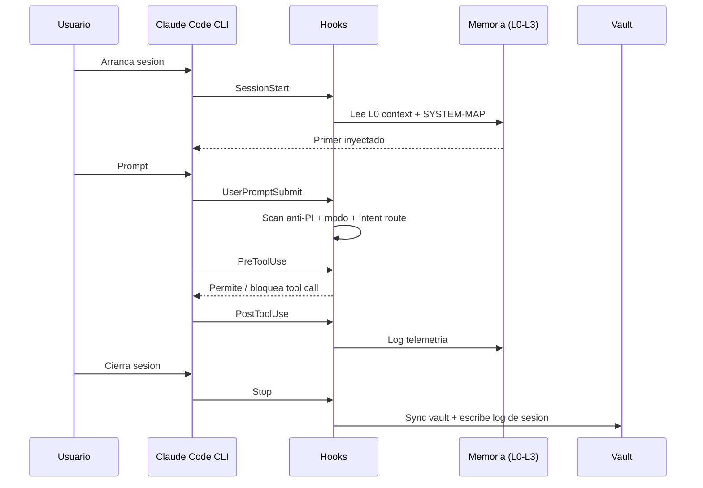

<!--
  ULTRON — README (Espanol)
  English version: README.md
-->

<div align="center">

<h1>ULTRON</h1>

<p><b>Tu centro de mando local para Claude Code.</b></p>

<p>
  Memoria jerarquica &middot; personas opt-in &middot; hooks endurecidos &middot;
  un panel desktop que convierte el trabajo de varios dias con Claude
  (y, si quieres, Codex y Gemini) en algo que puedes gestionar de verdad.
</p>

<p>
  <a href="https://github.com/SkiTemplar/ultron/actions/workflows/ci.yml"></a>
  <a href="LICENSE"></a>
  <a href="CHANGELOG.md"></a>
  
  <a href="https://claude.com/claude-code"></a>
  
  
</p>

<p>
  <b>Docs:</b>
  <a href="INSTALL.md">Instalacion</a> &middot;
  <a href="docs/QUICKSTART.md">Quickstart</a> &middot;
  <a href="CHANGELOG.md">Changelog</a> &middot;
  <a href="CONTRIBUTING.md">Contribuir</a> &middot;
  <a href="SECURITY.md">Seguridad</a> &middot;
  <a href="AUTHORS.md">Autores</a> &middot;
  <a href="NOTICE">Notice</a> &middot;
  <a href="LICENSE">Licencia</a>
</p>

<p>
  <b>Lee en:</b>
  <a href="README.md">English</a>
  ·
  <a href="README.es.md">Espanol</a>
</p>

<sub>Texto plano, opt-in, cero SaaS, cero telemetria. La fontaneria es el producto.</sub>

</div>

> [!WARNING]
> **Beta publica.** ULTRON se publica como preview funcional. Hay bordes sin pulir, cambios incompatibles entre minor releases y una cola continua de arreglos. Los reports y PRs son MUY bienvenidos &mdash; abre un issue en este repo. Cada release nueva entra en el [Changelog](CHANGELOG.md) a medida que aparecen bugs.

<p align="center">
  
  <br />
  <sub><i>Dashboard &mdash; Full Diagnostic, Maintenance commands, Pending items.</i></sub>
</p>

<p align="center">
  
  <br />
  <sub><i>Pesta&ntilde;a Skills &mdash; scanner de seguridad estricto, skills quarantined arriba del todo, findings + waiver inline.</i></sub>
</p>

<p align="center">
  
  <br />
  <sub><i>Pesta&ntilde;a Agents &mdash; 9 agentes ULTRON + 15 community pre-instalados, 60 mas disponibles en el catalogo, mismo ruleset PI que Skills.</i></sub>
</p>

> Los screenshots se llenar&aacute;n a medida que avance la beta p&uacute;blica &mdash; el layout que ves coincide con la versi&oacute;n actual.

---

## Tabla de contenidos

<details>
<summary><b>Click para expandir</b></summary>

1. [Que es ULTRON](#que-es-ultron)
2. [Que resuelve](#que-resuelve)
3. [Como funciona](#como-funciona)
4. [Quick start](#quick-start)
5. [Funcionalidades](#funcionalidades)
6. [Arquitectura](#arquitectura)
7. [Personalizar](#personalizar)
8. [Stack tecnico](#stack-tecnico)
9. [Roadmap](#roadmap)
10. [Contribuir](#contribuir)
11. [Origen y atribucion](#origen-y-atribucion)
12. [Licencia](#licencia)
13. [Creditos](#creditos)

</details>

---

## Que es ULTRON

ULTRON es un **centro de mando local** que se monta encima del CLI oficial de [Claude Code](https://claude.com/claude-code). Vive entero en tu carpeta de usuario (`~/.ultron/`), guarda todo en archivos de texto plano y pareja el runtime con un panel desktop Tauri para que un proyecto de varios dias no se sienta como diez conversaciones huerfanas pegadas con cinta aislante.

> [!NOTE]
> ULTRON no sustituye a Claude Code. Lo envuelve, le da memoria persistente, enruta personas especializadas y expone la maquinaria en una UI que puedes auditar y editar.

| Pilar | Lo que aporta |
|---|---|
| **Memoria jerarquica** | Cuatro capas (L0 contexto caliente hasta L3 mirror remoto) para que Claude retome donde lo dejaste tras cada reinicio. |
| **Personas y skills** | Un dispatcher activa al especialista correcto segun la intencion: `debugger`, `code-reviewer`, `ui-designer`, etc. |
| **Agents** | 9 agentes ULTRON + 15 community = 24 subagentes autonomos pre-instalados, mas un catalogo de 60 adicionales, todos pasados por el mismo ruleset PI que las skills. |
| **Hooks endurecidos** | Anti-prompt-injection, recall automatico de notas, log de sesion y sync con el vault — todo enchufado a `settings.json`. |
| **Panel desktop** | Tauri 2 + React 19 con 16 pestañas para memoria, skills, agents, hooks, planes, sesiones, costes y MCPs. |

**Filosofia.** Archivos de texto plano. Todo opt-in. Cero SaaS. Cero telemetria externa. No hay backend en la nube. Arranca piezas, forkealas o edita el JSON a mano — el sistema esta pensado para desmontarse.

---

## Que resuelve

Cuando trabajas con Claude Code en proyectos reales aparecen los mismos problemas:

- El contexto se evapora entre sesiones; pierdes los primeros diez minutos rebriefando al modelo.
- Skills, hooks y servidores MCP viven en carpetas distintas y no hay un panel unico.
- Los planes largos derivan; no sabes que se decidio hace tres dias sin hacer scroll en chats.
- Costes y uso de herramientas se acumulan sin visibilidad.

ULTRON resuelve todo eso en local, sin alquilar un backend:

- Cada sesion nueva arranca leyendo un primer pre-computado (`context.md`, tope ~400 tokens).
- Las personas auto-enrutan por intencion — no necesitas recordar los nombres exactos de las skills.
- El vault (`~/.ultron-vault/`) se indexa en SQLite FTS5 y en una instancia local de Qdrant (binario nativo de Windows, sin Docker) para recall semantico.
- El panel concentra hooks, planes, sesiones, costes y MCPs instalados en una sola ventana.

---

## Como funciona

Cuando arrancas Claude Code, lee `~/.claude/CLAUDE.md` (tus instrucciones globales). Ese archivo contiene un **wake-up protocol** que dispara la lectura de `~/.ultron/.tmp/context.md` (memoria L0) y `~/.ultron/SYSTEM-MAP.md` (indice estable de rutas). En menos de un segundo, Claude sabe quien eres, que estabas haciendo y donde buscar lo demas.

A partir de ahi, los hooks definidos en `~/.claude/settings.json` se enchufan al ciclo:



Las **cuatro capas de memoria**:

| Capa | Donde vive | Para que sirve |
|---|---|---|
| **L0** hot context | `~/.ultron/.tmp/context.md` | Primer pre-computado, <=400 tokens, leido en cada sesion |
| **L1** indexed | `~/.ultron/brain_index/index.db` | SQLite FTS5 sobre el vault troceado, recall BM25 |
| **L2** vault | `~/.ultron-vault/*.md` | Notas markdown curadas con wikilinks — fuente de verdad |
| **L3** remote | git remote opcional | Mirror externo de L2, drenado por el hook `Stop` |

Encima de L1 vive una instancia local de **Qdrant** (el binario nativo de Windows — sin Docker, sin daemon) para recall semantico sobre el mismo corpus. Un sistema de decay devuelve notas estancadas a la superficie cada vez que arrancas sesion.

---

## Quick start

> [!IMPORTANT]
> Windows 11 es la plataforma principal. macOS y Linux no estan testeados oficialmente en v15.4.

**One-liner.**

```powershell
git clone https://github.com/SkiTemplar/ultron.git $env:USERPROFILE\.ultron
cd $env:USERPROFILE\.ultron
.\install.ps1
```

**Flags utiles.**

```powershell
.\install.ps1                  # interactivo (recomendado)
.\install.ps1 -NonInteractive  # CI / desatendido (acepta defaults)
.\install.ps1 -Verbose         # debug paso a paso
.\install.ps1 -NoApp           # sin la build de Tauri (mas rapido, headless)
.\install.ps1 -NoDocker        # saltar Qdrant (recall semantico apagado)
```

El installer es **idempotente** — puedes ejecutarlo varias veces sin miedo; detecta lo que ya esta hecho y solo aplica los cambios pendientes. Si algo falla, mira [`INSTALL.md`](INSTALL.md) para troubleshooting manual.

Para desinstalar todo lo que ULTRON metió en tu maquina (sin tocar tus skills en `~/.claude/skills/`):

```powershell
.\uninstall.ps1            # interactivo: confirma antes de borrar
.\uninstall.ps1 -DryRun    # solo enseña lo que tocaría
.\uninstall.ps1 -KeepBackups   # renombra ~/.ultron/ en vez de borrarlo
```

<details>
<summary><b>Que hace el installer (10 pasos)</b></summary>

| # | Paso | Que hace |
|---|---|---|
| 1 | Preflight | Chequeos de OS / PowerShell / RAM / disco / internet |
| 2 | Claude Code | Verifica que el CLI esta instalado y autenticado |
| 3 | uv | Instala uv si falta |
| 4 | Qdrant | Descarga el binario nativo de Windows (v1.18.0) en `~/.ultron/qdrant-native/` y siembra `config/production.yaml`. Sin Docker, sin daemon. Lo arranca `ensure-qdrant.ps1` en cada SessionStart |
| 5 | Layout | Crea `~/.ultron/`, `~/.ultron-vault/`, `~/.claude/skills/` |
| 6 | Hooks | Fusiona `templates/settings-hooks.json` en `settings.json` (no destructivo, con backup) |
| 7 | Skills | Picker interactivo: 12 core (siempre ON) + slots opt-in |
| 8 | brain_index | Inicializa el indice SQLite FTS5 |
| 9 | Control Center | `npm install` y opcionalmente `tauri build` |
| 10 | Doctor | Verificacion final con `doctor.py` (0 = clean, 1 = warn, 2 = block) |

</details>

---

## Funcionalidades

| Area | Highlights |
|---|---|
| **Memoria** | Jerarquia L0-L3, indice SQLite FTS5, Qdrant nativo para recall semantico (sin Docker), decay surfacing |
| **Personas** | 12 skills core, dispatch por intencion, ruleset anti-PI PI001-PI013 |
| **Agents** | 24 pre-instalados (9 ULTRON + 15 community), catalogo con 60 mas en `cockpit/agent-catalog.json`, pestaña Agents dedicada con el mismo scanner de seguridad que Skills, slot de Agent en el AI Router, embeddings en Qdrant para descubrimiento semantico |
| **Hooks** | `SessionStart`, `UserPromptSubmit`, `PreToolUse`, `PostToolUse`, `Stop` — todos auditables |
| **Control Center** | 16 pestañas: Dashboard, Usage, Notifications, Changelog, News, MCPs, Skills, Agents, Memory, Sessions, Projects, Gaming, Plans, Stats, Personal, Settings. La pestaña System incluye sub-pestañas: Overview, Schedules, Hooks. (La pestaña Logs está cableada pero deshabilitada hoy.) |
| **Dual-mode** | Peer review opcional con Codex CLI + delegacion long-context con Gemini CLI, ambos via suscripcion |
| **Seguridad** | Scanner anti-prompt-injection, carpeta de cuarentena, allow-list IPC en Tauri |
| **Privacidad** | Sin telemetria, sin llamadas externas sin accion del usuario, el vault es tuyo |

<details>
<summary><b>Skills core (12, instaladas por defecto)</b></summary>

`ultron` &middot; `senior-engineer` &middot; `code-reviewer` &middot; `debugger` &middot; `refactoring-specialist` &middot; `ui-designer` &middot; `business-strategist` &middot; `skill-creator` &middot; `superpowers` &middot; `webapp-testing` &middot; `windows-admin` &middot; `second-opinion`

Los slots opt-in se entregan como **plantillas vacias**: forkea ULTRON y rellena las tuyas (asistente financiero, voz creativa, ingeniero de game engine, agente personal de mail/calendar, etc.). El picker de `install.ps1` pregunta una por una.

</details>

<details>
<summary><b>Agents (24 pre-instalados, catalogo de 60+)</b></summary>

Los agents viven en `~/.claude/agents/*.md` y siguen el mismo contrato de YAML frontmatter que las skills. ULTRON trae 9 agentes propios — `ultron-arch`, `ultron-changelog`, `ultron-context`, `ultron-docs`, `ultron-metadata`, `ultron-perf`, `ultron-refactor`, `ultron-security`, `ultron-test` — mas 15 community seleccionados del catalogo publico: `architect-reviewer`, `code-reviewer`, `context-manager`, `debugger`, `legacy-modernizer`, `mcp-developer`, `multi-agent-coordinator`, `powershell-7-expert`, `python-pro`, `react-specialist`, `refactoring-specialist`, `rust-engineer`, `security-auditor`, `test-automator`, `typescript-pro`.

Hay 60 agentes adicionales descritos en `cockpit/agent-catalog.json` que se instalan a demanda desde la pestaña Agents. Cada agente pasa por el mismo scanner PI001-PI013 que gatekeepa a las skills; los que fallan caen en quarantine con el mismo flujo de waiver Allow-anyway. El AI Router expone un slot Agent para que una tarea apunte a un agente en lugar de a un modelo crudo. Las descripciones de agentes se embeben en Qdrant con `scripts/cockpit/embed_agents.py` para recall semantico.

</details>

---

## Arquitectura


<details>
<summary><b>Matriz de compatibilidad</b></summary>

| Plataforma | Estado |
|---|---|
| Windows 11 | Soportada |
| Windows 10 | Best effort (no esta en CI) |
| macOS | Planificada para v16 |
| Linux | Planificada para v16 |

</details>

---

## Personalizar

ULTRON esta construido para que lo desmontes y lo recables a tu gusto. Todo es texto plano debajo de tu home:

- **`~/.claude/CLAUDE.md`** — tus instrucciones globales para cada sesion de Claude Code. Edita directamente o usa la pestaña `Personal` del Control Center.
- **`~/.claude/settings.json`** — hooks y permisos. La pestaña `Hooks` es un editor tipado sobre este archivo.
- **`~/.claude/skills/<name>/SKILL.md`** — activar / desactivar / editar personas. Borra una carpeta para desinstalar la skill.
- **`~/.claude/agents/<name>.md`** — misma idea para subagentes autonomos. La pestaña Agents muestra estado de instalacion, findings de seguridad y el catalogo de community agents desde `cockpit/agent-catalog.json`.
- **`~/.ultron-vault/`** — tu vault L2. Markdown plano con wikilinks. Lo que escribas aqui se indexa en la proxima ejecucion de `brain_index.py update`.
- **`~/.ultron/plans/PLANS.json`** — tus planes en curso. La pestaña `Plans` es un frontend sobre este archivo.
- **`~/.ultron/personal/profile.md`** — tu perfil personal (intereses, contexto, preferencias).

> [!TIP]
> Esto es **tu** sistema. Forkealo. Modificalo. La filosofia es texto plano mas Git, asi que todo es revisable con un diff.

---

## Stack tecnico

| Capa | Tecnologia |
|---|---|
| Control Center (frontend) | Tauri 2 + React 19 + TypeScript (strict) |
| Control Center (backend) | Rust (estable) |
| Herramientas Python (cockpit/) | Python 3.13 + uv |
| Memoria | SQLite FTS5 + Qdrant (binario nativo de Windows, sin Docker) |
| Agents | Markdown con YAML frontmatter en `~/.claude/agents/`, catalogo en `cockpit/agent-catalog.json`, embeddings via `embed_agents.py` |
| Scripting OS | PowerShell 5.1+ |
| Runtimes LLM | Claude Code CLI (principal), Codex CLI (peer review, opcional), Gemini CLI (long-context, opcional) |

---

## Roadmap

| Release | Estado | Highlights |
|---|---|---|
| **v15.4** | Actual | Pulido del Control Center — instalador visual con 10 toggles opcionales, lanzamiento IDE-aware (13 editores incluyendo CLion + familia JetBrains), visor Markdown en Agents, 36 button prompts en cada seccion, Cmd+K palette con comandos de mantenimiento, auto-detector de updates al arrancar + rebuild 1-click, panel Settings → Features + AI Router con defaults inteligentes por zona. |
| **v15.3.x** | Estable | Auto-updater Tauri, Projects IDE-aware launch, Agents tab, AI Router auto-mode, security scanner, ecosistema de agentes. |
| **v15.2** | Lanzado | Control Center con 17 pestañas, memoria L0-L3, hooks endurecidos, 12 skills core, dual-mode v2 via CLIs de suscripcion. |
| **v15.5+** | Siguiente | Bus de eventos cross-session, supervisor daemon, companion movil via Tailscale. |
| **v16** | Futuro | Pipeline DAG, overnight loop, expansion multi-plataforma. |

Notas detalladas en [`CHANGELOG.md`](CHANGELOG.md).

---

## Contribuir

PRs bienvenidos en arquitectura, packaging, soporte cross-platform y skills core. El contenido personal (feeds de noticias del autor, categorias de gasto, librerias de juegos) esta fuera de scope — forkealos para ti. Guia completa en [`CONTRIBUTING.md`](CONTRIBUTING.md).

Reporta problemas de seguridad de forma privada segun [`SECURITY.md`](SECURITY.md).

---

## Origen y atribucion

ULTRON fue originalmente creado por **USER SURNAME** en 2026.

El proyecto es open source bajo MIT (ver [`LICENSE`](LICENSE)). Forks y modificaciones son bienvenidos — contribuidores que extiendan sustancialmente el trabajo pueden añadirse a [`AUTHORS.md`](AUTHORS.md). Por los terminos de MIT, cualquier copia o trabajo derivado debe conservar el aviso de copyright original que nombra a USER SURNAME como autor original de ULTRON. El nombre "ULTRON" identifica al proyecto original; los proyectos derivados deberian elegir un nombre distinto salvo que pretendan upstream sus cambios. Politica completa en [`NOTICE`](NOTICE).

---

## Licencia

MIT — ver [`LICENSE`](LICENSE).

---

## Creditos

ULTRON orquesta tres herramientas que no le pertenecen y sin las que no existiria:

- [**Claude Code**](https://claude.com/claude-code) — Anthropic. El runtime que ULTRON envuelve.
- [**Codex CLI**](https://github.com/openai/codex) — OpenAI. Peer review y rescue opcional.
- [**Gemini CLI**](https://github.com/google-gemini/gemini-cli) — Google. Long-context delegate e image generation opcional.

La capa vectorial usa [Qdrant](https://qdrant.tech). El shell desktop es [Tauri](https://tauri.app). El pipeline Python corre sobre [uv](https://github.com/astral-sh/uv). Gracias a los cuatro proyectos.

<div align="center">

<sub>Construido por <a href="https://github.com/SkiTemplar">USER SURNAME</a> &middot; MIT &middot; 2026</sub>

</div>
