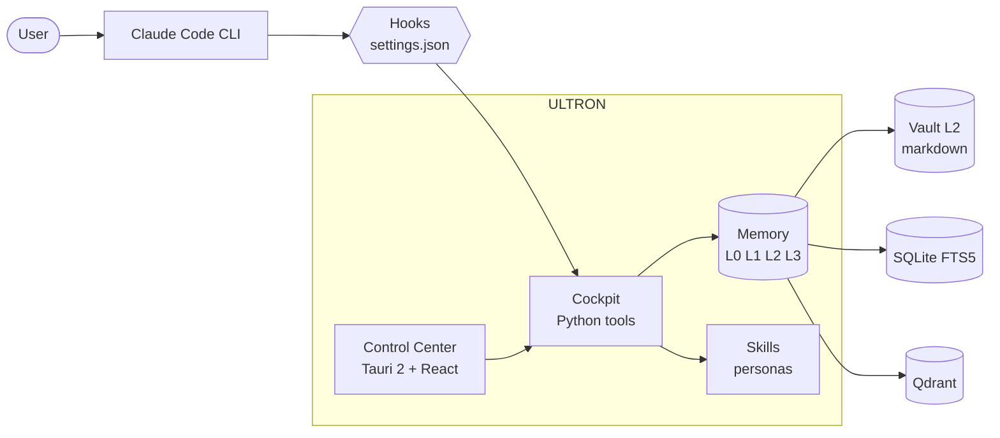

# ULTRON

[](LICENSE)
[](CHANGELOG.md)
[](#requisitos--requirements)
[](https://claude.com/claude-code)

**ULTRON — Tu centro de mando local para Claude Code.**
**ULTRON — Your local command center for Claude Code.**

Memoria jerárquica, personas opt-in, hooks endurecidos y un panel desktop que convierte el trabajo de varios días con Claude (y, si quieres, Codex y Gemini) en algo que puedes gestionar de verdad.

Hierarchical memory, opt-in personas, hardened hooks, and a desktop cockpit that turns multi-day work with Claude (and optionally Codex and Gemini) into something you can actually manage.

---

## 1. ¿Qué es ULTRON?

### Español

ULTRON es un **centro de mando local** que se monta encima del CLI oficial de [Claude Code](https://claude.com/claude-code). Vive entero en tu carpeta de usuario (`~/.ultron/`), guarda todo en archivos de texto plano y resuelve un problema concreto: cuando trabajas con Claude Code en proyectos de varios días, el contexto se pierde entre sesiones, las skills y hooks viven dispersas, y no hay forma de ver de un vistazo el estado de tu sistema.

Lo que ULTRON añade:

- Una **capa de memoria jerárquica** (L0 a L3) que sobrevive a los reinicios y mantiene a Claude orientado entre sesiones.
- Un **sistema de personas y skills** que activa el experto adecuado según la intención del usuario (debugger, code-reviewer, ui-designer, etc.).
- Una **batería de hooks** que se enchufan al `settings.json` de Claude Code: anti-prompt-injection, auto-recall de notas, sesión-log, sincronización con el vault.
- Un **panel desktop** (Tauri 2 + React 19) con 15 pestañas que orquesta memoria, skills, hooks, planes, sesiones, costes y MCPs.

**Filosofía:** archivos de texto plano, todo opt-in, cero SaaS, cero telemetría externa. No hay backend en la nube. Si quieres tirar una pieza, la tiras. Si quieres forkearla, la forkeas. La fontanería es el producto.

### English

ULTRON is a **local command center** layered on top of the official [Claude Code](https://claude.com/claude-code) CLI. It lives entirely in your home folder (`~/.ultron/`), stores everything in plain text files, and solves a concrete problem: when you work with Claude Code on multi-day projects, context is lost between sessions, skills and hooks live scattered, and there is no single view of your system's state.

What ULTRON adds:

- A **hierarchical memory layer** (L0 to L3) that survives reboots and keeps Claude oriented across sessions.
- A **personas and skills system** that activates the right specialist by user intent (debugger, code-reviewer, ui-designer, etc.).
- A **battery of hooks** wired into Claude Code's `settings.json`: anti-prompt-injection, note auto-recall, session logging, vault sync.
- A **desktop cockpit** (Tauri 2 + React 19) with 15 tabs that orchestrates memory, skills, hooks, plans, sessions, costs, and MCPs.

**Philosophy:** plain text files, everything opt-in, zero SaaS, zero external telemetry. There is no cloud backend. If you want to rip a piece out, rip it. If you want to fork it, fork it. The plumbing is the product.

---

## 2. ¿Para qué sirve? — What is it for?

### Español

Casos de uso concretos:

- **Proyectos largos en Claude Code sin perder contexto.** Cada sesión nueva arranca leyendo un primer (`context.md`, ≤400 tokens) que resume dónde lo dejaste.
- **Personas especializadas que se activan por intención.** Escribes "revisa este código" y el dispatcher invoca `code-reviewer`. Escribes "depúrame este test" y entra `debugger`. No tienes que recordar los nombres.
- **Memoria semántica de tus decisiones técnicas.** Notas en el vault (`~/.ultron-vault/`) se indexan en SQLite FTS5 y, opcionalmente, en Qdrant para búsqueda por significado.
- **Panel para todo lo que orbita Claude Code:** Qdrant, hooks, memoria, planes en curso, sesiones pasadas, costes, MCPs instalados.
- **Hooks automáticos** que se ejecutan en cada paso del ciclo de Claude Code: escaneo anti-prompt-injection, recall de notas relevantes, log de sesión al cerrar, sync con el vault.

### English

Concrete use cases:

- **Long projects in Claude Code without losing context.** Every new session starts by reading a primer (`context.md`, ≤400 tokens) that summarizes where you left off.
- **Specialized personas activated by intent.** Type "review this code" and the dispatcher invokes `code-reviewer`. Type "debug this test" and `debugger` takes over. No need to remember names.
- **Semantic memory of your technical decisions.** Vault notes (`~/.ultron-vault/`) are indexed in SQLite FTS5 and optionally Qdrant for meaning-based search.
- **A dashboard for everything orbiting Claude Code:** Qdrant, hooks, memory, in-flight plans, past sessions, costs, installed MCPs.
- **Automatic hooks** that run at each step of Claude Code's lifecycle: anti-prompt-injection scanning, relevant note recall, session log on close, vault sync.

---

## 3. ¿Cómo funciona? — How does it work?

### Diagrama / Diagram



### Español

Cuando arrancas Claude Code, lee primero `~/.claude/CLAUDE.md` (instrucciones globales). Ese archivo contiene un "wake-up protocol" que dispara la lectura de `~/.ultron/.tmp/context.md` (memoria L0) y `~/.ultron/SYSTEM-MAP.md` (índice estable de rutas). En menos de un segundo, Claude sabe quién eres, qué estabas haciendo y dónde buscar lo demás.

A partir de ahí, los hooks definidos en `~/.claude/settings.json` se enchufan al ciclo:

- **SessionStart** prepara el contexto y avisa de bloqueantes.
- **UserPromptSubmit** escanea tu prompt contra reglas anti-prompt-injection, decide modo (MEDIUM / HIGH / ULTRA) y enrutador de intención.
- **PreToolUse** valida cada llamada a herramienta (bloquea bash peligroso, auto-aprueba lectura).
- **PostToolUse** registra telemetría y captura feedback.
- **Stop** sincroniza el vault, escribe el log de sesión y limpia archivos temporales.

Las **cuatro capas de memoria** funcionan así:

| Capa | Dónde vive | Para qué sirve |
|---|---|---|
| **L0** hot context | `~/.ultron/.tmp/context.md` | Primer pre-computado, ≤400 tokens, leído en cada sesión |
| **L1** indexed | `~/.ultron/brain_index/index.db` | SQLite FTS5 sobre el vault troceado, recall BM25 |
| **L2** vault | `~/.ultron-vault/*.md` | Notas markdown curadas con wikilinks (fuente de verdad) |
| **L3** remote | git remote opcional | Mirror externo de L2, drenado por el hook Stop |

Encima de L1 vive opcionalmente **Qdrant** (vector store local) para recall semántico sobre el mismo corpus. Un sistema de decay devuelve notas estancadas a la superficie cada vez que arrancas sesión.

### English

When you start Claude Code, it first reads `~/.claude/CLAUDE.md` (global instructions). That file contains a "wake-up protocol" that triggers reading `~/.ultron/.tmp/context.md` (L0 memory) and `~/.ultron/SYSTEM-MAP.md` (stable path index). In under a second, Claude knows who you are, what you were doing, and where to look for the rest.

From there, the hooks defined in `~/.claude/settings.json` plug into the lifecycle:

- **SessionStart** primes context and surfaces blockers.
- **UserPromptSubmit** scans your prompt against anti-prompt-injection rules, decides mode (MEDIUM / HIGH / ULTRA), and dispatches by intent.
- **PreToolUse** validates each tool call (blocks dangerous bash, auto-approves read-only).
- **PostToolUse** logs telemetry and captures feedback.
- **Stop** syncs the vault, writes the session log, and cleans up temp files.

The **four memory layers** work like this:

| Layer | Where it lives | What it does |
|---|---|---|
| **L0** hot context | `~/.ultron/.tmp/context.md` | Pre-computed primer, ≤400 tokens, read on every session |
| **L1** indexed | `~/.ultron/brain_index/index.db` | SQLite FTS5 over chunked vault, BM25 retrieval |
| **L2** vault | `~/.ultron-vault/*.md` | Curated markdown notes with wikilinks (source of truth) |
| **L3** remote | optional git remote | Off-machine mirror of L2, drained by Stop hook |

On top of L1 lives an optional **Qdrant** instance (local vector store) for semantic recall over the same corpus. A decay system bubbles stale notes back to the surface every time you start a session.

---

## 4. Requisitos / Requirements

### Español

- **Windows 11** (plataforma principal; macOS / Linux no testeados oficialmente)
- **Claude Code CLI** autenticado contra tu cuenta de Claude
- **Node.js 22+** y npm (para el Control Center)
- **Rust toolchain estable** (para compilar el binario del Control Center)
- **uv** para Python (el installer lo instala si falta)
- **Docker Desktop** (opcional; solo si quieres Qdrant local para recall semántico)
- 8 GB de RAM mínimos recomendados, 5 GB libres en disco

### English

- **Windows 11** (primary platform; macOS / Linux not officially tested)
- **Claude Code CLI** authenticated against your Claude account
- **Node.js 22+** and npm (for the Control Center)
- **Rust stable toolchain** (to compile the Control Center binary)
- **uv** for Python (the installer fetches it if missing)
- **Docker Desktop** (optional; only if you want local Qdrant for semantic recall)
- 8 GB RAM minimum recommended, 5 GB free disk space

---

## 5. Instalación / Installation

### One-liner

```powershell
git clone https://github.com/SkiTemplar/ultron.git $env:USERPROFILE\.ultron
cd $env:USERPROFILE\.ultron
.\install.ps1
```

Flags útiles / Useful flags:

```powershell
.\install.ps1                  # interactive (recommended)
.\install.ps1 -NonInteractive  # CI / unattended (accept defaults)
.\install.ps1 -Verbose         # debug what each step is doing
.\install.ps1 -NoApp -NoDocker # bare-bones: skip Tauri build and Qdrant
```

### Qué hace el installer / What the installer does

| Paso / Step | Español | English |
|---|---|---|
| 1. Preflight | Comprueba OS, PowerShell, RAM, disco e internet | Checks OS, PowerShell, RAM, disk, internet |
| 2. Claude Code | Verifica que el CLI está instalado y autenticado | Verifies the CLI is installed and authenticated |
| 3. uv | Instala uv si falta | Installs uv if missing |
| 4. Docker | Detecta Docker Desktop (opcional) | Detects Docker Desktop (optional) |
| 5. Qdrant | Lanza el contenedor `qdrant/qdrant` en el puerto 6333 | Runs the `qdrant/qdrant` container on port 6333 |
| 6. Layout | Crea `~/.ultron/`, `~/.ultron-vault/`, `~/.claude/skills/` | Creates `~/.ultron/`, `~/.ultron-vault/`, `~/.claude/skills/` |
| 7. Hooks | Fusiona `templates/settings-hooks.json` en `settings.json` (no destructivo, hace backup) | Merges `templates/settings-hooks.json` into `settings.json` (non-destructive, with backup) |
| 8. Skills | Picker interactivo: 12 core (siempre ON) + 8 personales (opt-in) | Interactive picker: 12 core (always ON) + 8 personal (opt-in) |
| 9. brain_index | Inicializa el índice SQLite FTS5 | Initializes the SQLite FTS5 index |
| 10. Control Center | `npm install` y opcionalmente `tauri build` | `npm install` and optionally `tauri build` |
| 11. Doctor | Verificación final con `doctor.py` (0=clean, 1=warn, 2=block) | Final verification via `doctor.py` (0=clean, 1=warn, 2=block) |

**Idempotente / Idempotent.** Puedes correr `install.ps1` varias veces sin miedo: detecta lo que ya está hecho y solo aplica los cambios pendientes.

You can run `install.ps1` multiple times safely: it detects what is already done and only applies pending changes.

Si algo falla, consulta [`INSTALL.md`](INSTALL.md) para los pasos manuales de troubleshooting.
If something fails, see [`INSTALL.md`](INSTALL.md) for manual troubleshooting steps.

### Skills disponibles / Available skills

**Core (12, instaladas por defecto / installed by default):**

`ultron` · `senior-engineer` · `code-reviewer` · `debugger` · `refactoring-specialist` · `ui-designer` · `business-strategist` · `skill-creator` · `superpowers` · `webapp-testing` · `windows-admin` · `second-opinion`

**Personales (opt-in, ejemplos / opt-in, examples):**

Los slots opt-in son **plantillas vacías**: forkea ULTRON y rellena las tuyas (asistente personal, finanzas, escritura creativa, motor de juegos, etc.). El installer pregunta una por una.

The opt-in slots are **empty templates**: fork ULTRON and fill in your own (personal assistant, finances, creative writing, game engine, etc.). The installer asks one at a time.

---

## 6. Personalización / Customization

### Español

ULTRON está construido para que lo desmontes y lo recables a tu gusto. Todo es texto plano debajo de tu home:

- **`~/.claude/CLAUDE.md`** — Tus instrucciones globales para cada sesión de Claude Code. Edita directamente o usa la pestaña `Personal` del Control Center.
- **`~/.claude/settings.json`** — Hooks y permisos. La pestaña `Hooks` es un editor tipado sobre este archivo.
- **`~/.claude/skills/<name>/SKILL.md`** — Activar / desactivar / editar personas. Borra una carpeta para desinstalar la skill.
- **`~/.ultron-vault/`** — Tu vault L2. Markdown plano con wikilinks. Lo que escribas aquí se indexa en la próxima ejecución de `brain_index.py update`.
- **`~/.ultron/plans/PLANS.json`** — Tus planes en curso. La pestaña `Plans` es un frontend sobre este archivo.
- **`~/.ultron/personal/profile.md`** — Tu perfil personal (intereses, contexto, preferencias).

**Esto es TU sistema. Fork it. Modifícalo. La filosofía es texto plano + Git.**

### English

ULTRON is built to be taken apart and rewired to your taste. Everything is plain text under your home:

- **`~/.claude/CLAUDE.md`** — Your global instructions for every Claude Code session. Edit directly or use the Control Center's `Personal` tab.
- **`~/.claude/settings.json`** — Hooks and permissions. The `Hooks` tab is a typed editor over this file.
- **`~/.claude/skills/<name>/SKILL.md`** — Activate / deactivate / edit personas. Delete a folder to uninstall a skill.
- **`~/.ultron-vault/`** — Your L2 vault. Plain markdown with wikilinks. Whatever you write here is indexed on the next `brain_index.py update` run.
- **`~/.ultron/plans/PLANS.json`** — Your in-flight plans. The `Plans` tab is a frontend over this file.
- **`~/.ultron/personal/profile.md`** — Your personal profile (interests, context, preferences).

**This is YOUR system. Fork it. Modify it. The philosophy is plain text + Git.**

---

## 7. Stack técnico / Tech stack

- **Control Center**: Tauri 2 + React 19 + TypeScript
- **Backend desktop**: Rust (estable / stable)
- **Cockpit**: Python 3.13 + uv
- **Memoria / Memory**: SQLite FTS5 + Qdrant (opcional / optional)
- **Scripts Windows**: PowerShell 5.1+
- **Runtime LLM**: Claude Code CLI (Anthropic) — opcionalmente Codex CLI (OpenAI) y Gemini CLI (Google) para review y delegación

---

## 8. Roadmap

### Español

- **Actual — v15.2.** Control Center estable con 15 pestañas, memoria L0-L3, hooks endurecidos, 12 skills core + slots opt-in personalizables, dual-mode v2 vía CLIs de suscripción.
- **Siguiente — v15.3.** Capa anti-alucinación, bus de eventos cross-session, supervisor daemon.
- **Futuro — v16.** Pipeline DAG, overnight loop, mobile companion PWA, expansión multi-plataforma.

Notas de release en [`CHANGELOG.md`](CHANGELOG.md).

### English

- **Current — v15.2.** Stable Control Center with 15 tabs, L0-L3 memory, hardened hooks, 12 core skills + customizable opt-in slots, dual-mode v2 via subscription CLIs.
- **Next — v15.3.** Anti-hallucination layer, cross-session event bus, supervisor daemon.
- **Future — v16.** Pipeline DAG, overnight loop, mobile companion PWA, multi-platform expansion.

Release notes in [`CHANGELOG.md`](CHANGELOG.md).

---

## 9. Origen y atribución / Origin and attribution

ULTRON fue originalmente creado por **USER SURNAME** en 2026.

ULTRON was originally created by **USER SURNAME** in 2026.

El proyecto es open source bajo MIT (ver [`LICENSE`](LICENSE)). Forks y modificaciones son bienvenidos — contribuidores que extiendan sustancialmente el trabajo pueden añadirse a [`AUTHORS.md`](AUTHORS.md). Por los términos de MIT, cualquier copia o trabajo derivado debe conservar el aviso de copyright original que nombra a USER SURNAME como autor original de ULTRON. El nombre "ULTRON" identifica al proyecto original; los proyectos derivados deberían elegir un nombre distinto salvo que pretendan upstream sus cambios. Política completa en [`NOTICE`](NOTICE).

The project is open source under MIT (see [`LICENSE`](LICENSE)). Forks and modifications are welcome — contributors who substantially extend the work may add themselves to [`AUTHORS.md`](AUTHORS.md). Per MIT terms, any copy or derivative work must retain the original copyright notice naming USER SURNAME as the originator of ULTRON. The name "ULTRON" identifies the original project; derivative projects are encouraged to pick a distinct name unless they intend to upstream their changes. Full attribution policy in [`NOTICE`](NOTICE).

---

## 10. Licencia / License

MIT — ver / see [`LICENSE`](LICENSE).

---

## 11. Créditos / Credits

ULTRON orquesta tres herramientas que no le pertenecen y sin las que no existiría:

ULTRON orchestrates three tools it does not own and could not exist without:

- [**Claude Code**](https://claude.com/claude-code) — Anthropic. El runtime que ULTRON envuelve. / The runtime ULTRON wraps.
- [**Codex CLI**](https://github.com/openai/codex) — OpenAI. Peer review y rescue opcional. / Optional peer review and rescue.
- [**Gemini CLI**](https://github.com/google-gemini/gemini-cli) — Google. Long-context delegate e image generation opcional. / Optional long-context delegate and image generation.

La capa vectorial usa [Qdrant](https://qdrant.tech). El shell desktop es [Tauri](https://tauri.app). El pipeline Python corre sobre [uv](https://github.com/astral-sh/uv). Gracias a los cuatro proyectos.

The vector layer runs on [Qdrant](https://qdrant.tech). The desktop shell is [Tauri](https://tauri.app). The Python pipeline runs on [uv](https://github.com/astral-sh/uv). Thanks to all four projects.

---

## 12. Contribuir / Contributing

PRs bienvenidos en arquitectura, packaging, soporte cross-platform y skills core. El contenido personal (feeds de noticias del autor, categorías de gasto, librerías de juegos) está fuera de scope — forkéalos para ti. Ver [`CONTRIBUTING.md`](CONTRIBUTING.md).

PRs welcome on architecture, packaging, cross-platform support, and core skills. Personal-flavored content (the author's news feeds, expense categories, gaming libraries) is out of scope — fork those for yourself. See [`CONTRIBUTING.md`](CONTRIBUTING.md).

Reporta problemas de seguridad de forma privada según [`SECURITY.md`](SECURITY.md). Expectativas de comportamiento en [`CODE_OF_CONDUCT.md`](CODE_OF_CONDUCT.md).

Report security issues privately per [`SECURITY.md`](SECURITY.md). Behavioral expectations live in [`CODE_OF_CONDUCT.md`](CODE_OF_CONDUCT.md).
