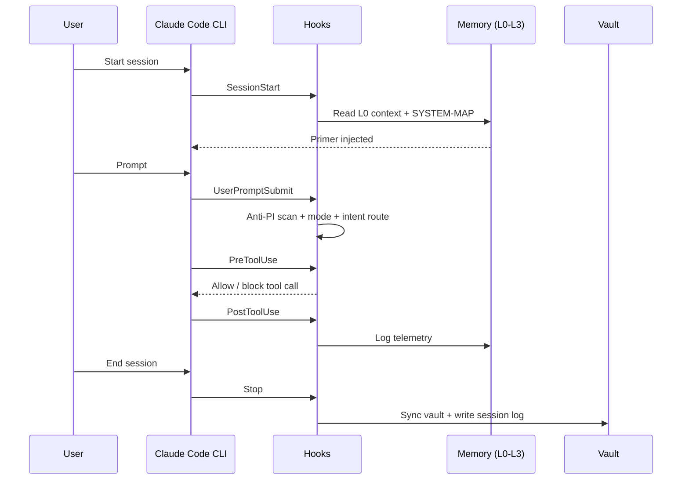
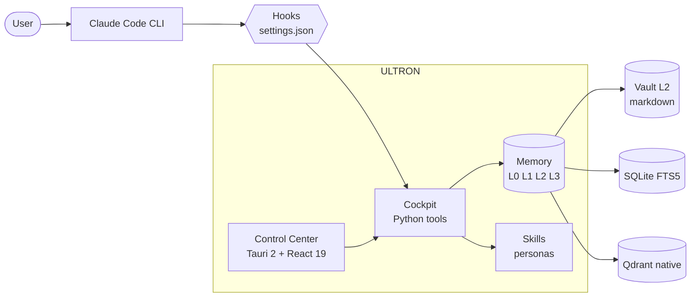

<!--
  ULTRON — README (English)
  Spanish version: README.es.md
-->

<div align="center">

<h1>ULTRON</h1>

<p><b>Your local AI command center for Claude Code.</b></p>

<p>
  Hierarchical memory · opt-in personas · hardened hooks · a desktop cockpit that turns
  multi-day work with Claude (and optionally Codex and Gemini) into something you can actually manage.
</p>

<p>
  <a href="LICENSE"></a>
  <a href="CHANGELOG.md"></a>
  
  <a href="https://claude.com/claude-code"></a>
  
  
</p>

<p>
  <b>Docs:</b>
  <a href="INSTALL.md">Install</a> ·
  <a href="CHANGELOG.md">Changelog</a> ·
  <a href="CONTRIBUTING.md">Contributing</a> ·
  <a href="SECURITY.md">Security</a> ·
  <a href="AUTHORS.md">Authors</a> ·
  <a href="NOTICE">Notice</a> ·
  <a href="LICENSE">License</a>
</p>

<p>
  <b>Read in:</b>
  <a href="README.md">English</a>
  ·
  <a href="README.es.md">Espanol</a>
</p>

<sub>Plain-text, opt-in, zero SaaS, zero telemetry. The plumbing is the product.</sub>

</div>

> [!WARNING]
> **Public beta.** ULTRON is open-sourced as a working preview. Expect rough edges, breaking changes between minor versions and a steady stream of fixes. Bug reports and PRs are very welcome — open an issue in this repo. New releases land in the [Changelog](CHANGELOG.md) as bugs surface.

---

## Table of contents

<details>
<summary><b>Click to expand</b></summary>

1. [What is ULTRON](#what-is-ultron)
2. [What it solves](#what-it-solves)
3. [How it works](#how-it-works)
4. [Quick start](#quick-start)
5. [Features](#features)
6. [Architecture](#architecture)
7. [Customize it](#customize-it)
8. [Tech stack](#tech-stack)
9. [Roadmap](#roadmap)
10. [Contributing](#contributing)
11. [Origin and attribution](#origin-and-attribution)
12. [License](#license)
13. [Credits](#credits)

</details>

---

## What is ULTRON

ULTRON is a **local command center** layered on top of the official [Claude Code](https://claude.com/claude-code) CLI. It lives entirely under your home folder (`~/.ultron/`), stores everything in plain text, and pairs the runtime with a Tauri desktop cockpit so a multi-day project never feels like ten orphaned chat sessions stitched together.

> [!NOTE]
> ULTRON does not replace Claude Code. It wraps it, gives it persistent memory, routes specialized personas, and exposes the moving parts in a UI you can audit and edit.

| Pillar | What you get |
|---|---|
| **Hierarchical memory** | Four layers (L0 hot context to L3 remote mirror) so Claude resumes on the same page after every reboot. |
| **Personas & skills** | A dispatcher activates the right specialist by intent — `debugger`, `code-reviewer`, `ui-designer`, etc. |
| **Hardened hooks** | Anti-prompt-injection, note auto-recall, session logging and vault sync, wired into `settings.json`. |
| **Desktop Control Center** | Tauri 2 + React 19 with 16 tabs for memory, skills, hooks, plans, sessions, costs and MCPs. |

**Philosophy.** Plain text files. Everything opt-in. Zero SaaS. Zero external telemetry. No cloud backend. Rip pieces out, fork them, or hand-edit the JSON — the system is designed to be taken apart.

---

## What it solves

When you work with Claude Code on real projects, the same problems keep showing up:

- Context evaporates between sessions; you spend the first ten minutes re-briefing the model.
- Skills, hooks and MCP servers live in different folders and there is no single pane of glass.
- Long plans drift; you cannot tell what was decided three days ago without scrolling chat logs.
- Costs and tool usage accumulate without visibility.

ULTRON addresses all of that locally, without renting a backend:

- Every new session reads a pre-computed primer (`context.md`, capped at ~400 tokens).
- Personas auto-route by user intent — no need to remember exact skill names.
- The vault (`~/.ultron-vault/`) is indexed in SQLite FTS5 plus a local Qdrant instance (native Windows binary, no Docker) for semantic recall.
- The cockpit surfaces hooks, plans, sessions, costs and installed MCPs in one window.

---

## How it works

When you launch Claude Code, it reads `~/.claude/CLAUDE.md` (your global instructions). That file contains a **wake-up protocol** that pulls in `~/.ultron/.tmp/context.md` (L0 memory) and `~/.ultron/SYSTEM-MAP.md` (a stable path index). In under a second Claude knows who you are, what you were doing and where to look for the rest.

From there, hooks wired into `~/.claude/settings.json` participate in the lifecycle:



The **four memory layers**:

| Layer | Where it lives | What it does |
|---|---|---|
| **L0** hot context | `~/.ultron/.tmp/context.md` | Pre-computed primer, <=400 tokens, read on every session |
| **L1** indexed | `~/.ultron/brain_index/index.db` | SQLite FTS5 over the chunked vault, BM25 retrieval |
| **L2** vault | `~/.ultron-vault/*.md` | Curated markdown notes with wikilinks — the source of truth |
| **L3** remote | optional git remote | Off-machine mirror of L2, drained by the `Stop` hook |

On top of L1 lives a local **Qdrant** instance (the native Windows binary — no Docker, no daemon) for semantic recall over the same corpus. A decay system bubbles stale notes back to the surface every time you start a session.

---

## Quick start

> [!IMPORTANT]
> Windows 11 is the primary target. macOS and Linux are not officially tested at v15.2.

**One-liner.**

```powershell
git clone https://github.com/SkiTemplar/ultron.git $env:USERPROFILE\.ultron
cd $env:USERPROFILE\.ultron
.\install.ps1
```

**Common flags.**

```powershell
.\install.ps1                  # interactive (recommended)
.\install.ps1 -NonInteractive  # CI / unattended (accept defaults)
.\install.ps1 -Verbose         # debug what each step is doing
.\install.ps1 -NoApp           # skip the Tauri Control Center build
.\install.ps1 -NoDocker        # skip Qdrant (semantic recall stays off)
```

The installer is **idempotent** — rerun it any time; it detects what is already done and only applies pending changes. If something fails, see [`INSTALL.md`](INSTALL.md) for manual troubleshooting.

To remove everything ULTRON installed (without touching your Claude Code skills in `~/.claude/skills/`):

```powershell
.\uninstall.ps1            # interactive: confirms before deleting
.\uninstall.ps1 -DryRun    # preview what would be removed
.\uninstall.ps1 -KeepBackups   # rename ~/.ultron/ instead of deleting
```

<details>
<summary><b>What the installer does (10 steps)</b></summary>

| # | Step | What it does |
|---|---|---|
| 1 | Preflight | OS / PowerShell / RAM / disk / internet checks |
| 2 | Claude Code | Verifies the CLI is installed and authenticated |
| 3 | uv | Installs uv if missing |
| 4 | Qdrant | Downloads the native Windows binary (v1.18.0) into `~/.ultron/qdrant-native/`, seeds `config/production.yaml`. No Docker, no daemon. Boots from `ensure-qdrant.ps1` on SessionStart |
| 5 | Layout | Creates `~/.ultron/`, `~/.ultron-vault/`, `~/.claude/skills/` |
| 6 | Hooks | Merges `templates/settings-hooks.json` into `settings.json` (non-destructive, with backup) |
| 7 | Skills | Interactive picker: 12 core (always ON) + opt-in slots |
| 8 | brain_index | Initializes the SQLite FTS5 index |
| 9 | Cockpit | `npm install` and optionally `tauri build` |
| 10 | Doctor | Final verification via `doctor.py` (0 = clean, 1 = warn, 2 = block) |

</details>

---

## Features

| Area | Highlights |
|---|---|
| **Memory** | L0-L3 hierarchy, SQLite FTS5 index, native Qdrant for semantic recall (no Docker), decay surfacing |
| **Personas** | 12 core skills, intent-based dispatch, prompt-injection ruleset PI001-PI013 |
| **Hooks** | `SessionStart`, `UserPromptSubmit`, `PreToolUse`, `PostToolUse`, `Stop` — all auditable |
| **Control Center** | 16 tabs: Dashboard, Usage, Notifications, Changelog, News, MCPs, Skills, Memory, Sessions, Projects, Gaming, Plans, Logs, Stats, Personal, Settings. System tab nests sub-tabs: Overview, Schedules, Hooks |
| **Dual-mode** | Optional Codex CLI peer review + Gemini CLI long-context delegation, both subscription-only |
| **Security** | Anti-prompt-injection scanner, quarantine folder, Tauri IPC allow-list |
| **Privacy** | No telemetry, no external calls without user action, vault is yours |

<details>
<summary><b>Core skills (12, installed by default)</b></summary>

`ultron` &middot; `senior-engineer` &middot; `code-reviewer` &middot; `debugger` &middot; `refactoring-specialist` &middot; `ui-designer` &middot; `business-strategist` &middot; `skill-creator` &middot; `superpowers` &middot; `webapp-testing` &middot; `windows-admin` &middot; `second-opinion`

Opt-in slots ship as **empty templates**: fork ULTRON and fill them with your own personas (finance assistant, creative-writing voice, game-engine engineer, personal mail/calendar agent, etc.). The picker in `install.ps1` asks one at a time.

</details>

---

## Architecture



<details>
<summary><b>Compatibility matrix</b></summary>

| Platform | Status |
|---|---|
| Windows 11 | Supported |
| Windows 10 | Best effort (not in CI) |
| macOS | Planned for v16 |
| Linux | Planned for v16 |

</details>

---

## Customize it

ULTRON is built to be taken apart and rewired. Everything lives in plain text under your home folder:

- **`~/.claude/CLAUDE.md`** — your global instructions for every Claude Code session. Edit directly or use the cockpit's `Personal` tab.
- **`~/.claude/settings.json`** — hooks and permissions. The `Hooks` tab is a typed editor over this file.
- **`~/.claude/skills/<name>/SKILL.md`** — activate / deactivate / edit personas. Delete a folder to uninstall a skill.
- **`~/.ultron-vault/`** — your L2 vault. Plain markdown with wikilinks. Anything you write here gets indexed on the next `brain_index.py update` run.
- **`~/.ultron/plans/PLANS.json`** — in-flight plans. The `Plans` tab is a frontend over this file.
- **`~/.ultron/personal/profile.md`** — your personal profile (interests, context, preferences).

> [!TIP]
> This is **your** system. Fork it. Modify it. The philosophy is plain text plus Git, so everything is diff-able and reviewable.

---

## Tech stack

| Layer | Tech |
|---|---|
| Control Center (frontend) | Tauri 2 + React 19 + TypeScript (strict) |
| Control Center (backend) | Rust (stable) |
| Cockpit Python tools | Python 3.13 + uv |
| Memory store | SQLite FTS5 + Qdrant (native Windows binary, no Docker) |
| OS scripting | PowerShell 5.1+ |
| LLM runtimes | Claude Code CLI (primary), Codex CLI (peer review, optional), Gemini CLI (long context, optional) |

---

## Roadmap

| Release | Status | Highlights |
|---|---|---|
| **v15.2** | Current | Control Center with 16 tabs, L0-L3 memory, hardened hooks, 12 core skills, dual-mode v2 via subscription CLIs |
| **v15.3** | Next | Anti-hallucination layer, cross-session event bus, supervisor daemon |
| **v16** | Future | Pipeline DAG, overnight loop, mobile companion PWA, multi-platform expansion |

Detailed release notes in [`CHANGELOG.md`](CHANGELOG.md).

---

## Contributing

PRs welcome on architecture, packaging, cross-platform support and core skills. Personal-flavored content (the author's news feeds, expense categories, gaming libraries) is out of scope — fork those for yourself. Full guide in [`CONTRIBUTING.md`](CONTRIBUTING.md).

Report security issues privately per [`SECURITY.md`](SECURITY.md).

---

## Origin and attribution

ULTRON was originally created by **USER SURNAME** in 2026.

The project is open source under MIT (see [`LICENSE`](LICENSE)). Forks and modifications are welcome — contributors who substantially extend the work may add themselves to [`AUTHORS.md`](AUTHORS.md). Per MIT terms, any copy or derivative work must retain the original copyright notice naming USER SURNAME as the originator of ULTRON. The name "ULTRON" identifies the original project; derivative projects are encouraged to pick a distinct name unless they intend to upstream their changes. Full attribution policy in [`NOTICE`](NOTICE).

---

## License

MIT — see [`LICENSE`](LICENSE).

---

## Credits

ULTRON orchestrates three tools it does not own and could not exist without:

- [**Claude Code**](https://claude.com/claude-code) — Anthropic. The runtime ULTRON wraps.
- [**Codex CLI**](https://github.com/openai/codex) — OpenAI. Optional peer review and rescue.
- [**Gemini CLI**](https://github.com/google-gemini/gemini-cli) — Google. Optional long-context delegate and image generation.

The vector layer runs on [Qdrant](https://qdrant.tech). The desktop shell is [Tauri](https://tauri.app). The Python pipeline runs on [uv](https://github.com/astral-sh/uv). Thanks to all four projects.

<div align="center">

<sub>Built by <a href="https://github.com/SkiTemplar">USER SURNAME</a> &middot; MIT &middot; 2026</sub>

</div>
