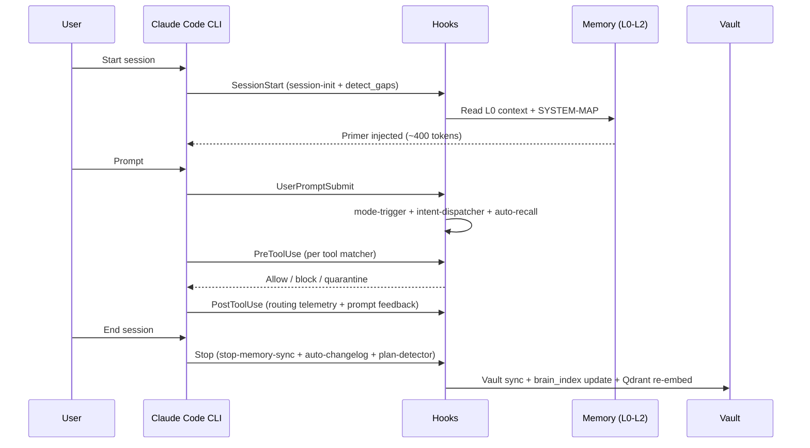
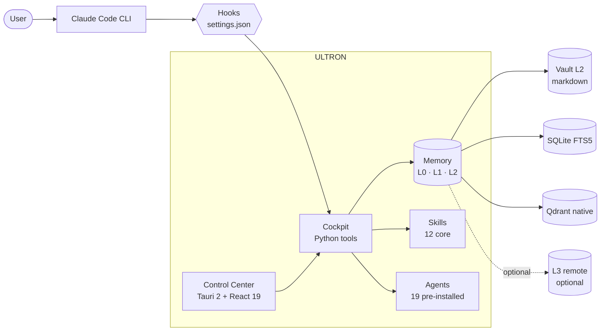

<!--
  ULTRON — README (English)
  Spanish version: README.es.md
-->

<div align="center">

<h1>ULTRON</h1>

<p><b>Your local AI command center for Claude Code.</b></p>

<p>
  Hierarchical memory · curated skills + agents · hardened hooks · a desktop Control Center that turns
  multi-day work with Claude (and optionally Codex and Gemini) into something you can actually manage.
</p>

<p>
  <a href="https://github.com/SkiTemplar/ultron/actions/workflows/ci.yml"></a>
  <a href="LICENSE"></a>
  <a href="CHANGELOG.md"></a>
  
  <a href="https://claude.com/claude-code"></a>
  
  
</p>

<p>
  <b>Docs:</b>
  <a href="INSTALL.md">Install</a> ·
  <a href="docs/QUICKSTART.md">Quickstart</a> ·
  <a href="CHANGELOG.md">Changelog</a> ·
  <a href="CONTRIBUTING.md">Contributing</a> ·
  <a href="SECURITY.md">Security</a> ·
  <a href="AUTHORS.md">Authors</a> ·
  <a href="NOTICE">Notice</a> ·
  <a href="LICENSE">License</a>
</p>

<p>
  <b>Read in:</b>
  <a href="README.md">English</a>
  ·
  <a href="README.es.md">Espanol</a>
</p>

<sub>Plain-text, opt-in, zero SaaS, zero telemetry. The plumbing is the product.</sub>

</div>

> [!WARNING]
> **Public beta.** ULTRON is open-sourced as a working preview. Expect rough edges, breaking changes between minor versions and a steady stream of fixes. Bug reports and PRs are very welcome — open an issue in this repo. New releases land in the [Changelog](CHANGELOG.md) as bugs surface.

<p align="center">
  
  <br />
  <sub><i>Dashboard — Full Diagnostic, Maintenance commands, Pending items.</i></sub>
</p>

<p align="center">
  
  <br />
  <sub><i>Skills tab — strict security scan, quarantined skills surfaced first, findings + waiver flow inline.</i></sub>
</p>

> Screenshots will fill in as the public beta gets capture cycles — the layout you see in the GIFs is the current one.

---

## Table of contents

<details>
<summary><b>Click to expand</b></summary>

1. [What is ULTRON](#what-is-ultron)
2. [What it solves](#what-it-solves)
3. [How it works](#how-it-works)
4. [Quick start](#quick-start)
5. [Features](#features)
6. [Architecture](#architecture)
7. [Customize it](#customize-it)
8. [Tech stack](#tech-stack)
9. [Release notes](#release-notes)
10. [Contributing](#contributing)
11. [Origin and attribution](#origin-and-attribution)
12. [License](#license)
13. [Credits](#credits)

</details>

---

## What is ULTRON

ULTRON is a **local command center** layered on top of the official [Claude Code](https://claude.com/claude-code) CLI. It lives entirely under your home folder (`~/.ultron/`), stores everything in plain text, and pairs the runtime with a Tauri Control Center so a multi-day project never feels like ten orphaned chat sessions stitched together.

> [!NOTE]
> ULTRON does not replace Claude Code. It wraps it, gives it persistent memory, routes the right specialist skill for the prompt, and exposes the moving parts in a UI you can audit and edit.

| Pillar | What you get |
|---|---|
| **Hierarchical memory** | Three local layers (L0 hot context → L1 keyword index → L2 vault) plus an optional L3 remote mirror, so Claude resumes on the same page after every reboot. |
| **Skills** | 12 core skills installed by default — `ultron`, `senior-engineer`, `debugger`, `code-reviewer`, `refactoring-specialist`, `ui-designer`, `business-strategist`, `skill-creator`, `superpowers`, `webapp-testing`, `windows-admin`, `second-opinion`. Plus opt-in slots for your own. A dispatcher activates the right one by user intent. |
| **Agents** | 19 autonomous subagents pre-installed (12 first-party ULTRON + 7 curated community), plus a 69-entry catalog you install on demand from the Agents tab. Same anti-prompt-injection scan as skills. |
| **Hardened hooks** | Anti-prompt-injection, note auto-recall, session logging and vault sync — all auditable, all wired into `settings.json`. |
| **Desktop Control Center** | Tauri 2 + React 19 with 18 wired sections (17 visible + Logs disabled) for memory, skills, agents, hooks, plans, sessions, costs and MCPs. |

**Philosophy.** Plain text files. Everything opt-in. Zero SaaS. Zero external telemetry. No cloud backend. Rip pieces out, fork them, edit the source — the system is designed to be taken apart.

---

## What it solves

When you work with Claude Code on real projects, the same problems keep showing up:

- Context evaporates between sessions; you spend the first ten minutes re-briefing the model.
- Skills, hooks and MCP servers live in different folders and there is no single pane of glass.
- Long plans drift; you cannot tell what was decided three days ago without scrolling chat logs.
- Costs and tool usage accumulate without visibility.

ULTRON addresses all of that locally, without renting a backend:

- Every new session reads a pre-computed primer (`context.md`, capped at ~400 tokens).
- Skills auto-route by user intent — no need to remember exact names; type "review this code" and the right specialist activates.
- The vault (`~/.ultron-vault/`) is indexed in SQLite FTS5 plus a local Qdrant instance (native binary, no daemon) for semantic recall.
- The Control Center surfaces hooks, plans, sessions, costs and installed MCPs in one window.

---

## How it works

Think of ULTRON as a **filing cabinet plus a butler** sitting on top of Claude Code. Every session, the butler hands Claude a one-page briefing of what you were doing, who you are and where stuff lives. Every prompt, scripts check for obvious foot-guns before any tool runs. Every session-end, the same scripts file away what just happened so the next session inherits it.

Concretely: when you launch Claude Code it reads `~/.claude/CLAUDE.md` (your global instructions). That file contains a **wake-up protocol** that pulls in `~/.ultron/.tmp/context.md` (the briefing) and `~/.ultron/SYSTEM-MAP.md` (a stable index of paths so Claude does not waste tokens grepping for files it could read directly). Under one second, Claude knows the state of the world.

From there, hooks wired into `~/.claude/settings.json` participate in every step of the lifecycle:



### Memory: the filing cabinet

Three local layers, one optional remote, plus a semantic search engine on top of everything:

| Layer | Where it lives | What it does | Analogy |
|---|---|---|---|
| **L0** hot context | `~/.ultron/.tmp/context.md` | Pre-computed primer, ≤400 tokens, loaded at every SessionStart | Sticky note on your monitor |
| **L1** keyword index | `~/.ultron/brain_index/index.db` | SQLite FTS5 over the chunked vault, BM25 retrieval | Card catalog at a library |
| **L2** vault | `~/.ultron-vault/*.md` | Curated markdown notes with wikilinks — the source of truth | The shelves the library indexes |
| **L3** remote *(planned)* | `github.com/<you>/ultron-memory` | Off-machine mirror of L2, drained by the `Stop` hook in HIGH+ mode | Off-site archive box |

> [!NOTE]
> **L3 status.** The Stop hook code path is wired (see `memory_sync.py push-async`), but the `github.com/SkiTemplar/ultron-memory` reference repo does **not** exist yet — L3 is opt-in and currently only fires if **you** create your own `~/.ultron-vault` git remote. There is no shared mirror.

On top of L1+L2 lives a local **Qdrant** instance (a native platform binary on Windows or Linux, no daemon) that runs semantic recall over the same corpus — so "find that note about Tauri permissions" works even when you don't remember the exact words. A decay system bubbles stale notes back to the surface every time you start a session, so old context resurfaces instead of rotting forever.

---

## Quick start

> [!IMPORTANT]
> Windows 11 is the primary target; Linux x86_64 (Debian / Ubuntu / Fedora / Arch) supported from v15.5 (build verified, end-to-end install still untested by the author). macOS is an explicit non-goal.

Open a terminal, paste the one-liner that matches your OS, wait ~3 minutes.
Pin to a release tag if you want a reproducible install. **Full install
reference is in [`INSTALL.md`](INSTALL.md)** (bootstrap details, manual
installer flags, troubleshooting); per-step manual install lives in
[`docs/INSTALL-ADVANCED.md`](docs/INSTALL-ADVANCED.md).

**Windows 11** (PowerShell, no Git required):

```powershell
iwr -useb https://raw.githubusercontent.com/SkiTemplar/ultron/main/bootstrap.ps1 | iex
```

**Linux x86_64** (Debian / Ubuntu / Fedora / Arch):

```bash
curl -fsSL https://raw.githubusercontent.com/SkiTemplar/ultron/main/bootstrap.sh | bash
```

Both scripts resolve the latest `v*.*.*` release tag via the GitHub
Releases API, verify the SHA-256 of the system ZIP, extract to `~/.ultron`,
run `install.ps1` / `install.sh`, and launch the desktop Control Center.
Re-run any time to upgrade — `~/.ultron-vault/` and `~/.ultron/plans/` are
preserved.

> [!NOTE]
> **Windows SmartScreen.** The NSIS installer is unsigned. SmartScreen will warn — click **More info → Run anyway**. Code signing is tracked in [`docs/RELEASE-PROCESS.md`](docs/RELEASE-PROCESS.md).

---

## Features

| Area | Highlights |
|---|---|
| **Memory** | L0 → L2 local layers + optional L3 remote mirror (planned), SQLite FTS5 index, native Qdrant binary for semantic recall, decay system surfaces stale notes |
| **Skills** | 12 core skills installed by default, intent-based dispatch, opt-in slots for your own, prompt-injection ruleset PI001-PI013 |
| **Agents** | 19 pre-installed (12 first-party ULTRON + 7 stack-aligned community) + 69-entry catalog installable on demand = **88 total available**. Dedicated Agents tab with the same anti-prompt-injection scanner as Skills, AI Router agent slot, embeddings in Qdrant for semantic discovery. |
| **Skill / Agent Vault** | Demote a skill or agent without deleting it: the **Vault** button moves the file to `~/.ultron/skill-vault/` or `~/.ultron/agent-vault/` so Claude stops auto-loading it. Restore from the sidebar Vault panel. Vaulted entries can still surface as suggestions via the auto-recall hook (`[VAULT·SKILL·82%] …`). |
| **Hooks** | `SessionStart`, `UserPromptSubmit`, `PreToolUse`, `PostToolUse`, `PreCompact`, `PostCompact`, `Stop` — all auditable |
| **Control Center** | 18 wired sections (17 visible + Logs disabled): Dashboard, Usage, Notifications, Changelog, News, System, MCPs, Skills, Agents, Memory, Sessions, Projects, Gaming, Plans, Stats, Personal, Settings + Logs. The System tab nests sub-tabs: Overview, Schedules, Hooks. |
| **Dual-mode** | Optional Codex CLI peer review + Gemini CLI long-context delegation, both subscription-only |
| **Security** | Anti-prompt-injection scanner, quarantine folder, Tauri IPC allow-list, defense-in-depth deny list in `settings.json` |
| **Privacy** | No telemetry, no external calls without user action, vault is yours |

<details>
<summary><b>Core skills (12, installed by default)</b></summary>

`ultron` &middot; `senior-engineer` &middot; `code-reviewer` &middot; `debugger` &middot; `refactoring-specialist` &middot; `ui-designer` &middot; `business-strategist` &middot; `skill-creator` &middot; `superpowers` &middot; `webapp-testing` &middot; `windows-admin` &middot; `second-opinion`

Opt-in slots ship as **empty templates**: fork ULTRON and fill them with your own (finance assistant, creative-writing voice, game-engine engineer, personal mail/calendar agent, etc.). The picker in `install.ps1` asks one at a time.

</details>

<details>
<summary><b>Agents (12 ULTRON + 7 curated community + 69 catalog = 88 total)</b></summary>

Agents live in `~/.claude/agents/*.md` with the same YAML-frontmatter contract as skills.

**12 first-party ULTRON agents** (always installed): `ultron-arch`, `ultron-changelog`, `ultron-context`, `ultron-docs`, `ultron-metadata`, `ultron-news`, `ultron-perf`, `ultron-refactor`, `ultron-security`, `ultron-self-improve`, `ultron-skill-editor`, `ultron-test`.

**7 stack-aligned community agents** (installed by default): `cpp-pro` (modern C++17/20/23), `graphics-programmer` (OpenGL / Vulkan / HLSL / GLSL / WGSL + RenderDoc), `unreal-engine-engineer` (UE5 C++ / Blueprints / GAS / Nanite / Lumen), `unity-engineer` (Unity 2022 LTS + Unity 6, DOTS, URP / HDRP), `devops-engineer` (GitHub Actions, signing, Tauri release), `database-admin` (Postgres / Supabase / SQLite + EXPLAIN ANALYZE), `fullstack-developer` (features cross-stack).

**69 catalog agents** in `cockpit/agent-catalog.json` — install on demand from **Agents tab → Discover online**. Every agent is scanned by the PI001-PI013 ruleset; failures land in quarantine with the same Allow-anyway waiver as skills. The AI Router exposes a per-zone Agent slot (Settings → AI Router → Reset to ULTRON recommended wires curated pairs).

</details>

<details>
<summary><b>How the memory works (L0 → L3)</b></summary>

ULTRON stitches four memory layers so Claude resumes on the same page after every reboot. Think of it as **sticky note → card catalog → library shelves → off-site archive**:

- **L0 — hot context.** `~/.ultron/.tmp/context.md` (≤ 400 tokens). Pinned summary of recent sessions, projects, pending alerts. Loaded automatically at SessionStart. *Sticky note.*
- **L1 — keyword index.** SQLite + FTS5 at `~/.ultron/brain_index/index.db`. Fast BM25 lookup over every vault note. Rebuilt incrementally by the Stop hook. *Card catalog.*
- **L2 — vault.** Plain-text Obsidian-style notes under `~/.ultron-vault/` (your curated long-term knowledge). Plus `~/.ultron/archive/` for older indexed material. *The shelves.*
- **L3 — remote mirror** *(planned, opt-in).* The Stop hook can push to `github.com/<you>/ultron-memory` for cross-machine sync (HIGH+ mode), but the code path only runs if **you** create the remote in `~/.ultron-vault`. There is no shared `SkiTemplar/ultron-memory` repo. *Off-site archive.*

On top of those, a native Qdrant binary (`~/.ultron/qdrant-native/qdrant.exe`) provides semantic recall via dense embeddings for skills + agents + vault notes. Recall is hybrid: FTS5 + Qdrant, both surface results through the `ultron recall` CLI and the Memory tab. The whole system is plain text — no SaaS lock-in, you can grep, diff, fork, archive.

</details>

---

## Architecture

ULTRON sits between **you** and **Claude Code**. The CLI does the talking; ULTRON does the bookkeeping. Five moving parts:

- **Hooks** — small Python and PowerShell scripts wired into `~/.claude/settings.json`. They fire on `SessionStart`, `UserPromptSubmit`, `PreToolUse`, `PostToolUse`, `Stop`. This is where prompt-injection scanning, intent routing and memory updates happen.
- **Cockpit** — the Python toolbox under `~/.ultron/scripts/cockpit/`. The hooks call into it for the actual work: indexing the vault, computing the context primer, routing prompts to skills, embedding into Qdrant.
- **Memory** — the filing-cabinet stack from the previous section (L0 → L2 local, L3 optional). Cockpit reads and writes it; the Control Center visualizes it.
- **Skills + Agents** — markdown files under `~/.claude/skills/` and `~/.claude/agents/` that Claude Code activates by intent or explicit invocation. ULTRON ships 12 core skills + 19 pre-installed agents (88 total available).
- **Control Center** — the Tauri 2 + React 19 desktop app under `~/.ultron/control-center/`. It is the panel you actually look at; everything underneath is plain text you can grep.



<details>
<summary><b>Compatibility matrix</b></summary>

| Platform | Status |
|---|---|
| Windows 11 | Supported (primary target) |
| Windows 10 | Best effort (not in CI) |
| Linux x86_64 (Debian / Ubuntu / Fedora / Arch) | Build verified from v15.5 (`.deb` + `.AppImage`); end-to-end install untested by the author |
| macOS | Out of scope — explicit non-goal |

</details>

---

## Customize it

ULTRON is built to be taken apart and rewired. Everything lives in plain text under your home folder:

- **`~/.claude/CLAUDE.md`** — your global instructions for every Claude Code session. Edit directly or use the Control Center's `Personal` tab.
- **`~/.claude/settings.json`** — hooks and permissions. The `Hooks` tab (inside System) is a typed editor over this file.
- **`~/.claude/skills/<name>/SKILL.md`** — activate / deactivate / edit a skill. Delete a folder to uninstall it.
- **`~/.claude/agents/<name>.md`** — same idea for autonomous subagents. The Agents tab shows install state, security findings and the catalog of community agents from `cockpit/agent-catalog.json`.
- **`~/.ultron-vault/`** — your L2 vault. Plain markdown with wikilinks. Anything you write here gets indexed on the next `brain_index.py update` run.
- **`~/.ultron/plans/PLANS.json`** — in-flight plans. The `Plans` tab is a frontend over this file.
- **`~/.ultron/personal/profile.md`** — your personal profile (interests, context, preferences).
- **The source itself.** ULTRON is MIT-licensed and open source: every Python hook, every Rust Tauri command, every React component is in this repo. Clone, branch, edit, send PRs — or fork it and run a private flavour. See [`CONTRIBUTING.md`](CONTRIBUTING.md).

> [!TIP]
> This is **your** system. Fork it. Modify it. Change the code. The philosophy is plain text plus Git, so everything is diff-able and reviewable.

---

## Tech stack

| Layer | Tech |
|---|---|
| Control Center (frontend) | Tauri 2 + React 19 + TypeScript (strict) |
| Control Center (backend) | Rust (stable) |
| Cockpit Python tools | Python 3.13 + uv |
| Memory store | SQLite FTS5 + Qdrant (native platform binary, single process) |
| Agents | YAML-frontmatter markdown under `~/.claude/agents/`, catalog in `cockpit/agent-catalog.json`, embeddings via `embed_agents.py` |
| OS scripting | PowerShell 5.1+ |
| LLM runtimes | Claude Code CLI (primary), Codex CLI (peer review, optional), Gemini CLI (long context, optional) |

---

## Release notes

Current stable: **[v15.5.18](https://github.com/SkiTemplar/ultron/releases/tag/v15.5.18)** — Round-2 burn-down + R3 polish: **Tauri `dialog:confirm` ACL bug fixed** (9 destructive flows that silently no-op'd now route through a `confirmDialog()` wrapper using `@tauri-apps/plugin-dialog`), **Stop hook chain 5→3 processes** (session-log + session-cleanup inlined into stop-memory-sync; auto-changelog and plan-detector standalone), Pending Items panel relocated above-fold with sidebar badge polling every 60s, new auto-recall fire trail at `~/.ultron/logs/auto-recall.log`. Builds on v15.5.16 (Round 2 sweep) which added the routing macro-test (95%/20), the version drift markdown-body CI guard, and the `personal-info-leak` CI gate (`audit_personal_data.py` HIGH=0). Ships `.deb` + `.AppImage` alongside the Windows NSIS / MSI; CI matrix green on `ubuntu-22.04`. Linux end-to-end install still **unverified by the author** — testers wanted, open an issue if you try it.

Previous stable: **v15.5.16** — Round-2 ULTRA sweep (routing 95% verified, 5 personal skills slots added, leakage HIGH=0, MAINTAINERS+CHECKLIST docs, qdrant scripts moved, legacy installers archived, SYSTEM-MAP lazy-load).

Full release notes in [`CHANGELOG.md`](CHANGELOG.md). Latest release on [GitHub Releases](https://github.com/SkiTemplar/ultron/releases/latest) ships the NSIS `.exe` + MSI for Windows, `.deb` + `.AppImage` for Linux, and the `ultron-system-<tag>.zip` + `.sha256` consumed by the bootstrap one-liners.

---

## Contributing

PRs welcome on architecture, packaging, cross-platform support and core skills. Personal-flavored content (the author's news feeds, expense categories, gaming libraries) is out of scope — fork those for yourself. Full guide in [`CONTRIBUTING.md`](CONTRIBUTING.md).

Report security issues privately per [`SECURITY.md`](SECURITY.md).

---

## Origin and attribution

ULTRON was originally created by **[USER SURNAME](https://www.linkedin.com/in/USER-SURNAME-SURNAME2-671b02274/)** ([@SkiTemplar](https://github.com/SkiTemplar)) in 2026.

The project is open source under MIT (see [`LICENSE`](LICENSE)). Forks and modifications are welcome — contributors who substantially extend the work may add themselves to [`AUTHORS.md`](AUTHORS.md). Per MIT terms, any copy or derivative work must retain the original copyright notice naming USER SURNAME as the originator of ULTRON. The name "ULTRON" identifies the original project; derivative projects are encouraged to pick a distinct name unless they intend to upstream their changes. Full attribution policy in [`NOTICE`](NOTICE).

---

## License

MIT — see [`LICENSE`](LICENSE).

**Trademark / non-affiliation**: "ULTRON" in this project is a backronym for
**U**ltimate **L**ocal **T**oken **R**eduction **O**rchestration **N**etwork.
This software is **not affiliated with, endorsed by, sponsored by, or
associated with** Marvel Entertainment, The Walt Disney Company, or any of
their subsidiaries. See [`NOTICE`](NOTICE) for the full disclaimer.

---

## Credits

ULTRON orchestrates three tools it does not own and could not exist without:

- [**Claude Code**](https://claude.com/claude-code) — Anthropic. The runtime ULTRON wraps.
- [**Codex CLI**](https://github.com/openai/codex) — OpenAI. Optional peer review and rescue.
- [**Gemini CLI**](https://github.com/google-gemini/gemini-cli) — Google. Optional long-context delegate and image generation.

The vector layer runs on [Qdrant](https://qdrant.tech). The desktop shell is [Tauri](https://tauri.app). The Python pipeline runs on [uv](https://github.com/astral-sh/uv). Thanks to all four projects.

<div align="center">

<sub>Built by <a href="https://github.com/SkiTemplar">USER SURNAME</a> &middot; <a href="https://www.linkedin.com/in/USER-SURNAME-SURNAME2-671b02274/">LinkedIn</a> &middot; MIT &middot; 2026</sub>

</div>
