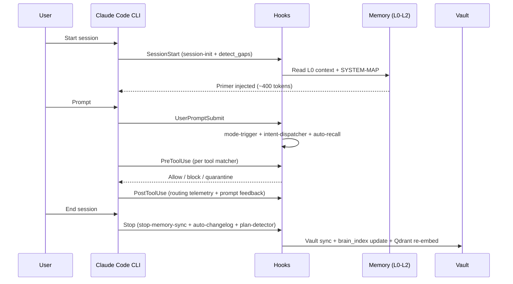
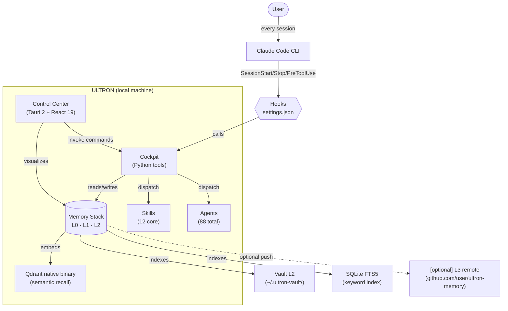

<!--
  ULTRON — README (English)
  Spanish version: README.es.md
-->

<div align="center">

<h1>ULTRON</h1>

<p><b>Local AI cockpit for Claude Code. Single-user, open-source, zero SaaS.</b></p>

<p>
  Hierarchical memory · curated skills + agents · hardened hooks · a Tauri desktop Control Center that turns
  multi-day work with Claude Code into something you can actually manage and audit.
</p>

<p>
  <a href="https://github.com/SkiTemplar/ultron/actions/workflows/ci.yml"></a>
  <a href="LICENSE"></a>
  <a href="CHANGELOG.md"></a>
  
  <a href="https://claude.com/claude-code"></a>
  
  
</p>

<p>
  <b>Quick links:</b>
  <a href="INSTALL.md">Install</a> ·
  <a href="docs/ONBOARDING-fullize.md">Onboarding</a> ·
  <a href="docs/ARCHITECTURE-overview.md">Architecture</a> ·
  <a href="docs/QUICKSTART.md">Quickstart</a> ·
  <a href="CHANGELOG.md">Changelog</a> ·
  <a href="CONTRIBUTING.md">Contributing</a> ·
  <a href="SECURITY.md">Security</a> ·
  <a href="AUTHORS.md">Authors</a> ·
  <a href="LICENSE">License</a>
</p>

<p>
  <b>Read in:</b>
  <a href="README.md">English</a>
  ·
  <a href="README.es.md">Espanol</a>
</p>

<sub>Plain-text, opt-in, zero SaaS, zero telemetry. The plumbing is the product.</sub>

</div>

> [!WARNING]
> **Public beta.** ULTRON is open-sourced as a working preview. Expect rough edges, breaking changes between minor versions and a steady stream of fixes. Bug reports and PRs are very welcome — open an issue in this repo. New releases land in the [Changelog](CHANGELOG.md) as bugs surface.

<p align="center">
  
  <br />
  <sub><i>Dashboard — Full Diagnostic, Maintenance commands, Pending items.</i></sub>
</p>

<p align="center">
  
  <br />
  <sub><i>Skills tab — strict security scan, quarantined skills surfaced first, findings + waiver flow inline.</i></sub>
</p>

> Screenshots will fill in as the public beta gets capture cycles — the layout you see in the GIFs is the current one.

---

## Table of contents

<details>
<summary><b>Click to expand</b></summary>

1. [What is ULTRON](#what-is-ultron)
2. [What it solves](#what-it-solves)
3. [How it works](#how-it-works)
4. [Quick start](#quick-start)
5. [Features](#features)
6. [Architecture](#architecture)
7. [Customize & Extend](#customize--extend)
8. [Tech stack](#tech-stack)
9. [Release notes & roadmap](#release-notes--roadmap)
10. [Contributing](#contributing)
11. [About & Attribution](#about--attribution)
12. [License](#license)
13. [Credits & Dependencies](#credits--dependencies)

</details>

---

## What is ULTRON

ULTRON is a **local cockpit** layered on top of the official [Claude Code](https://claude.com/claude-code) CLI. It lives entirely under your home folder (`~/.ultron/`), stores everything in plain text, and pairs the runtime with a Tauri 2 + React 19 Control Center so a multi-day project never feels like ten orphaned chat sessions stitched together.

**Single-user tool.** ULTRON is USER SURNAME's personal AI development cockpit, open-sourced for others to fork and customize. Not a team platform, not a SaaS service — your local machine, your settings, your forks.

> [!NOTE]
> ULTRON does not replace Claude Code. It wraps it, gives it persistent memory, routes the right specialist skill for the prompt, and exposes the moving parts in a UI you can audit, edit, and version-control.

| Pillar | What you get |
|---|---|
| **Hierarchical memory** | Three local layers (L0 hot context → L1 keyword index → L2 vault) plus optional L3 remote mirror, semantic recall via Qdrant embeddings, so Claude resumes on the same page after every reboot. |
| **Skills + Agents** | 12 core skills + 88 agents (19 pre-installed, 69 on-demand). Intent-based dispatch, anti-prompt-injection scanning, semantic discovery. |
| **Hardened hooks** | Anti-prompt-injection, note auto-recall, session logging, vault sync, decision capture — all auditable, all wired into `settings.json`. |
| **Cockpit dashboard** | Tauri 2 + React 19 with 18 sections: Dashboard (quick-actions, active project, resume session), Kanban (per-project), Decisions (auto-captured, filtered noise), Memory (4-layer stack), Skills, Agents, Sessions, Projects, Plans, Stats, Settings and more. |
| **AI Router + Free-tier proxy** | Provider catalog synchronization, cost tracking, optional free-tier proxy sidecar (NVIDIA NIM, OpenRouter). |

**Philosophy.** Plain text files. Everything opt-in. Zero SaaS. Zero external telemetry. No cloud backend. Rip pieces out, fork them, edit the source — the system is designed to be taken apart.

---

## What it solves

When you work with Claude Code on real projects, the same problems keep showing up:

- Context evaporates between sessions; you spend the first ten minutes re-briefing the model.
- Skills, hooks and MCP servers live in different folders and there is no single pane of glass.
- Long plans drift; you cannot tell what was decided three days ago without scrolling chat logs.
- Costs and tool usage accumulate without visibility.

ULTRON addresses all of that locally, without renting a backend:

- Every new session reads a pre-computed primer (`context.md`, capped at ~400 tokens).
- Skills auto-route by user intent — no need to remember exact names; type "review this code" and the right specialist activates.
- The vault (`~/.ultron-vault/`) is indexed in SQLite FTS5 plus a local Qdrant instance (native binary, no daemon) for semantic recall.
- The Control Center surfaces hooks, plans, sessions, costs and installed MCPs in one window.

---

## How it works

Think of ULTRON as a **filing cabinet plus a butler** sitting on top of Claude Code. Every session, the butler hands Claude a one-page briefing of what you were doing, who you are and where stuff lives. Every prompt, scripts check for obvious foot-guns before any tool runs. Every session-end, the same scripts file away what just happened so the next session inherits it.

Concretely: when you launch Claude Code it reads `~/.claude/CLAUDE.md` (your global instructions). That file contains a **wake-up protocol** that pulls in `~/.ultron/.tmp/context.md` (the briefing) and `~/.ultron/SYSTEM-MAP.md` (a stable index of paths so Claude does not waste tokens grepping for files it could read directly). Under one second, Claude knows the state of the world.

From there, hooks wired into `~/.claude/settings.json` participate in every step of the lifecycle:



### Memory: the filing cabinet

Three local layers, one optional remote, plus a semantic search engine on top of everything:

| Layer | Where it lives | What it does | Analogy |
|---|---|---|---|
| **L0** hot context | `~/.ultron/.tmp/context.md` | Pre-computed primer, ≤400 tokens, loaded at every SessionStart | Sticky note on your monitor |
| **L1** keyword index | `~/.ultron/brain_index/index.db` | SQLite FTS5 over the chunked vault, BM25 retrieval | Card catalog at a library |
| **L2** vault | `~/.ultron-vault/*.md` | Curated markdown notes with wikilinks — the source of truth | The shelves the library indexes |
| **L3** remote *(opt-in)* | `github.com/<you>/ultron-memory` | Off-machine mirror of L2, drained by the `Stop` hook in HIGH+ mode | Off-site archive box |

> [!NOTE]
> **L3 status.** The Stop hook code path is wired (see `memory_sync.py push-async`). L3 is **fully opt-in and per-user**: there is no shared mirror — each user creates their own **private** repo named `ultron-memory` under their account, wires it as the `~/.ultron-vault` remote, and ULTRON pushes deltas in HIGH+ mode. See `docs/memory-layers.md` for the one-time setup.

On top of L1+L2 lives a local **Qdrant** instance (a native platform binary on Windows or Linux, no daemon) that runs semantic recall over the same corpus — so "find that note about Tauri permissions" works even when you don't remember the exact words. A decay system bubbles stale notes back to the surface every time you start a session, so old context resurfaces instead of rotting forever.

---

## Quick start

> [!IMPORTANT]
> Windows 11 is the primary target; Linux x86_64 (Debian / Ubuntu / Fedora / Arch) supported from v15.5 (build verified, end-to-end install still untested by the author). macOS is an explicit non-goal.

Open a terminal, paste the one-liner that matches your OS, wait ~3 minutes.
Pin to a release tag if you want a reproducible install. **Full install
reference is in [`INSTALL.md`](INSTALL.md)** (bootstrap details, manual
installer flags, troubleshooting); per-step manual install lives in
[`docs/INSTALL-ADVANCED.md`](docs/INSTALL-ADVANCED.md).

**Windows 11** (PowerShell, no Git required):

```powershell
iwr -useb https://raw.githubusercontent.com/SkiTemplar/ultron/main/bootstrap.ps1 | iex
```

**Linux x86_64** (Debian / Ubuntu / Fedora / Arch):

```bash
curl -fsSL https://raw.githubusercontent.com/SkiTemplar/ultron/main/bootstrap.sh | bash
```

Both scripts resolve the latest `v*.*.*` release tag via the GitHub
Releases API, verify the SHA-256 of the system ZIP, extract to `~/.ultron`,
run `install.ps1` / `install.sh`, and launch the desktop Control Center.
Re-run any time to upgrade — `~/.ultron-vault/` and `~/.ultron/plans/` are
preserved.

> [!NOTE]
> **Windows SmartScreen.** The NSIS installer is unsigned. SmartScreen will warn — click **More info → Run anyway**. Code signing is tracked in [`docs/RELEASE-PROCESS.md`](docs/RELEASE-PROCESS.md).

---

## Features

| Area | Highlights |
|---|---|
| **Memory (L0 → L3)** | Hot context (~400 tokens) → SQLite FTS5 index → markdown vault → optional remote mirror. Native Qdrant binary for semantic recall (BGE-384 embeddings). Decay system surfaces stale notes. |
| **Dashboard cockpit** | Active project hero card, quick-actions (Terminal/IDE/Context/AI), resume session, recent projects, workdays metric, alerts. All in responsive bento grid. |
| **Kanban (per-project)** | Draggable cards, canonical columns (backlog → todo → in_progress → review → done), reordering, archive. Backend-normalized schema with idempotent migrations. |
| **Decisions panel** | Auto-capture architectural decisions from Stop hook, anti-noise filter (29+ tests), inline accept/reject UI, metadata (origin, date, agents). |
| **Skills + Agents** | 12 core skills + 88 agents total (19 pre-installed, 69 catalog on-demand). Intent-based dispatcher. Anti-prompt-injection ruleset (PI001-PI013). Vault demote without deletion. Qdrant embeddings for semantic discovery. |
| **Hooks** | `SessionStart`, `UserPromptSubmit`, `PreToolUse`, `PostToolUse`, `PreCompact`, `PostCompact`, `Stop` — all auditable, wired in `settings.json`, can be disabled per-hook. |
| **AI Router + free-tier proxy** | Live provider catalog sync (checks credentials), cost tracking, optional sidecar proxy Go binary for free-tier LLMs (NVIDIA NIM, OpenRouter). Toggle per-session via `-FreeTier` flag. |
| **Control Center** | 18 wired sections: Dashboard, Projects, Kanban, Decisions, Memory, Skills, Agents, Sessions, Plans, Settings, Stats, News, MCPs, Personal, Gaming, System (with Overview/Schedules/Hooks sub-tabs), Notifications, Logs (disabled). All read/write to plain-text files. |
| **Multi-LLM support** | Claude Code primary, optional Codex CLI (peer review), optional Gemini CLI (long context, image generation). |
| **Security** | Anti-prompt-injection scanner, quarantine folder for flagged skills/agents, Tauri IPC allow-list, defense-in-depth deny rules in `settings.json`. |
| **Privacy** | Zero telemetry, zero external calls without user action, vault is yours, no cloud backend. |

<details>
<summary><b>Core skills (12, installed by default)</b></summary>

`ultron` &middot; `senior-engineer` &middot; `code-reviewer` &middot; `debugger` &middot; `refactoring-specialist` &middot; `ui-designer` &middot; `business-strategist` &middot; `skill-creator` &middot; `superpowers` &middot; `webapp-testing` &middot; `windows-admin` &middot; `second-opinion`

Opt-in slots ship as **empty templates**: fork ULTRON and fill them with your own (finance assistant, creative-writing voice, game-engine engineer, personal mail/calendar agent, etc.). The picker in `install.ps1` asks one at a time.

</details>

<details>
<summary><b>Agents (12 ULTRON + 7 curated community + 69 catalog = 88 total)</b></summary>

Agents live in `~/.claude/agents/*.md` with the same YAML-frontmatter contract as skills.

**12 first-party ULTRON agents** (always installed): `ultron-arch`, `ultron-changelog`, `ultron-context`, `ultron-docs`, `ultron-metadata`, `ultron-news`, `ultron-perf`, `ultron-refactor`, `ultron-security`, `ultron-self-improve`, `ultron-skill-editor`, `ultron-test`.

**7 stack-aligned community agents** (installed by default): `cpp-pro` (modern C++17/20/23), `graphics-programmer` (OpenGL / Vulkan / HLSL / GLSL / WGSL + RenderDoc), `unreal-engine-engineer` (UE5 C++ / Blueprints / GAS / Nanite / Lumen), `unity-engineer` (Unity 2022 LTS + Unity 6, DOTS, URP / HDRP), `devops-engineer` (GitHub Actions, signing, Tauri release), `database-admin` (Postgres / Supabase / SQLite + EXPLAIN ANALYZE), `fullstack-developer` (features cross-stack).

**69 catalog agents** in `cockpit/agent-catalog.json` — install on demand from **Agents tab → Discover online**. Every agent is scanned by the PI001-PI013 ruleset; failures land in quarantine with the same Allow-anyway waiver as skills. The AI Router exposes a per-zone Agent slot (Settings → AI Router → Reset to ULTRON recommended wires curated pairs).

</details>

<details>
<summary><b>How the memory works (L0 → L3)</b></summary>

ULTRON stitches four memory layers so Claude resumes on the same page after every reboot. Think of it as **sticky note → card catalog → library shelves → off-site archive**:

- **L0 — hot context.** `~/.ultron/.tmp/context.md` (≤ 400 tokens). Pinned summary of recent sessions, projects, pending alerts. Loaded automatically at SessionStart. *Sticky note.*
- **L1 — keyword index.** SQLite + FTS5 at `~/.ultron/brain_index/index.db`. Fast BM25 lookup over every vault note. Rebuilt incrementally by the Stop hook. *Card catalog.*
- **L2 — vault.** Plain-text Obsidian-style notes under `~/.ultron-vault/` (your curated long-term knowledge). Plus `~/.ultron/archive/` for older indexed material. *The shelves.*
- **L3 — remote mirror** *(opt-in).* The Stop hook can push to `github.com/<you>/ultron-memory` for cross-machine sync (HIGH+ mode). Each user creates their own **private** repo (vault contents are personal); the code path only runs once **you** wire your own remote in `~/.ultron-vault`. *Off-site archive.*

On top of those, a native Qdrant binary (`~/.ultron/qdrant-native/qdrant.exe`) provides semantic recall via dense embeddings for skills + agents + vault notes. Recall is hybrid: FTS5 + Qdrant, both surface results through the `ultron recall` CLI and the Memory tab. The whole system is plain text — no SaaS lock-in, you can grep, diff, fork, archive.

</details>

---

## Architecture

ULTRON sits between **you** and **Claude Code**. The CLI does the talking; ULTRON does the bookkeeping and the visualization. Five moving parts:

- **Hooks** — small Python and PowerShell scripts wired into `~/.claude/settings.json`. They fire on `SessionStart`, `UserPromptSubmit`, `PreToolUse`, `PostToolUse`, `Stop`. This is where prompt-injection scanning, intent routing, memory updates, and decision capture happen.
- **Cockpit (Python tools)** — the Python toolbox under `~/.ultron/scripts/cockpit/`. Hooks call into it for: indexing the vault, computing context primers, routing prompts to skills, embedding into Qdrant, draining decisions, syncing remote mirrors.
- **Memory stack (L0 → L3)** — the filing-cabinet from the previous section (hot context → keyword index → vault → optional remote). Cockpit reads and writes it; the Control Center visualizes it. All plain text, all git-able.
- **Skills + Agents** — markdown files under `~/.claude/skills/` and `~/.claude/agents/`. Claude Code activates them by user intent (via intent dispatcher) or explicit invocation. 12 core skills + 88 agents total (19 pre-installed, 69 on-demand catalog).
- **Control Center (Tauri 2 + React 19)** — the desktop app under `control-center/`. Tauri backend (Rust) orchestrates file I/O, subprocess management (proxy sidecar, Qdrant binary), and hook triggering. React frontend renders the 18-section dashboard. Everything underneath is plain text you can grep, diff, and version-control.



<details>
<summary><b>Compatibility matrix</b></summary>

| Platform | Status |
|---|---|
| Windows 11 | Supported (primary target) |
| Windows 10 | Best effort (not in CI) |
| Linux x86_64 (Debian / Ubuntu / Fedora / Arch) | Build verified from v15.5 (`.deb` + `.AppImage`); end-to-end install untested by the author |
| macOS | Out of scope — explicit non-goal |

</details>

---

## Customize & Extend

ULTRON is built to be taken apart and rewired. Everything lives in plain text under your home folder. The `Control Center` is a UI on top of it, but you can edit everything directly:

**Configuration files** (edit in Control Center UI or directly):
- **`~/.claude/CLAUDE.md`** — global instructions for every Claude Code session. Edit in `Personal` tab or directly.
- **`~/.claude/settings.json`** — hooks, providers, permissions. Edit in `System → Hooks` tab (typed editor) or directly.
- **`~/.ultron/plans/PLANS.json`** — in-flight plans. Edit in `Plans` tab or directly.
- **`~/.ultron/personal/profile.md`** — your personal profile (interests, context, preferences). Edit in `Personal` tab or directly.

**Skills and Agents** (add your own):
- **`~/.claude/skills/<name>/SKILL.md`** — activate/deactivate/edit a skill. Delete folder to uninstall. Add your own skills using the template.
- **`~/.claude/agents/<name>.md`** — autonomous subagents. Install from `Agents tab → Discover online`, or add your own. Anti-prompt-injection scanning applies to all.

**Memory and vault** (your knowledge base):
- **`~/.ultron-vault/`** — L2 vault. Plain markdown with wikilinks. Index it via `brain_index.py update` (happens automatically on Stop hook).
- **`~/.ultron-vault/remote`** — optional L3 remote mirror. Set up your own private `ultron-memory` repo for cross-machine sync (see `docs/memory-layers.md`).

**Source code** (fork, modify, PR):
- ULTRON is MIT-licensed and open source. Every Python hook, Rust Tauri command, and React component is in this repo. Clone, branch, edit, send PRs — or fork it and run a private flavour. See [`CONTRIBUTING.md`](CONTRIBUTING.md) and [`docs/ARCHITECTURE-overview.md`](docs/ARCHITECTURE-overview.md).

> [!TIP]
> This is **your** system. Fork it. Modify it. Customize the Control Center UI, add new sections, change the color scheme, add your own hooks. The philosophy is plain text plus Git, so everything is diff-able and reviewable. See the developer onboarding in [`docs/ONBOARDING-fullize.md`](docs/ONBOARDING-fullize.md) to get started coding.

---

## Tech stack

| Layer | Tech |
|---|---|
| Control Center (frontend) | Tauri 2 + React 19 + TypeScript (strict) |
| Control Center (backend) | Rust (stable) |
| Cockpit Python tools | Python 3.13 + uv |
| Memory store | SQLite FTS5 + Qdrant (native platform binary, single process) |
| Agents | YAML-frontmatter markdown under `~/.claude/agents/`, catalog in `cockpit/agent-catalog.json`, embeddings via `embed_agents.py` |
| OS scripting | PowerShell 5.1+ |
| LLM runtimes | Claude Code CLI (primary), Codex CLI (peer review, optional), Gemini CLI (long context, optional) |

---

## Release notes & roadmap

**Latest:**
- **[v15.5.20](https://github.com/SkiTemplar/ultron/releases/tag/v15.5.20)** — UX, hooks, leakage-gate polish
- **[v15.6-dev]** (fullize branch) — Dashboard cockpit, Kanban per-project, Decisions panel, Qdrant semantic recall, AI Router honesty, free-tier proxy sidecar, improved Memory UI

**Full changelog:** [`CHANGELOG.md`](CHANGELOG.md)
**In-development features:** [`docs/CHANGELOG-fullize-2026-05-30.md`](docs/CHANGELOG-fullize-2026-05-30.md)
**Latest releases:** [GitHub Releases](https://github.com/SkiTemplar/ultron/releases/latest)

---

## Contributing

ULTRON is USER SURNAME's personal cockpit, open-sourced for others to use and fork. 

**PRs welcome for:**
- Architecture improvements, refactoring, code quality
- Cross-platform support (Windows 11, Linux x86_64, macOS)
- Core memory, skills, agents, hooks infrastructure
- Control Center UI/UX, dashboard, documentation

**Out of scope for main repo:**
- Personal-flavored content (USER's news feeds, expense categories, gaming libraries, custom skills)
- Single-user-specific workflows or integrations
- Feature requests that assume a team context

**Recommended approach:** Fork ULTRON, customize it for your use case, and maintain your fork. If you think your changes would benefit the broader community, open an issue first to discuss.

Full contribution guide: [`CONTRIBUTING.md`](CONTRIBUTING.md). Report security issues privately: [`SECURITY.md`](SECURITY.md).

---

## About & Attribution

**Created by:** [USER SURNAME](https://www.linkedin.com/in/USER-SURNAME-SURNAME2-671b02274/) ([@SkiTemplar](https://github.com/SkiTemplar)) in 2026.

**What ULTRON is:** USER's personal AI development cockpit, open-sourced for others to use, study, fork, and modify.

**License:** MIT (see [`LICENSE`](LICENSE)). Forks and modifications are welcome. Per MIT terms, any copy or derivative work must retain the original copyright notice naming USER SURNAME as the originator. The name "ULTRON" identifies the original project; if you fork it, you're encouraged to pick a distinct name unless you intend to upstream changes.

**Contributing:** If you extend ULTRON meaningfully and want credit, add yourself to [`AUTHORS.md`](AUTHORS.md). Full attribution policy in [`NOTICE`](NOTICE).

---

## License

MIT — see [`LICENSE`](LICENSE).

**Trademark / non-affiliation**: "ULTRON" in this project is a backronym for
**U**ltimate **L**ocal **T**oken **R**eduction **O**rchestration **N**etwork.
This software is **not affiliated with, endorsed by, sponsored by, or
associated with** Marvel Entertainment, The Walt Disney Company, or any of
their subsidiaries. See [`NOTICE`](NOTICE) for the full disclaimer.

---

## Credits & Dependencies

**LLM runtimes ULTRON orchestrates:**
- [**Claude Code**](https://claude.com/claude-code) — Anthropic. Primary runtime.
- [**Codex CLI**](https://github.com/openai/codex) — OpenAI. Optional peer review.
- [**Gemini CLI**](https://github.com/google-gemini/gemini-cli) — Google. Optional long-context and image generation.

**Infrastructure & Libraries:**
- [**Qdrant**](https://qdrant.tech) — Vector database for semantic recall (native platform binary, no daemon).
- [**Tauri**](https://tauri.app) — Desktop app framework (Rust backend, web frontend).
- [**uv**](https://github.com/astral-sh/uv) — Python package manager and runner.
- [**SQLite**](https://www.sqlite.org/) — Local keyword index (FTS5 full-text search).
- **React 19** — Frontend framework.
- **Rust** — Backend command orchestration and subprocess management.

**Thank you** to all open-source projects that make ULTRON possible.

<div align="center">

<sub>Built by <a href="https://github.com/SkiTemplar">USER SURNAME</a> &middot; <a href="https://www.linkedin.com/in/USER-SURNAME-SURNAME2-671b02274/">LinkedIn</a> &middot; MIT &middot; 2026</sub>

</div>
