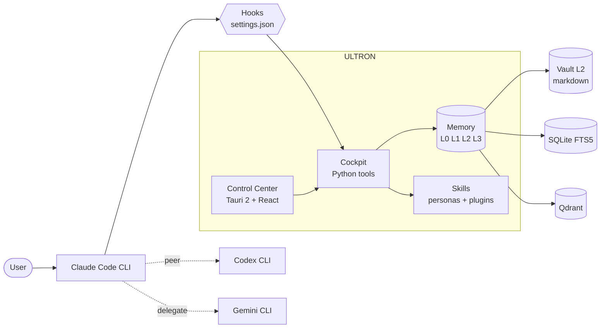

# ULTRON

[](LICENSE)
[](CHANGELOG.md)
[](#requirements)
[](https://claude.com/claude-code)

**Your local AI command center for Claude Code.**

Hierarchical memory, opt-in personas, hardened hooks, and a Tauri desktop cockpit that turns multi-day work with Claude, Codex, and Gemini into something you can actually manage.


> Screenshots are placeholders. Drop your own captures into `docs/screenshots/` after install.

---

## What is ULTRON

ULTRON is a personal cognitive harness layered on top of the official Claude Code CLI. It runs locally under `~/.ultron/`, persists state across sessions through a four-layer memory, and treats Claude (Opus) as the orchestrator while delegating to Codex (peer review, rescue) and Gemini (long context, image generation) when their strengths fit the job.

It is not a SaaS. It is not multi-tenant. It is one user's command center that happens to be open enough that anyone can clone it and reshape it for themselves. Every skill, every hook, every tab is opt-in, and the system is explicitly designed so the user can tear pieces out, replace them, or fork them.

The Control Center desktop app (Tauri 2 + React 19) is the visible surface, but the real machinery is the cockpit Python scripts, the hook protocol that wires into Claude Code's `settings.json`, and the local memory pipeline running on SQLite FTS5 and Qdrant.

---

## Features

### Memory — four layers, one source of truth

| Layer | Where | What |
|---|---|---|
| **L0** hot context | `~/.ultron/.tmp/context.md` | Pre-computed session primer, capped at 400 tokens |
| **L1** indexed | `~/.ultron/brain_index/index.db` | SQLite FTS5 over chunked vault notes, BM25 retrieval |
| **L2** vault | `~/.ultron-vault/*.md` | Curated markdown notes with wikilink graph (source of truth) |
| **L3** remote | optional git remote | Off-machine mirror of L2, drained by Stop hook |

A local Qdrant collection (`ultron_vault`, `ultron_skills`) sits beside L1 for semantic recall on the same corpus. Decay scoring surfaces stale notes back into L0 every SessionStart.

### Skills and personas — 14 L1 personas + plugins

Routing-aware skills live in `~/.claude/skills/` and are described by `skills.manifest.yaml`. Fourteen L1 personas ship with the repo and cover code, ops, research, finance, gaming, and personal-assistant work. Each persona declares triggers, cost tier, dispatcher priority, and a `security_status` against the PI001-PI013 prompt-injection ruleset before the dispatcher will route to it.

Plugins (L2) sit alongside in `~/.claude/skills/` and can be auto-discovered or vault-archived.

### Hooks — 12 wired into Claude Code

`SessionStart`, `UserPromptSubmit` (x3), `PreToolUse` (x4), `PostToolUse` (x3), and `Stop` (x3) hooks are merged non-destructively into `~/.claude/settings.json` on install. They handle context priming, mode triggering, prompt-injection scanning, vault sync, news generation, and decay updates.

### Control Center — 17-tab desktop GUI

Tauri 2 + React 19 frontend with a Rust backend talking to the cockpit. Tabs cover Dashboard, Usage, Notifications, Changelog, News, System, MCPs, Skills, Memory, Sessions, Projects, Gaming, Plans, Logs, Stats (Self-Improve), Personal, Hooks, and Settings. A subset is gated behind feature flags so each user can enable only the tabs they want.

### Dual and triple mode — Claude + Codex + Gemini

- **MiniDual** — one read-only Codex review round.
- **Dual** — adversarial review, bounded to three rounds.
- **MaxDual** — full rescue pipeline, five rounds, ULTRA mode only, explicit confirmation.
- **Gemini delegate** — long-context (>80k tokens) analysis, codebases over 150 files, image and video generation.

All peers run through their official CLIs against your existing subscription. No API keys, anywhere.

---

## Quick start

**Prerequisites:**

- Windows 11 (primary platform; macOS and Linux untested)
- [Claude Code CLI](https://claude.com/claude-code), authenticated
- Rust stable toolchain (for the Tauri build)
- Node 22 and npm
- [uv](https://github.com/astral-sh/uv) for Python
- Codex CLI (optional, for peer review)
- Gemini CLI (optional, for long-context delegate)

**One-liner:**

```powershell
git clone https://github.com/SkiTemplar/ultron.git $env:USERPROFILE\.ultron
cd $env:USERPROFILE\.ultron
.\scripts\install.ps1
```

The installer creates `~/.ultron/` and its subdirectories, optionally clones a memory template into your vault, merges hooks into `~/.claude/settings.json` non-destructively, lets you toggle which skill packs install (core, dev, personal-assistant, gaming, finance, creative are all optional), and builds the Control Center binary.

---

## Modular by design

ULTRON is built to be torn apart and rewired.

- **Skill packs are opt-in.** Core skills are always installed. Personal-assistant, gaming, finance, news, creative — every one of those is a toggle. If you do not want a `Gaming` tab, do not install the gaming pack.
- **General vs personal.** Some skills are general-purpose (the engineer, debugger, research-explainer). Others are explicitly personal to the author — the news generator pulls from feeds I read, the gaming module tracks my libraries, `tio-gilito` manages my expenses. Treat the personal ones as examples of how to build your own.
- **Self-modifying.** The `Skills` tab edits the manifest live. The `Hooks` tab toggles handlers in `settings.json`. The `Personal` tab edits the global `CLAUDE.md`. You are expected to fork the personas, rewrite the hooks, and reshape the cockpit until it fits the way you actually work.

If a feature feels too author-specific, the answer is almost always to disable it, swap it, or build your own version. The plumbing is the product.

---

## Architecture



---

## Customize

Everything lives in plain text under your home directory.

- `~/.ultron/skills/` and `~/.claude/skills/` — add, edit, or delete persona definitions. Run `ultron skills sync` to re-register.
- `~/.claude/CLAUDE.md` — your global instructions for every Claude Code session. Edit it directly or via the `Personal` tab.
- `~/.claude/settings.json` — hook definitions. The `Hooks` tab is a typed editor over this file.
- `~/.ultron-vault/` — your L2 vault. Plain markdown. Add notes, link them with wikilinks, and they will be picked up by the next `brain_index.py update`.
- `~/.ultron/plans/PLANS.json` — the single source of truth for your in-flight work. The `Plans` tab is a frontend over it.

The philosophy is the same throughout: text files on disk, no hidden databases of intent, every change reversible with `git`.

---

## Roadmap

- **v15.x (current)** — Memory and context overhaul, dual-mode v2 via subscription CLIs, Control Center stabilization, persona batches 1 and 2.
- **v16 (next)** — Bus foundation, supervisor daemon, pipeline DAG, overnight loop, mobile remote PWA, anti-hallucination layer.

Full plan in [plans/MEGA-PLAN-v15.md](plans/MEGA-PLAN-v15.md). Release notes in [CHANGELOG.md](CHANGELOG.md).

---

## Contributing

PRs welcome on architecture, packaging, cross-platform support, and core skills. Personal-flavored content (the author's news feeds, expense categories, gaming libraries) is out of scope — fork those for yourself. See [CONTRIBUTING.md](CONTRIBUTING.md) for setup, code style, and PR requirements.

Security issues should be reported privately per [SECURITY.md](SECURITY.md). Behavioral expectations live in [CODE_OF_CONDUCT.md](CODE_OF_CONDUCT.md).

---

## License

MIT — see [LICENSE](LICENSE).

---

## Credits

ULTRON orchestrates three tools it does not own and could not exist without:

- [**Claude Code**](https://claude.com/claude-code) by Anthropic — the runtime ULTRON wraps.
- [**Codex CLI**](https://github.com/openai/codex) by OpenAI — peer review and rescue.
- [**Gemini CLI**](https://github.com/google-gemini/gemini-cli) by Google — long-context delegate and image generation.

The vector layer runs on [Qdrant](https://qdrant.tech). The desktop shell is [Tauri](https://tauri.app). The Python pipeline runs on [uv](https://github.com/astral-sh/uv). Thanks to all four projects.
