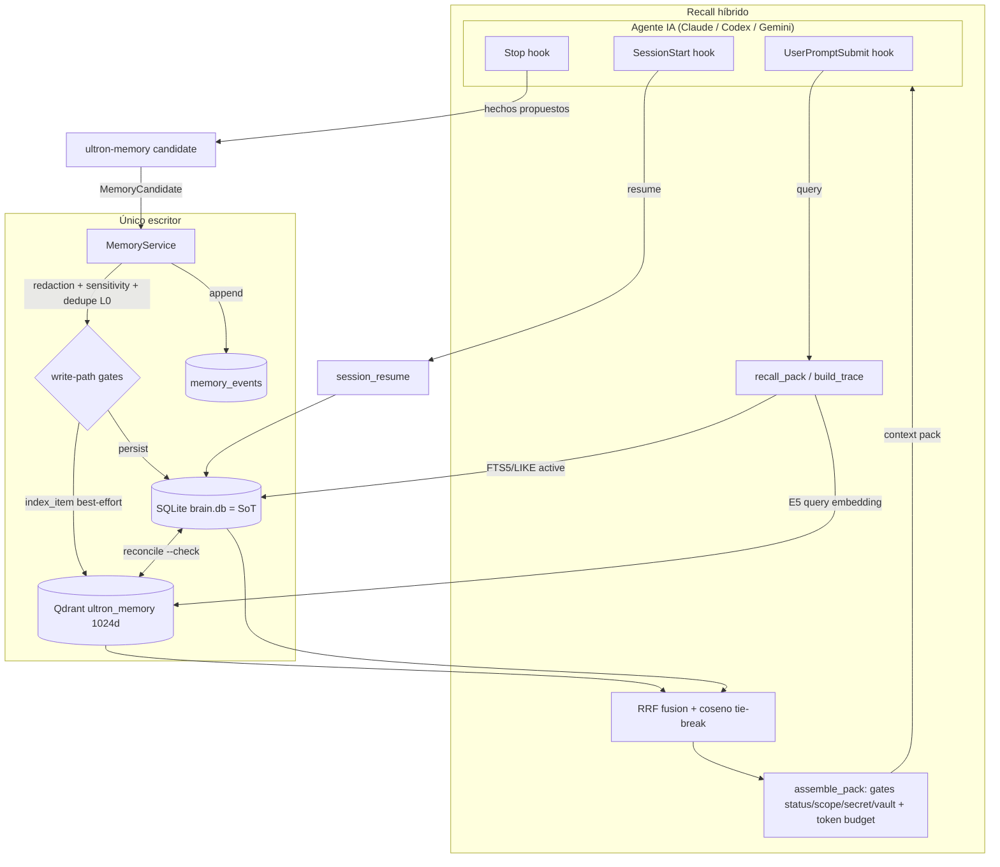

# ULTRON Memory System — Especificación autocontenida para revisión externa

> **Propósito de este documento.** Está escrito para una IA (o ingeniero) **externa** que
> **no conoce el repositorio**. Es deliberadamente autocontenido: describe la arquitectura,
> el modelo de datos, los caminos de escritura/lectura, las garantías de seguridad y
> consistencia, las métricas de evaluación, y el estado real (HECHO vs PENDIENTE) del sistema
> de memoria de ULTRON a fecha **2026-06-04** (rama `fullize-2026-05-30`, HEAD `f936a66`).
> Donde aporta, se cita evidencia `archivo:línea` del código Rust real. Al final hay una
> **pregunta concreta** para la IA externa.
>
> Lenguaje del código: **Rust** (backend Tauri 2) + un sidecar CLI Rust + hooks en Node.js.
> Almacenes: **SQLite** (`brain.db`) como fuente de verdad + **Qdrant** como índice vectorial
> derivado. Sin red obligatoria: todo corre local en la máquina del usuario (Windows).

---

## 1. Resumen ejecutivo

ULTRON es un **Memory-Orchestrated Agent Runtime local**: una capa de memoria persistente,
gobernada y auditable que sirve a asistentes de IA de línea de comandos (Claude Code, Codex,
Gemini) en la máquina del usuario. El objetivo declarado es construir **el mejor sistema de
memoria/recall/gobernanza** para agentes: que el agente recuerde decisiones, hechos, tareas,
restricciones y perfiles a través de sesiones; que nunca filtre secretos ni datos obsoletos;
que el recall sea medible; y que toda escritura sea trazable y reversible.

El diseño se apoya en cuatro invariantes duras:

1. **Una sola fuente de verdad (SoT):** SQLite `~/.ultron/brain.db`. Hoy contiene **943 items
   activos** (`schema_version = 2`).
2. **Un solo escritor:** la fachada Rust `MemoryService`. Hooks y agentes **nunca** escriben
   `memory_items` directo; proponen `MemoryCandidate`s que se promueven aquí
   (`service.rs:1-9`, `82-84`).
3. **Índice derivado, no autoridad:** Qdrant `ultron_memory` (943 puntos, E5-Large 1024d,
   coseno) es un índice reconstruible desde la SoT (`qdrant_index.rs:1-9`).
4. **Event-sourcing:** cada mutación añade un `MemoryEvent` append-only (auditoría).

El **núcleo** (escritura segura + recall híbrido + consistencia básica + evals básicas) está
implementado y verificado en runtime real, con `recall@8 = 0.9166` y `secret_leak = 0` /
`stale_leak = 0` sobre el set actual. Lo que falta para el "100%" no es el núcleo, sino tres
capas: **motor avanzado de recuperación** (reranker, dedupe semántico, contradicción
bitemporal), **policy engine del router/orquestador** (privacy-routing, ZonePolicy, skills en
el catálogo), y **control plane + observabilidad** (doctor/repair/rollback, trace_id).

---

## 2. Arquitectura

### 2.1 Componentes

| Componente | Rol | Tecnología |
|---|---|---|
| `brain.db` | **Fuente de verdad** (SoT). Tablas `memory_items`, `memory_candidates`, `memory_events`. | SQLite (WAL) |
| `MemoryService` | **Único escritor.** Fachada stateless: cada método abre `brain.db`, muta, y emite un evento. | Rust (`service.rs`) |
| Qdrant `ultron_memory` | **Índice denso derivado** (recall semántico). `point_id == item.id`. Reconstruible con `reindex_all`. | Qdrant nativo, E5-Large 1024d, coseno |
| FTS5 sobre `memory_items` | **Índice disperso** (léxico) dentro de `brain.db`. | SQLite FTS5 / LIKE |
| Embeddings E5 | `MultilingualE5Large` 1024d vía `fastembed` (ONNX, ~1.3 GB lazy). Prefijos `query:` / `passage:`. | ONNX local |
| Hooks (Node.js) | Disparados por el harness del agente (SessionStart, UserPromptSubmit, Stop). **Proponen** candidates; no escriben memoria directa. | Node.js |
| Sidecar `ultron-memory` | CLI Rust que expone la misma lógica de backend sin GUI. Subcomandos: `resume`, `orchestrate`, `recall`, `stats`, `reindex`, `eval`, `reconcile`, `candidate` (`bin/ultron_memory.rs:40-99`). | Rust binario |
| Control Center (Tauri) | GUI de escritorio que registra los `#[tauri::command]` y embebe la CLI del agente. | Tauri 2 + React |

### 2.2 Flujo

El "context pack" devuelto al agente es una lista compacta de **summaries** (no contenido
completo) bajo un presupuesto de tokens, con la traza "por qué esta memoria" para cada hit.

---

## 3. Modelo de datos

### 3.1 `MemoryItem` (registro canónico gobernado)

Definido en `model.rs:198-260`. Campos relevantes (vocabularios controlados como enums TEXT):

- **Identidad/scope:** `id` (UUID v4), `kind` (`MemoryType`: decision, fact, task, constraint,
  persona, skill, agent_note, session_summary…), `scope` (`Scope`: global, user, project, repo,
  branch, session, workflow, agent, skill), `project_id/repo_id/branch/workflow_id/agent_id/skill_id`.
- **Contenido:** `title`, `summary` (forma compacta que se inyecta), `content` (detalle, lazy),
  `content_json`, `tags`.
- **Estado (`Status`, `model.rs:93-104`):** `pending | active | rejected | stale | deprecated |
  quarantined | archived`. **Solo `active` es elegible para recall.**
- **Sensibilidad (`Sensitivity`, `model.rs:114-121`):** `public | internal | private | secret`.
  El gate `secret` excluye del context pack.
- **Confianza/importancia/estabilidad:** `confidence`, `importance`, `stability`
  (`temporary | durable | permanent`).
- **Procedencia (`Source`, `model.rs:123-138`):** `user_explicit`, `assistant_inferred`,
  `tool_observed`, `code_observed`, `workflow_generated`, `imported_*` (ETL de Mem0/ECC/KG/
  sesiones/vault), `manual_ui`.
- **Relaciones temporales:** `supersedes`, `superseded_by`, `contradicts[]`, `derived_from`.
- **Dedupe/consistencia (OLA B):** `content_hash` (FNV-1a 64-bit hex del texto normalizado,
  `model.rs:248-252`, `texthash.rs:22-35`), `normalized_text` (lower + colapso de whitespace),
  `schema_version` (= 2). `qdrant_point_id` existe en el esquema pero **no se genera** en
  `index_item` (se usa `item.id` como point id).
- **Operacional:** `token_estimate`, `access_count`, `last_accessed_at`, `last_injected_at`,
  `validated_by_user`, `validated_at`, `pinned` (elevado por el usuario, siempre considerado).

### 3.2 `MemoryCandidate` (propuesta a validar)

`model.rs:397-417`. Lo que producen hooks/agentes. Campos `proposed_*` espejo del item, más:
`source_event_ids`, `confidence`, `importance`, `risk_level` (string; marcador `"secret"` para
escalar a `Secret` al aprobar), `duplicate_candidates[]`, `contradiction_candidates[]`,
`recommended_action` (`CandidateAction`: approve, reject, edit, merge, supersede, **quarantine**),
`status` (`CandidateStatus`). Se promueve a `MemoryItem` con `to_item()` (`model.rs:446-458`).

### 3.3 `MemoryEvent` (auditoría event-sourced)

`model.rs:341-354`. Append-only. `event_type` (`created, updated, approved, rejected, edited,
merged, split, deprecated, restored, contradicted, retrieved, injected, exported, imported`),
`memory_id`, `before_json`/`after_json` (snapshots), `actor` (`user, memory_agent,
workflow_agent, system, migration`), `reason`, `confidence`, `created_at`. Hoy ~1043 eventos.
El `before_json` de un `forget` es **el único registro superviviente** del item borrado.

---

## 4. Write-path y seguridad

Todo el camino de escritura pasa por `MemoryService`. Pipeline en `create_candidate`
(`service.rs:84-162`), replicado en `add_imported` (`:249-268`), `edit` (`:296-344`) y
`supersede` (`:454-490`):

1. **Redacción de secretos (OLA A, HECHO).** `redaction::redact_in_place` sobre title, summary,
   content, content_json **y tags** (`service.rs:92-97`, `redact_tags` `:68-77`). El detector
   (`redaction.rs`) es dependency-free (sin regex): reconoce prefijos de credenciales conocidos
   (Anthropic, OpenAI, GitHub, Google, AWS, Slack, GitLab, Mem0), cabeceras `Bearer`/`Token`,
   asignaciones `key=value`, y bloques PEM (`redaction.rs:22-58`). **El embedding se genera solo
   sobre texto ya redactado** (`qdrant_index.rs:43-48` embebe `searchable_text()` tras redacción).
2. **Sensitivity gate (H2, HECHO).** Si se detectó secreto, el candidate se marca
   `recommended_action = Quarantine` (nunca auto-approve) y `risk_level = "secret"`
   (`service.rs:142-145`). Al aprobar, el item se eleva a `Sensitivity::Secret` de forma
   **monotónica, nunca a la baja** (`raised_sensitivity`, `service.rs:38-44`, `212-213`; test
   `:614-634`). Esto cierra el gate `Secret` del recall, que antes estaba hueco.
3. **Dedupe L0/FTS (HECHO parcial).** Dos capas: (a) near-dupe léxico vía `search_items` FTS
   marca duplicados activos como `Merge` (`service.rs:99-112`); (b) **L0 exacto** por
   `content_hash`: `find_active_by_content_hash` con **guard de scope/project** — un match exacto
   en otro proyecto es near-duplicate, NO duplicate, y nunca cruza la frontera de proyecto
   (`service.rs:114-136`).
4. **Quarantine / anti-poisoning.** Precedencia: `Quarantine` (secreto) > `Merge` (dup).
5. **Forget verificable (H4, HECHO básico).** `MemoryService::forget` (`service.rs:505-520`):
   `get_item` → snapshot `before` → `delete_item` (SQLite, error propagado: el borrado DEBE
   aterrizar) → `qdrant_index::remove_item` (best-effort) → `MemoryEvent` con `before` = item_json.
   Es un borrado físico explícito (derecho al olvido / purga de secreto filtrado), distinto de
   deprecate/reject (que conservan la fila). **Limitación:** aún no cubre backups ni logs JSONL.

**Mitigaciones reales y cableadas (no tocar sin re-correr el eval security gate):**
redacción antes de persistir y antes de embeber; recall aplica gates status≠Active /
cross-project / vault / `sensitivity==Secret`; `MemoryService` único escritor.

---

## 5. Recall pipeline

`recall_unified.rs` — un solo camino de recuperación. `build_trace` (`:199-296`) produce la traza
completa; `recall_pack` (`:299-307`) la versión compacta usada por la CLI.

1. **DENSE.** Se embebe la query (`E5 query:`) y se hace k-NN filtrado en Qdrant
   (`status=active` + `project_id` opcional), devolviendo `(canonical_id, coseno)`
   (`qdrant_index.rs:185-213`). Si E5/Qdrant no está disponible → vector vacío → **degradación
   limpia a sparse-only**.
2. **SPARSE.** FTS5/bm25 (en la práctica LIKE term-OR) sobre items ACTIVOS
   (`MemoryService::search_active`, `recall_unified.rs:208-211`).
3. **Fusión RRF.** Reciprocal Rank Fusion: `score(d) = Σ 1/(k + rank + 1)` con `k = 60`
   (`rrf_fuse`, `:83-98`). Fanout de 30 por fuente, límite final 8.
4. **Desempate por coseno (B1).** Empates de RRF se rompen por la **similitud coseno real** del
   denso (`:232-243`), restaurando una señal continua hasta que llegue el reranker (OLA D).
5. **Context pack con gates (`assemble_pack`, `:105-193`), unit-testable sin Qdrant/E5:**
   - límite de resultados; `status == Active` (re-verificado en SQLite por hit);
   - **scope**: items globales aplican en todas partes; el resto debe casar `project_id`;
   - **vault off-by-default** bajo filtro de proyecto (el corpus importado, ~92%, inundaría);
   - **sensitivity gate**: `Secret` nunca se inyecta (`:149-153`);
   - **token budget** = 1500: si se excede y ya hay items, se descarta; el primer item se permite
     aunque sea grande, truncando su summary al presupuesto (B4, `:154-170`).
   - cada item lleva `reason` ("dense#2 + sparse#5") y se emite un `MemoryEvent::Retrieved`.

Las invariantes del pack están cubiertas por test
(`assemble_pack_enforces_governance_invariants`, `:384-444`): rejected/deprecated/secret/
cross-project/vault NUNCA entran; active-in-project y global SÍ.

---

## 6. Consistencia SQLite ↔ Qdrant

- **`reconcile --check` (read-only, HECHO).** `reconcile_check` (`qdrant_index.rs:123-143`)
  hace un set-diff puro entre ids activos en SQLite y point ids en Qdrant, reportando
  `missing_in_qdrant` (activo no indexado) y `orphan_in_qdrant` (indexado pero ya no activo).
  Hoy `in_sync = true` (943 = 943). `--repair` está **deliberadamente NO implementado**
  (mutaría el índice; la política exige dry-run + confirmación explícita). `reindex_all`
  reconstruye desde la SoT cuando se desea.
- **W4 — index en write-paths (HECHO).** `sync_index` (`service.rs:52-58`) mantiene el índice
  denso al día best-effort: items `Active` se (re)indexan, los no-activos se eliminan. Se invoca
  en los 6 write-paths que crean/editan/restauran/superseden/relabelan activos
  (`service.rs:219, 263, 337, 366, 444, 475-481`). Antes, aprobar el primer candidate hacía
  derivar `in_sync`. Los errores se tragan: la SoT manda y el drift es detectable/reparable.
- **`content_hash` idempotencia (HECHO).** FNV-1a determinista sobre `normalized_text`
  (`texthash.rs`), estable entre runs/builds/plataformas; clave de dedupe e idempotencia.

**Brecha conocida:** no existe outbox/CDC transaccional. El `index_item` best-effort cierra
~90% del riesgo, pero un fallo de Qdrant durante un write deja un missing hasta el próximo
reconcile/reindex (falso-negativo: memoria activa ausente del denso, no inyección de contenido
retirado, porque `assemble_pack` re-verifica `status==Active` en SQLite por hit).

---

## 7. Evals

- **Golden set.** El harness real (`evals.rs`) lleva 12 queries hardcoded como baseline de
  arranque, pero existe un **dataset externo generado** de **942 positivos** desde `brain.db`
  (`evals/golden_set.json`, `gen_golden.py` read-only con `mode=ro` + `PRAGMA query_only`,
  muestreo estratificado por tipo, `expect_ids = [canonical_id]`). El gate de secretos descarta
  filas peligrosas **antes** de entrar al dataset (1 filtrada). Además `negative_fixtures.json`
  con casos adversariales sintéticos (secret/stale/cross-project/duplicate/temporal).
- **`eval_metrics.rs` (PURO, HECHO).** Núcleo aritmético unit-testable sin I/O: `precision_at_k`,
  `recall_at_k`, `mrr`, `ndcg@k`, `context_waste_ratio` (`eval_metrics.rs:31-79`, 23 tests).
  Relevancia binaria; división por cero guardada en todos los casos (nunca `NaN`).
- **Security gate (HECHO).** El eval mide y exige `secret_leak = 0` y `stale_leak = 0`.
- **Baseline reproducible:** `recall@8 = 0.9166` (`ultron-memory eval`).

**Brecha de validez (registrada):** el golden set generado tiene query ≈ summary en ~97.7% de
casos (comparten tokens literales), así que mide recall léxico, no semántico. El subcomando
`eval` hoy **solo reporta recall@8** — `eval_metrics` existe pero **no está cableado** al
subcomando.

---

## 8. Estado HECHO vs PENDIENTE por subsistema

| Subsistema | % aprox. | HECHO | PENDIENTE |
|---|---|---|---|
| **Núcleo memoria** (SoT, único escritor, write-path, recall híbrido, eventos) | **~80%** | redaction + sensitivity + dedupe L0 + forget + RRF + gates + content_hash + reconcile --check + W4 index | outbox/CDC, forget cubriendo backups/logs, dedupe semántico |
| **Evals** | **~50%** | eval_metrics puro (23 tests), golden 942, security gate, recall@8 baseline | cablear eval_metrics al subcomando, golden con paráfrasis real, `eval_runs` persistido + `eval-compare` (regresión) |
| **Orquestador / skills** | **~30%** | `orchestrate()` vivo e2e (advisory), catálogo indexa **agentes** | `index_skills()` (no existe), namespacing `skill::`/`agent::`, activation-policy con umbrales, result-contract, delegación real (hoy advisory-only) |
| **AI Router** | **~40%** | `route(zone, prompt)` real con cadena primary→fallback, proxy free-tier | ZonePolicy (temperature, response_schema, privacy, cache, circuit_breaker), **privacy-routing** (private/secret → local), capability model |
| **Control plane / observabilidad** | **~15%** | `reconcile --check`, `stats`, `eval` vía sidecar | `doctor/repair/rollback/explain/replay`, **trace_id** end-to-end, lifecycle/disk CLI, hook manifest desplegado, MCP enforcement |

---

## 9. Gaps frente al estado del arte (SOTA)

1. **Reranker cross-encoder.** Tras RRF, reordenar con un cross-encoder (p.ej. `bge-reranker-v2-m3`
   ONNX local). Hoy el desempate es coseno bi-encoder; falta el segundo paso de precisión.
2. **Contextual retrieval.** Enriquecer cada chunk con contexto del documento antes de embeber
   (estilo Anthropic contextual embeddings/BM25) para subir recall sin reranker.
3. **Dedupe L2-L4.** Hoy solo L0 (hash exacto) + near-dupe FTS. Faltan L2 (MinHash/SimHash
   shingles), L3 (coseno embedding con thresholds calibrados), L4 (misma entidad canónica + scope),
   con guard temporal (near-duplicate ≠ duplicate) y merge explicable + rollback (CONTRACTS §4).
4. **Contradiction / supersession bitemporal.** `contradiction.rs` y `reflection.rs` tienen
   lógica real pero **sin caller de producción** (TODO en `service.rs:146-149`). Faltan columnas
   `valid_from/valid_to` para consultas temporales y supersesión bitemporal.
5. **Reflection grounded.** Generar insights de orden superior anclados en evidencia (no
   alucinados), como candidates a validar.
6. **ZonePolicy + privacy-routing.** El router carece de `temperature`/`response_schema`/`privacy`/
   `cache`/`circuit_breaker`. **Cadena de privacidad rota:** un secreto guardado en claro en una
   sesión previa + Zone sin flag privacy ⇒ podría evadir gates e ir a un proveedor cloud. Refuerza
   el wiring sensitivity↔recall↔router como una sola cadena.
7. **`index_skills` + procedural memory.** Las skills no compiten en routing; falta indexarlas en
   el catálogo y aprender "intent/proyecto → skill que funcionó" con decay.
8. **trace_id / observabilidad.** No existe correlación hook→orchestrator→recall→router→event;
   sin replay por traza ni taxonomía de errores.
9. **Lifecycle / disk manager.** Sin CLI de mantenimiento (scan/plan/apply dry-run), sin gestión
   de las ~6 copias duplicadas de `.fastembed_cache` ni rotación de backups (~40 GB en disco).
10. **Recuperación de sparse real (BM25/FTS5).** El sparse actual es LIKE term-OR; falta BM25 real.

---

## 10. Pregunta para la IA externa

Dado todo lo anterior — un núcleo de memoria local seguro, consistente y medible (SoT SQLite +
índice Qdrant E5 1024d + único escritor + recall híbrido RRF con gates + evals con security gate
a leak=0), pero con motor avanzado, policy engine y control plane incompletos —:

> **¿Qué falta para que este sea el mejor sistema de memoria para agentes de IA del mundo, y
> cómo lo priorizarías?**

Concretamente, nos interesa tu criterio sobre:

- **Recuperación.** ¿El stack RRF (dense E5 + sparse) + desempate coseno es suficiente, o el mayor
  salto de calidad vendría de un reranker cross-encoder, de contextual retrieval, o de otra técnica?
  ¿En qué orden invertirías?
- **Gobernanza temporal.** ¿Cómo modelarías supersesión/contradicción bitemporal
  (`valid_from/valid_to`) sin convertir el recall en algo lento o frágil? ¿Merece la pena frente a
  un simple `superseded_by`?
- **Dedupe multicapa.** ¿Vale la pena L2-L4 (MinHash → embedding → entidad) a escala de 10³-10⁴
  items, o el hash exacto + near-dupe FTS cubre el 95% del valor?
- **Seguridad/privacy.** ¿Cómo cerrarías la cadena de privacidad (sensitivity → recall gate →
  privacy-routing) de forma verificable? ¿Qué detectores (PII, prompt-injection) son
  imprescindibles antes de persistir fuentes externas/MCP?
- **Evaluación.** ¿Cómo construir un golden set que mida recall **semántico** real (no solapamiento
  léxico) y que detecte regresiones por commit? ¿Qué métricas son las que de verdad importan para
  un sistema de memoria de agente (más allá de recall@k/MRR/nDCG/context-waste)?
- **Arquitectura.** ¿Es correcta la decisión "SQLite = SoT, Qdrant = índice derivado, único
  escritor, event-sourced"? ¿Outbox/CDC transaccional es necesario o `index_item` best-effort +
  reconcile basta a esta escala?
- **Lo que no hemos pensado.** Cualquier técnica, patrón o riesgo del estado del arte (memoria de
  agentes, RAG, retrieval) que deberíamos estar considerando y no aparece arriba.

Responde con un plan priorizado (qué primero, qué después, qué descartar) y, donde puedas,
justifica con referencias a sistemas o papers concretos.

---

*Fin del documento. Estado de verdad verificado a 2026-06-04, HEAD `f936a66`, evidencia
`archivo:línea` sobre `control-center/src-tauri/src/memory/*.rs` y
`control-center/src-tauri/src/commands/memory/recall_unified.rs`.*
