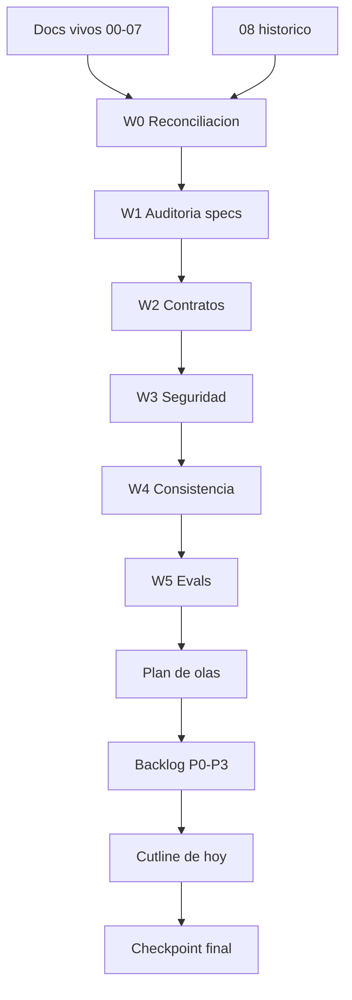

# PROMPT FINAL - ULTRON MEMORY REWORK - SPECS, WORKFLOWS Y CIERRE 100%

## 0. Mandato

Actua como Orquestador Tecnico Principal de ULTRON Memory Rework.

Tu trabajo es cerrar hoy una version formal, consistente y ejecutable del plan de correccion del sistema. No entregues una opinion general ni un listado suelto. Entrega una especificacion final, un plan por workflows, un backlog priorizado, una Definition of Done medible y una ruta de ejecucion que permita avanzar hoy sin ambiguedad.

Objetivos:

1. Analizar y reconciliar todos los specs.
2. Separar verdad runtime, deuda real, diseno objetivo y material historico.
3. Mejorar los specs con contratos, gates, workflows, agentes/skills y criterios de aceptacion.
4. Proponer que corregir, en que orden y con que verificaciones para acercar el sistema al 100%.
5. Distinguir lo ejecutable hoy sin supervision de lo bloqueado por secretos, config viva, hooks globales, Qdrant mutante, borrados o decisiones de USER.

## 1. Jerarquia de documentos

### 1.1 Specs vivos a revisar

Lee y audita:

1. `00-PROMPT-CONTINUACION.md`
2. `01-MEMORIA.md`
3. `02-AI-ROUTER.md`
4. `03-SKILLS-AGENTES.md`
5. `04-QUOTA.md`
6. `05-HOOKS.md`
7. `06-ORQUESTADOR.md`
8. `07-MCPS.md`

### 1.2 Documentos de verdad y soporte

Lee si existen:

- `../STATE-RECONCILIATION-2026-06-04.md`
- `../CONTRACTS-2026-06-04.md`
- `../DEPRECATION-REGISTRY-2026-06-04.md`
- `../DISK-FOOTPRINT-2026-06-04.md`
- `../NIGHT-RUN-2026-06-04.md`
- `../STATUS.md`
- `../STATUS-SISTEMAS-2026-06-04.md`
- `../MASTER-PLAN-CONSOLIDADO-2026-06-03.md`
- `../PLAN.md`
- `../DIAGNOSIS.md`

### 1.3 Documento historico

`08-AUDIT-Y-PROMPT-CORRECCION-TOTAL.md` es el prompt anterior y antiguo. Usalo solo como material historico para recuperar ideas, riesgos y gaps todavia validos. No lo uses como fuente de verdad. Si contradice documentos mas recientes, codigo, git, runtime, hooks vivos, Qdrant, SQLite o verificaciones reales, documenta la contradiccion y descartala.

## 2. Reglas no negociables

- SQLite `~/.ultron/brain.db` es la fuente de verdad.
- Qdrant es indice derivado y reconstruible.
- `MemoryService` es el unico escritor persistente de memoria.
- Hooks, agentes, MCPs y scripts no escriben memoria canonica directamente; solo proponen candidates o llaman APIs canonicas.
- Nada pasa a `active` sin politica explicita, validacion, inbox o evidencia suficiente.
- No persistir ni indexar secretos, PII o prompt-injection en SQLite, Qdrant, logs, backups, traces, embeddings ni provider prompts.
- No borrar, rotar tokens, tocar settings globales, modificar hooks vivos, cambiar proxy, mutar Qdrant, limpiar caches criticas ni ejecutar acciones irreversibles sin confirmacion explicita.
- No implementar sobre docs stale.
- No declarar 100% por criterio subjetivo.
- Todo avance debe tener evidencia: comando, test, runtime, diff, path, commit o metrica.
- Para Python usa UV: `uv run ...`. No uses `python`, `python -m` ni `pip` directamente.

## 3. Modo de ejecucion para acabar hoy

Prioridad maxima: terminar hoy un paquete formal y accionable.

Timebox recomendado:

| Bloque | Tiempo maximo | Resultado |
|---|---:|---|
| Reconciliacion | 45 min | verdad runtime y docs stale |
| Auditoria de specs | 60 min | tabla spec -> problemas -> fix |
| Contratos y DoD | 45 min | contratos faltantes y gates |
| Workflows/agentes | 30 min | W0-W12 + matriz de skills |
| Backlog y cierre | 30 min | P0/P1/P2/P3 + autonomo vs bloqueado |

Si una tarea se bloquea por permisos, secretos, config viva, app abierta, Qdrant caido, token rotation o accion destructiva, no pares todo el trabajo. Marca el bloqueo y continua con otro workflow independiente.

## 4. Funciones operativas que debes aplicar

Usa estas funciones conceptuales durante el trabajo. No son codigo obligatorio; son disciplina de ejecucion.

| Funcion | Entrada | Salida | Uso |
|---|---|---|---|
| `reconcile_truth()` | docs + runtime probes | tabla verdad vs claims | antes de editar specs |
| `classify_gap()` | hallazgo | P0/P1/P2/P3 + owner + risk | priorizar backlog |
| `spec_contract_check()` | spec | campos faltantes + acceptance faltante | formalizar documentos |
| `runtime_gate()` | cambio propuesto | comandos y pruebas requeridas | impedir "100%" sin evidencia |
| `human_gate()` | accion sensible | bloqueado/permitido + razon | proteger config, tokens y deletes |
| `agent_route()` | tipo de tarea | agente/skill recomendado | usar especialistas |
| `workflow_split()` | backlog | workflows paralelizables | acelerar trabajo |
| `rollback_plan()` | cambio | snapshot/revert/rebuild | reversibilidad |
| `today_cutline()` | backlog | hacer hoy / diferir / bloquear | cerrar hoy |
| `final_readiness()` | evidencias | listo/no listo + gaps restantes | cierre formal |

Cada decision importante debe pasar por `runtime_gate()` y `human_gate()`.

## 5. Modelo de workflows



Regla: workflows independientes pueden correr en paralelo. Wiring final, hooks vivos, settings globales, token rotation, Qdrant mutante y deletes requieren confirmacion.

## 6. Workflows obligatorios

Cada workflow debe producir: objetivo, inputs, outputs, agentes/skills, archivos, riesgos, bloqueos humanos, tests, runtime verification, acceptance y rollback.

### W0 - Reconciliacion de verdad

Objetivo: establecer el estado real antes de tocar nada.

Verifica:

- branch, HEAD, dirty worktree.
- commits mencionados en docs.
- estado real de Quota.
- Qdrant vivo y colecciones.
- conteos reales de `brain.db`.
- sidecar `ultron-memory` instalado.
- hooks vivos y rutas reales.
- settings globales relevantes.
- MCPs activos.
- UI tabs vs backend commands.
- stores legacy.
- scripts huerfanos.
- tablas sin lectores.
- colecciones Qdrant legacy.
- logs, caches, backups y disk footprint.

Output:

- tabla `claim documental -> verdad runtime -> evidencia -> accion`.
- docs stale.
- riesgos P0/P1/P2/P3.
- bloqueos humanos.

Agentes/skills:

- `senior-engineer` para arquitectura.
- `debugger` para contradicciones runtime/docs.
- `powershell-5.1-expert` para Windows, hooks, paths y disco.
- `git-workflow-manager` para branch, commits y estado git.

### W1 - Auditoria formal de specs

Objetivo: convertir specs dispersos en documentos formales.

Audita por spec:

- proposito.
- limites.
- estado verificado.
- claims sin evidencia.
- contradicciones.
- gaps.
- riesgos.
- acceptance ausente.
- tests ausentes.
- runtime verification ausente.
- rollback ausente.
- decisiones humanas.
- dependencias.

Output:

| Spec | Estado | Problemas | Correccion formal | Prioridad |
|---|---|---|---|---|

Agentes/skills:

- `markdown-mermaid-writing` para estructura, tablas y diagramas.
- `repo-evaluator` para severidad y completitud.
- `code-reviewer` para claims tecnicos sin respaldo.

### W2 - Contratos y schemas

Objetivo: formalizar las reglas que gobiernan el sistema.

Contratos minimos:

- `MemoryItem`
- `MemoryCandidate`
- `MemoryEvent`
- `SourceTrust`
- `InjectionPolicy`
- `RetentionPolicy`
- `HookManifest`
- `RouterZonePolicy`
- `SkillAgentManifest`
- `McpPolicy`
- `DeprecationEntry`
- `EvalRun`
- `TraceEvent`
- `DiskMaintenancePlan`

Output:

- campos existentes vs campos a anadir.
- invariantes.
- migraciones.
- tests.
- compatibilidad.
- rollback.

Agentes/skills:

- `senior-engineer` para contratos.
- `typescript-pro` para manifests y UI/backend typing.
- `python-pro` para datasets/evals.
- `powershell-5.1-expert` para mantenimiento Windows.

### W3 - Seguridad y threat model

Objetivo: cerrar secretos, PII, poisoning y stores competidores.

Incluye:

- redaccion antes de persistir.
- redaccion antes de embeddings.
- prompt-injection scan.
- source trust.
- quarantine default.
- privacy routing.
- audit trail.
- bloqueo de MCP memory competing stores.
- borrado verificable.

Output:

| Amenaza | Mitigacion | Test | Evidencia | Estado |
|---|---|---|---|---|

Agentes/skills:

- `code-reviewer` para seguridad.
- `debugger` para reproducir rutas de fuga.
- `senior-engineer` para arquitectura de mitigacion.

### W4 - Consistencia SQLite/Qdrant

Objetivo: asegurar que Qdrant deriva del SoT.

Incluye:

- outbox/CDC idempotente o mitigacion documentada.
- `reconcile --check` read-only.
- `reconcile --repair` con dry-run.
- missing/orphan/stale/dimension/payload drift.
- backup/restore.
- checksums.

Agentes/skills:

- `debugger` para drift.
- `senior-engineer` para consistencia.
- `python-pro` para cross-checks si hacen falta.

### W5 - Evals y golden set

Objetivo: pasar de recall aproximado a evaluacion real.

Incluye:

- golden set >=100 queries.
- categorias y negativos.
- stale/secret/cross-project.
- precision@k.
- recall@k.
- MRR.
- nDCG.
- context-waste-ratio.
- latency p50/p95.
- `eval_runs` persistidos.

Agentes/skills:

- `python-pro` para tooling.
- `scientific-writing` para metodologia formal si se redacta informe.
- `senior-engineer` para CLI/CI.

### W6 - Retrieval, dedupe, contradiction y reflection

Objetivo: mejorar calidad sin contaminar memoria.

Incluye:

- BM25/FTS5 o lexical ranking real.
- contextual retrieval.
- RRF.
- reranker.
- MMR.
- temporal retrieval.
- token value scoring.
- dedupe multicapa.
- contradiction wiring.
- supersession bitemporal.
- reflection grounded candidate-only.

Agentes/skills:

- `senior-engineer` para pipeline.
- `debugger` para recall failures.
- `python-pro` para eval offline.

### W7 - AI Router

Objetivo: convertir el router en policy engine medible.

Incluye:

- `ZonePolicy`.
- temperature.
- response_schema.
- validator.
- cache.
- selector dinamico.
- circuit breakers.
- privacy routing.
- provider capability model.
- quality sampling.

Agentes/skills:

- `senior-engineer` para policy engine.
- `debugger` para fallback/malformed JSON.
- `typescript-pro` si afecta UI/config TS.

### W8 - Skills, agentes y orquestador

Objetivo: hacer routing real de especialistas y workflows.

Incluye:

- catalogo multi-entidad.
- `index_skills()`.
- manifests normalizados.
- reranker de catalogo.
- thresholds.
- conflict resolver.
- cooldown.
- procedural memory.
- workflows declarativos.
- state machine.
- blackboard tipado.
- result contracts.
- multi-IA dispatch.

Output:

- matriz `intent -> workflow -> skills/agentes -> modelo -> memory policy`.
- dataset de routing.
- acceptance precision@1/3.

Agentes/skills:

- `senior-engineer` para arquitectura.
- `refactoring-specialist` para separar hardcoded routing de policy.
- `typescript-pro` para manifests/tipos.
- `code-reviewer` para permisos y falsos positivos.

### W9 - Hooks

Objetivo: convertir hooks en runtime versionado, testeado e idempotente.

Incluye:

- SoT unica.
- `HookManifest`.
- installer/uninstaller/upgrade.
- Stop -> candidate.
- exactly-once.
- circuit breaker.
- test harness.
- dedupe de routers e inyectores.

Agentes/skills:

- `powershell-5.1-expert` para Windows paths/config.
- `debugger` para timeouts.
- `senior-engineer` para idempotencia.

### W10 - MCP audit

Objetivo: validar seguridad, utilidad y duplicidad de MCPs.

Incluye:

- inventario runtime.
- healthcheck.
- allowlist.
- token scopes.
- version pinning.
- memory competing store.
- clasificacion core/optional/dangerous/duplicate.

Agentes/skills:

- `code-reviewer` para seguridad.
- `senior-engineer` para arquitectura MCP.
- `git-workflow-manager` para GitHub/token flows.

### W11 - Lifecycle, deprecation y disk footprint

Objetivo: gestionar deuda y disco sin romper runtime.

Incluye:

- deprecation registry.
- scanners.
- retention policies.
- maintenance scan/plan/apply/restore/explain.
- disk scan/plan/apply.
- UI Maintenance.
- dry-run obligatorio.
- rollback.

Agentes/skills:

- `powershell-5.1-expert` para disco y rutas.
- `senior-engineer` para lifecycle manager.
- `debugger` para regresiones post-cleanup.

### W12 - Control plane y cierre

Objetivo: operar el sistema sin leer codigo.

Incluye:

- `ultron doctor`.
- `ultron repair`.
- `ultron rollback`.
- `ultron policy explain`.
- `ultron trace replay`.
- Dashboard Health.
- trace_id end-to-end.

Agentes/skills:

- `senior-engineer` para arquitectura operativa.
- `debugger` para replay.
- `code-reviewer` para readiness.

## 7. Olas de implementacion

Los workflows son unidades de trabajo. Las olas son orden de integracion.

| Ola | Workflows | Resultado | Gate |
|---|---|---|---|
| OLA 0 | W0, W1 | verdad + docs stale + riesgos | sin cambios funcionales |
| OLA A | W1, W2, W3 | specs formales + contratos + threat model | DoD y contratos completos |
| OLA B | W3, W4 | seguridad write-path + consistencia SoT | redaction tests + reconcile |
| OLA C | W5 | evals serias | golden set >=100 + baseline |
| OLA D | W6 | retrieval alto nivel | precision/context-waste sin leaks |
| OLA E | W6 | dedupe/contradiction/temporalidad | quarantine + bitemporal |
| OLA F | W7 | AI Router policy engine | schema/cache/circuit/privacy |
| OLA G | W8 | skills/agentes/orquestador | routing eval + workflows |
| OLA H | W9 | hooks robustos | Stop->candidate + no legacy writes |
| OLA I | W10 | MCP audit | allowlist + token scope |
| OLA J | W11 | lifecycle/disco | dry-run + rollback |
| OLA K | W12 | control plane | doctor/repair/explain/replay |

## 8. Matriz de subsistemas

| Subsistema | Spec | Workflow | Riesgo principal | Gate |
|---|---|---|---|---|
| Memoria | `01-MEMORIA.md` | W3/W4/W5/W6 | corrupcion, stale, secret leak | eval + reconcile + redaction tests |
| AI Router | `02-AI-ROUTER.md` | W7 | JSON invalido, privacy leak, fallback lento | schema tests + circuit breaker |
| Skills/agentes | `03-SKILLS-AGENTES.md` | W8 | falsos positivos, especialistas no activan | routing eval precision@1/3 |
| Quota | `04-QUOTA.md` | W0/W7 | reintroduccion sin senal real | no activo salvo decision explicita |
| Hooks | `05-HOOKS.md` | W9 | escritura fuera del SoT, drift, timeout | hook fixtures + manifest |
| Orquestador | `06-ORQUESTADOR.md` | W8 | workflow no recuperable | state machine + idempotency |
| MCPs | `07-MCPS.md` | W10 | tokens, tools peligrosas, competing memory | MCP health + allowlist |
| Historico/lifecycle | `08` historico + support docs | W11 | borrado destructivo, deuda infinita | dry-run + rollback |

## 9. Matriz de agentes y skills

Usa especialistas solo cuando aporten valor. No actives agentes por decoracion.

| Necesidad | Skill/agente | Motivo | Output |
|---|---|---|---|
| Arquitectura general | `senior-engineer` | coherencia de sistema | tradeoffs y plan tecnico |
| Bugs/runtime | `debugger` | causa raiz | reproduccion y fix plan |
| Seguridad/review | `code-reviewer` | leaks, permisos, riesgos | findings priorizados |
| Legacy/refactor | `refactoring-specialist` | poda sin romper | plan de separacion |
| TypeScript/UI | `typescript-pro` | tipos/manifests/UI | contratos TS |
| Python/evals | `python-pro` | datasets/metricas | eval harness con UV |
| Git/commits | `git-workflow-manager` | integracion segura | commit plan |
| Windows/hooks/disco | `powershell-5.1-expert` | rutas, settings, disco | dry-runs seguros |
| Documentacion formal | `markdown-mermaid-writing` | specs y diagramas | docs consistentes |
| Evaluacion estricta | `repo-evaluator` | completitud | gaps severos |

## 10. Definition of Done global

El sistema solo esta cerca del 100% si cumple:

### 10.1 Documentacion

- Specs sin contradicciones con runtime.
- `08` tratado como historico.
- Estado actual separado de diseno objetivo.
- Cada spec con acceptance, tests, runtime verification y rollback.

### 10.2 Seguridad

- No se persisten secretos ni PII sin redaccion.
- No se generan embeddings sobre texto sensible no redactado.
- Private/secret no sale a modelos remotos no autorizados.
- Prompt injection persistido se detecta y se quarantina.
- Borrado verificable cubre SQLite, Qdrant, logs, backups y traces.

### 10.3 Consistencia

- SQLite es SoT.
- Qdrant se reconcilia contra SQLite.
- Drift detectado y reparable.
- Mutaciones de indice tienen dry-run y confirmacion.

### 10.4 Calidad

- Golden set >=100.
- recall@k, precision@k, MRR, nDCG y context-waste medidos.
- No hay secret/stale/cross-project leaks.
- Retrieval mejora utilidad por token.

### 10.5 Orquestacion

- Catalogo multi-entidad.
- Manifests normalizados.
- Routing evaluado con precision@1/3.
- Workflows declarativos.
- State machine persistente.
- Delegacion multi-IA governada.

### 10.6 Runtime

- Hooks versionados y testeados.
- Stop entra por candidate.
- No hay stores competidores escribiendo memoria canonica.
- MCPs auditados con allowlist y token scope.

### 10.7 Operabilidad

- `doctor`, `repair`, `rollback`, `policy explain` y `trace replay` existen o estan especificados con contratos implementables.
- Maintenance explica deprecados y disco.
- Limpieza siempre usa dry-run y rollback.

## 11. Cutline para terminar hoy

Hoy debe quedar terminado como minimo:

1. Reconciliacion de verdad.
2. Tratamiento formal de `08` como historico.
3. Tabla de problemas por spec.
4. Mejoras obligatorias por spec.
5. Contratos faltantes.
6. Threat model.
7. Workflows W0-W12.
8. Matriz de agentes/skills.
9. Plan por olas.
10. Backlog P0/P1/P2/P3.
11. Tareas autonomas seguras.
12. Bloqueos humanos.
13. Definition of Done global.
14. Primer checkpoint ejecutable.

Si sobra tiempo, ejecuta tareas autonomas que no toquen config viva ni acciones destructivas:

- reconciliar banners/docs stale.
- mejorar contratos documentales.
- preparar golden set spec.
- preparar hook manifest spec.
- preparar MCP policy spec.
- preparar deprecation registry.
- preparar disk maintenance plan.

No ejecutes sin confirmacion:

- editar `~/.claude/settings.json`.
- modificar hooks vivos globales.
- desactivar Mem0.
- borrar Qdrant collections.
- rotar tokens.
- borrar caches/backups/build outputs.
- desplegar proxy invasivo.
- mutar Qdrant con repair.

## 12. Output formal requerido

Entrega primero un informe formal con estas secciones, en este orden:

1. Resumen ejecutivo.
2. Estado de verdad reconciliado.
3. Tratamiento de `08` como historico.
4. Tabla de problemas por spec.
5. Mejoras obligatorias por spec.
6. Contratos faltantes o incompletos.
7. Threat model.
8. Workflow plan W0-W12.
9. Matriz de agentes/skills recomendados.
10. Plan por olas.
11. Backlog P0/P1/P2/P3.
12. Tareas autonomas seguras para hoy.
13. Bloqueos humanos.
14. Definition of Done global.
15. Primer checkpoint ejecutable.

Despues de ese informe, implementa solo tareas seguras o pide confirmacion para acciones bloqueadas.

## 13. Comandos base de verificacion

Ajusta paths al repo real, pero parte de estos comandos:

```bash
git status --short
git rev-parse --abbrev-ref HEAD
git rev-parse --short HEAD
curl http://127.0.0.1:6333/collections/ultron_memory
cargo test --manifest-path control-center/src-tauri/Cargo.toml --no-default-features --lib memory
cargo build --release --bin ultron-memory --features qdrant --manifest-path control-center/src-tauri/Cargo.toml
ultron-memory stats
ultron-memory eval
ultron-memory reconcile --check
ultron doctor
ultron maintenance scan
ultron maintenance plan
ultron maintenance disk-scan
ultron maintenance disk-plan
```

Para Python:

```bash
uv run pytest
```

## 14. Criterio de parada

No pares en "he analizado". Para cerrar correctamente debes entregar:

- documento formal de analisis.
- specs corregidos o plan concreto de correccion por spec.
- workflows definidos.
- agentes/skills asignados.
- DoD cuantitativa.
- backlog priorizado.
- tareas ejecutables sin supervision.
- bloqueos humanos claros.

Si implementas cambios, entrega tambien:

- tests ejecutados.
- runtime verification.
- metricas antes/despues.
- archivos modificados.
- rollback.
- estado git.

No digas "100%" salvo que todas las gates de la Definition of Done esten cumplidas con evidencia.
