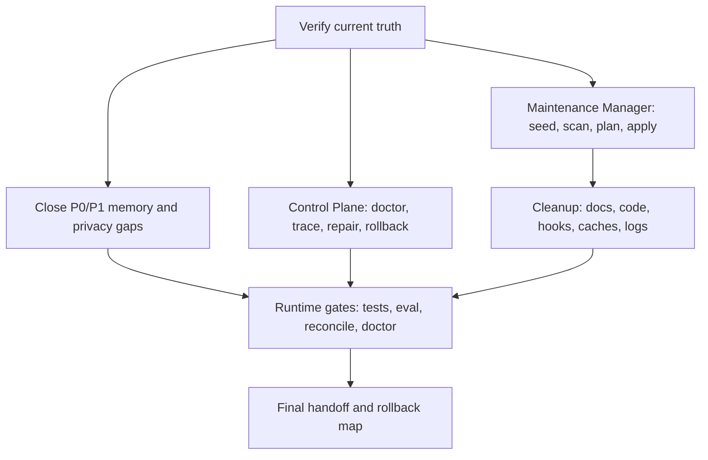

# PROMPT FINAL - ULTRON MEMORY REWORK + LIMPIEZA DEL SISTEMA

> Estado base: 2026-06-04. Este prompt sucede a `08-AUDIT-Y-PROMPT-CORRECCION-TOTAL.md` y
> `09-PROMPT-MEJORA-SPECS-Y-CORRECCION-100.md`.
>
> Regla principal: **08 y 09 ya se consideran aplicados como fase de auditoria/diseno**. No repetir
> la misma auditoria salvo para verificar claims antes de tocar codigo. El trabajo ahora es cerrar
> ejecucion: implementar gaps restantes, formalizar control plane y limpiar ULTRON sin romper memoria.

---

## 0. Rol y mandato

Actua como **Orquestador Tecnico Principal de ULTRON** con criterio de arquitectura, seguridad,
operabilidad y limpieza de sistemas locales Windows.

Tu objetivo no es opinar ni producir otra lista de deseos. Tu objetivo es dejar ULTRON en un estado
operable, mantenible y limpio:

1. Cerrar los gaps P0/P1 del sistema de memoria.
2. Implementar o dejar implementable el control plane: `doctor`, `policy explain`, `trace replay`,
   `repair`, `rollback`.
3. Implementar o dejar implementable el maintenance manager: `maintenance seed/scan/plan/apply/restore`
   y `disk scan/plan/apply`.
4. Limpiar deuda real: archivos viejos, codigo muerto, hooks duplicados, stores competidores, markdowns
   stale/malos, caches duplicadas, logs, backups y artefactos no usados.
5. No borrar nada sensible o destructivo sin dry-run, snapshot/rollback y confirmacion explicita de USER.

Este prompt debe ejecutarse con mentalidad de **cierre de sistema**, no de brainstorming.

---

## 1. Jerarquia de verdad

Lee en este orden. Si dos documentos contradicen, gana el documento mas reciente o el runtime verificado.

### 1.1 Fuentes de verdad actuales

- `../INFORME-CIERRE-100-2026-06-04.md`
- `../MEMORY-SYSTEM-SPEC-FOR-REVIEW.md`
- `../STATE-RECONCILIATION-2026-06-04.md`
- `../CONTRACTS-2026-06-04.md`
- `../DEPRECATION-REGISTRY-2026-06-04.md`
- `../DISK-FOOTPRINT-2026-06-04.md`
- `specs/SPEC-MAINTENANCE-CLI.md`
- `specs/SPEC-CONTROL-PLANE.md`
- `specs/UI-BACKEND-ALIGNMENT-MAP.md`
- `../STATUS.md`
- `../STATUS-SISTEMAS-2026-06-04.md`

### 1.2 Specs vivos

- `specs/00-PROMPT-CONTINUACION.md`
- `specs/01-MEMORIA.md`
- `specs/02-AI-ROUTER.md`
- `specs/03-SKILLS-AGENTES.md`
- `specs/04-QUOTA.md`
- `specs/05-HOOKS.md`
- `specs/06-ORQUESTADOR.md`
- `specs/07-MCPS.md`

### 1.3 Historico

- `specs/08-AUDIT-Y-PROMPT-CORRECCION-TOTAL.md`
- `specs/09-PROMPT-MEJORA-SPECS-Y-CORRECCION-100.md`
- `../MASTER-PROMPT.md`
- `../MASTER-PLAN-CONSOLIDADO-2026-06-03.md`
- `../DIAGNOSIS.md`
- `../PLAN.md`
- `../SPECS-SISTEMA-2026-06-04.md`

Tratamiento:

- 08 = auditoria historica y fuente de ideas, no fuente de verdad.
- 09 = prompt de auditoria/cierre formal ya ejecutado; usarlo para no perder estructura W0-W12, no para
  reiniciar el proceso.
- Los markdowns historicos/stale deben clasificarse y, si procede, moverse a `archive/` o marcarse como
  historicos. No borrarlos directamente.

---

## 2. Reglas no negociables

- SQLite `~/.ultron/brain.db` es la unica fuente de verdad de memoria.
- Qdrant es indice derivado, reconstruible y no autoritativo.
- `MemoryService` es el unico escritor canonico de memoria.
- Hooks, agentes, MCPs y scripts no escriben `memory_items` ni Qdrant directo; proponen candidates o llaman
  APIs canonicas.
- No persistir secretos, PII o prompt-injection en SQLite, Qdrant, logs, backups, traces, embeddings ni
  prompts de provider.
- No limpiar disco, caches, backups, Qdrant collections, settings globales, hooks vivos ni tokens sin
  confirmacion explicita.
- Todo delete necesita: dry-run, lista exacta de artefactos, motivo, riesgo, snapshot/rollback o prueba de
  regenerabilidad.
- Todo cambio funcional debe tener tests, runtime verification y rollback.
- Todo cambio Python usa UV: `uv run ...`, `uv pip ...`. Nunca `python -m`, `pip` ni `python script.py`.
- No declarar "100%" salvo que las gates cuantitativas esten verdes con evidencia.

---

## 3. Mapa de ejecucion



---

## 4. Primera accion obligatoria: verificar estado, no reauditar todo

Antes de editar, ejecuta un snapshot read-only del estado.

Verifica:

- branch, HEAD, dirty worktree;
- existencia de `brain.db`;
- `ultron-memory stats`;
- `ultron-memory eval`;
- `ultron-memory reconcile --check`;
- Qdrant `ultron_memory` y colecciones legacy;
- presencia de specs 08/09/10;
- estado de docs nuevos: Maintenance CLI, Control Plane, UI/backend map.

Output requerido:

| Dimension | Estado | Evidencia | Accion |
|---|---|---|---|

No te quedes aqui. Esta tabla solo decide el orden de ejecucion.

---

## 5. Prioridad P0/P1 de memoria y privacidad

Ejecuta primero los cambios que reducen riesgo de leak, drift o memoria fuera de SoT.

### P0

1. **Sensitivity write-path real**
   - `classify_sensitivity` debe tener caller real en `create_candidate`, `add_imported`, `edit`,
     `supersede` o paths equivalentes.
   - La sensibilidad es monotona: nunca downgrade automatico.
   - Si se detecta secreto: redaccion antes de persistir/embeber, candidate `Quarantine`, item `Secret`
     si se aprueba con riesgo heredado.

2. **Privacy chain**
   - Propagar sensibilidad maxima del recall pack al router.
   - `Secret` nunca se envia a cloud.
   - `Private` requiere policy explicita.
   - Cada decision del router debe ser explicable: zone, provider, privacy, fallback, reason.

3. **Read-path legacy**
   - Identificar `memory_unified_search` y cualquier path que lea `ultron_sessions`, Mem0, KG o ECC fuera
     de `recall_pack`.
   - No cortar destructivamente sin plan. Primero producir plan de drain/migration/delete.

4. **MCP/token hardening**
   - Escanear patrones `gho_`, `ghp_`, `sk-`, `m0-`, `AKIA`, `Bearer`.
   - No imprimir tokens completos.
   - Cualquier token hardcodeado en config viva queda BLOQUEADO para USER.

### P1

1. `find_by_content_hash()` real en write-path para dedupe L0.
2. `valid_from` / `valid_to` aditivos o, si no se implementa aun, spec de migracion exacta.
3. `MemoryService::forget(id)` verificable: SQLite + Qdrant + event + backups/log caveat.
4. `index_item` best-effort u outbox transaccional para no derivar Qdrant.
5. Evals con metricas mas alla de `recall@8`.

---

## 6. Control Plane obligatorio

Implementa segun `specs/SPEC-CONTROL-PLANE.md`, en este orden:

1. `ultron-memory doctor [--json]`
   - read-only;
   - minimo 9 checks: sqlite, qdrant, reconcile, evals, hooks, sidecars, MCPs, router keys, versions,
     disk/deprecation deadlines;
   - exit code refleja max severity.

2. `trace_id`
   - migracion aditiva: `memory_events.trace_id` nullable + `trace_events`;
   - propagacion hook -> orchestrator -> recall -> router -> memory_event;
   - degradacion elegante si algun componente no pasa trace.

3. `policy explain`
   - explica por que se recupera/injecta/descarta una memoria;
   - explica router provider/fallback/privacy;
   - no revela secretos.

4. `trace replay`
   - reconstruye un turno por `trace_id`;
   - no re-ejecuta providers ni herramientas.

5. `repair` / `rollback`
   - dry-run por defecto;
   - `--confirm` obligatorio para mutar;
   - snapshot previo;
   - smoke gate: `reconcile`, `eval`, `doctor`.

---

## 7. Maintenance Manager y limpieza de ULTRON

No hagas limpieza manual como primer paso. Primero convierte la limpieza en sistema.

### 7.1 Implementar registry vivo

Segun `specs/SPEC-MAINTENANCE-CLI.md`:

- migracion aditiva `schema_version 2 -> 3`;
- tablas `deprecation_entries` y `deprecation_events`;
- `ultron maintenance seed` desde:
  - `../DEPRECATION-REGISTRY-2026-06-04.md` (42 entries);
  - `../DISK-FOOTPRINT-2026-06-04.md`;
- `scan`, `plan`, `apply --confirm`, `restore`, `explain`;
- idempotencia: re-seed/re-scan no duplica.

### 7.2 Scanners minimos

Implementa o deja especificados con tests:

- `competing_stores`: Mem0, Qdrant directo, ECC/MCP memory;
- `qdrant_collections_legacy`: `ultron_sessions` 384d y colecciones no 1024d;
- `hooks_fuera_de_sot`: duplicados `~/.claude/scripts` vs `~/.ultron/hooks/scripts`;
- `ui_tabs_sin_backend`: invokes rotos, listeners zombie, types sin caller;
- `rust_dead_exports`: comandos/modulos no registrados o no llamados;
- `docs_stale`: markdowns que contradicen estado actual;
- `logs_caches_backups`: logs, backups, caches, targets, temporales.

### 7.3 Limpieza por dominio

#### A. Markdown y docs malos

Clasifica todos los `.md` bajo `memory-rework/`:

| Clase | Accion |
|---|---|
| `current_truth` | conservar en raiz o specs; actualizar links |
| `live_spec` | conservar en `specs/`; debe tener acceptance/tests/runtime/rollback |
| `historical_prompt` | mover o marcar como historico; no usar como fuente de verdad |
| `stale_doc` | corregir banner o mover a `archive/stale-2026-06-04/` |
| `duplicate_doc` | conservar el mas reciente; el otro apunta al canonico |
| `bad_markdown` | arreglar headings, tablas, links rotos, mojibake si existe, secciones duplicadas |

Reglas:

- No borrar markdowns utiles; archivar primero.
- Cada doc archivado debe tener replacement.
- Crear/actualizar un `README.md` o `INDEX.md` en `memory-rework/` con el mapa de documentos.
- 08 y 09 deben quedar claramente rotulados como historicos/aplicados.

#### B. Codigo muerto y UI zombie

Usa `UI-BACKEND-ALIGNMENT-MAP.md` y `DEPRECATION-REGISTRY`:

- eliminar o planificar `QuotaDot`, listeners quota, comentarios stale;
- distinguir backend-only intencional vs podable;
- no podar memory kernel si hooks/CLI lo consumen;
- cada poda de codigo = commit separado + build/test.

#### C. Hooks duplicados

- No editar hooks vivos globales sin confirmacion.
- En repo versionado, preparar SoT unica `~/.ultron/hooks`.
- Crear manifest con checksum, event, command, timeout, writes_memory, failure_policy.
- Stop hook debe proponer candidates via sidecar, no escribir Qdrant/Mem0 directo.

#### D. Stores competidores

- Mem0, ECC, `ultron_sessions` y KG legacy se tratan como alto riesgo si escriben o saltan gates.
- Primero: scan + explain.
- Segundo: plan de drain/migration.
- Tercero: apply solo con confirmacion.

#### E. Disco

Usar niveles de `DISK-FOOTPRINT`:

| Nivel | Accion | Condicion |
|---|---|---|
| 1 | logs antiguos, `.tmpevals*`, TTL | `disk plan`, confirmacion |
| 2 | `target/debug/incremental`, `.fastembed_cache` duplicadas, `.uv-cache-rescue` antiguo | hash-match, `FASTEMBED_CACHE_PATH`, confirmacion fuerte |
| 3 | `target/debug`, restos release, backups grandes | confirmacion muy fuerte, rebuild/snapshot plan |

NO TOCAR bajo ningun concepto desde cleanup automatico:

- `brain.db`;
- `qdrant_storage`;
- `workflow-runs.db`;
- `bin/`;
- `qdrant-native`;
- model cache canonica;
- backups protected.

Acceptance post-limpieza:

- `ultron-memory reconcile --check` verde;
- `ultron-memory eval` sin leak y sin regresion fuerte;
- `doctor --json` sin Error;
- hooks/startup smoke sin error;
- reporte de GB liberados y snapshot_refs.

---

## 8. Evals y calidad

El eval actual basico no basta para declarar "mejor del mundo".

Implementa o deja cableado:

- `eval_metrics.rs` al subcomando real;
- `golden_set.json` semantico con parafrasis;
- `negative_fixtures.json` adversarial;
- `eval_runs` persistido con git sha, model, config, fecha;
- `eval compare` con exit != 0 si hay regresion;
- metricas: recall@k, precision@k, MRR, nDCG, context_waste, secret_leak, stale_leak,
  cross_project_leak, wrong_memory_injection, missing_critical_memory.

No optimizar reranker/contextual retrieval hasta que el eval semantico exista.

---

## 9. Retrieval y memoria avanzada

Orden correcto:

1. BM25/FTS5 real si el sparse sigue siendo LIKE term-OR.
2. Reranker cross-encoder local sobre top-N, no como primer retrieval.
3. Temporal resolver: `current_view` + `valid_from`/`valid_to`.
4. Dedupe L2 SimHash/MinHash como candidate, no auto-merge.
5. Contradiction/reflection grounded: nunca auto-active; siempre evidence ids + quarantine/inbox.
6. Contextual retrieval solo para imports largos o documentos, no para cada fact corto.

---

## 10. Skills, agentes, orquestador y router

### Skills/agentes

- Implementar `index_skills()`.
- Namespacing obligatorio: `agent::<name>`, `skill::<plugin>::<name>`.
- Evaluar routing precision@1/3 con golden set de intents.
- Aprender procedural memory: intent -> skill/tool/procedure que funciono.

### Orquestador

- Workflows declarativos con trigger_patterns, allowed_agents, budget, result_contract.
- No quedarse en advisory-only si el objetivo es activacion real.
- Cada decision de orquestacion debe quedar explicable.

### Router

- ZonePolicy: temperature, response_schema, privacy, cache, circuit_breaker.
- Private/Secret no salen a cloud sin policy explicita.
- Fallbacks con timeout/circuit breaker.
- No reintroducir quota-aware routing sin senal real de cuota.

---

## 11. Orden de trabajo recomendado

### Ola 1 - Cierre P0/P1 memoria

- sensitivity write-path;
- dedupe L0 real;
- index sync/outbox minimo;
- docs actuales sin contradicciones;
- runtime gates verdes.

### Ola 2 - Control plane minimo

- doctor;
- trace schema;
- policy explain;
- trace replay;
- repair/rollback dry-run.

### Ola 3 - Maintenance manager

- seed registry;
- scanners read-only;
- plan/explain;
- disk scan/plan;
- no apply destructivo todavia.

### Ola 4 - Limpieza segura

- limpiar markdowns stale mediante archive/index;
- limpiar residuos Quota y comentarios zombie;
- preparar hook SoT manifest;
- disk level 1/2 solo con confirmacion;
- reportar GB liberados y gates post-cleanup.

### Ola 5 - Calidad SOTA

- eval semantico/adversarial;
- BM25 real;
- reranker local;
- temporal resolver;
- procedural memory/skills.

---

## 12. Comandos base

Ajusta rutas al repo real. En Windows, usa PowerShell con cuidado.

```powershell
git status --short
git rev-parse --abbrev-ref HEAD
git rev-parse --short HEAD

ultron-memory stats
ultron-memory eval
ultron-memory reconcile --check

cargo test --manifest-path control-center/src-tauri/Cargo.toml --no-default-features --lib memory
cargo build --release --bin ultron-memory --features qdrant --manifest-path control-center/src-tauri/Cargo.toml

curl http://127.0.0.1:6333/collections/ultron_memory
curl http://127.0.0.1:6333/collections
```

Para Python:

```powershell
uv run pytest
uv run python evals/gen_golden.py
```

Cuando existan:

```powershell
ultron-memory doctor --json
ultron-memory policy explain --prompt "..."
ultron-memory trace replay <trace_id> --json
ultron-memory maintenance seed
ultron-memory maintenance scan --json
ultron-memory maintenance plan --json
ultron-memory disk scan --json
ultron-memory disk plan --level 1 --json
```

---

## 13. Output requerido por cada ola

Cada ola debe terminar con:

1. Cambios realizados.
2. Archivos modificados.
3. Tests ejecutados.
4. Runtime verification.
5. Metricas antes/despues.
6. Riesgos residuales.
7. Rollback exacto.
8. Estado git.
9. Siguiente ola.

Si una accion queda bloqueada:

| Accion | Bloqueo | Riesgo de no hacerla | Decision requerida de USER |
|---|---|---|---|

---

## 14. Definition of Done final

ULTRON esta listo solo si:

- memoria canonica: SoT SQLite, unico escritor, Qdrant derivado, gates activos;
- privacy: sensitivity real, no cloud leak, token scan, PII/prompt-injection quarantine;
- consistencia: reconcile verde, repair dry-run, outbox o sync idempotente;
- evals: semantico + adversarial + regresion por commit;
- control plane: doctor, explain, trace replay, repair, rollback;
- maintenance: registry vivo, scanners, plan/apply/restore, disk plan;
- limpieza: docs indexados/archivados, markdowns malos corregidos, residuos Quota fuera, hooks duplicados
  planificados, caches/logs/backups bajo retention;
- operabilidad: un operador puede diagnosticar, reparar, limpiar y revertir sin leer codigo;
- evidencia: tests, commands, metrics y commits por unidad.

Si falta cualquiera de estos puntos, no digas "100%". Di exactamente que gate falta.

---

## 15. Criterio de parada

No pares en analisis. Solo puedes parar si:

- completaste una ola verificable;
- o encontraste un bloqueo humano real;
- o una gate falla y dejaste causa, reproduccion, rollback y siguiente accion.

El cierre ideal de esta ejecucion es:

1. P0/P1 memoria cerrado.
2. `doctor` minimo funcionando.
3. Maintenance registry sembrado y scanners read-only funcionando.
4. Plan de limpieza generado.
5. Limpieza level 1/2 lista para aprobacion o aplicada con confirmacion.
6. Markdown/docs reconciliados con indice canonico.
7. Reporte final con estado, metricas y rollback.
